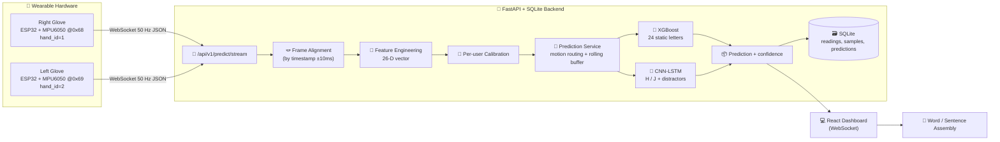
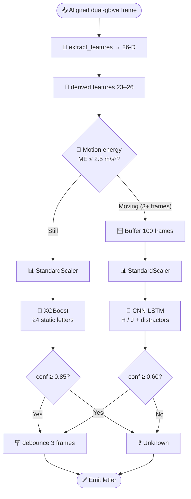
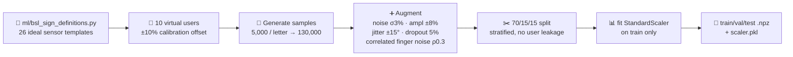
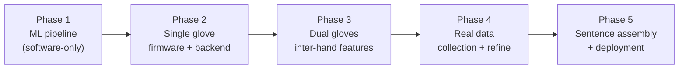

<div align="center">
  <h1>🧤 BSL Sign Gloves — Real-Time British Sign Language Fingerspelling</h1>

  ### 🤟 Dual-Glove Wearable + ML Pipeline for Live A–Z Recognition

  **A pair of sensor gloves that read your hands and speak the letters you sign**
  *Two ESP32 Gloves • 26-Feature Pipeline • Static + Dynamic ML • Live Dashboard • Text Assembly*


</div>

---

> ℹ️ **About this document.** This README describes the **system as originally designed and planned** — the intended, fully-healthy hardware and the clean ML pipeline **before** any damaged sensors were masked/rewired and **before** per-feature reliability weighting was introduced to recover live accuracy. In this baseline, **all 26 features are active and trusted equally**, the dynamic letters are **H and J**, and the pipeline is **synthetic-data-first** with a planned real-data fine-tuning phase. Sources: `docs/ML-dev-plan.md`, `docs/plan-bslSignLanguageGloves.md`, `docs/sensor-guide.md`, `docs/ml_evaluation_report.md`, and the `docs/new-docs/` build/train guides.

---

## 📑 Table of Contents

1. [Project Overview](#-project-overview)
2. [Key Features](#-key-features)
3. [End-to-End System Architecture](#-end-to-end-system-architecture)
4. [Hardware Layer](#-hardware-layer)
5. [Firmware Layer (ESP32)](#-firmware-layer-esp32)
6. [Backend Layer (FastAPI + SQLite)](#-backend-layer-fastapi--sqlite)
7. [Frontend Layer (React Dashboard)](#-frontend-layer-react-dashboard)
8. [The Machine Learning System](#-the-machine-learning-system)
9. [Feature Engineering (26-D Vector)](#-feature-engineering-the-26-dimensional-vector)
10. [The Models — What, Why, and How They Are Trained](#-the-models--what-why-and-how-they-are-trained)
11. [Synthetic-Data-First Strategy](#-synthetic-data-first-strategy)
12. [Calibration](#-calibration)
13. [Results (Phase 1, Synthetic)](#-results-phase-1-synthetic)
14. [Development Phases](#-development-phases-roadmap)
15. [Getting Started](#-getting-started)
16. [Running the Full System](#-running-the-full-system)
17. [Training the Models](#-training-the-models)
18. [Configuration Reference](#-configuration-reference)
19. [Project Structure](#-project-structure)
20. [Success Metrics & KPIs](#-success-metrics--kpis)
21. [Risk Register](#-risk-register)
22. [Known Limitations](#-known-limitations)
23. [License](#-license)

---

## 🎯 Project Overview

**BSL Sign Gloves** is a wearable system that recognizes **British Sign Language (BSL) two-handed fingerspelling** (the letters **A–Z**) in real time and assembles them into on-screen text.

Two **ESP32-powered gloves** — one for each hand — stream synchronized sensor packets (finger bend, fingertip pressure, and hand orientation) over Wi-Fi at **50 Hz** to a **FastAPI backend**. The backend aligns the left and right hand frames by timestamp, engineers a **26-dimensional feature vector**, and routes the stream through a **two-stage machine-learning recognizer**:

- a **static classifier** (XGBoost, with Random Forest and SVM baselines) for the **24 still-pose letters**, and
- a **dynamic CNN-LSTM** for the **two motion letters H and J** (plus a set of distractor gesture classes that teach the model to ignore everyday movement).

Recognized letters are debounced, displayed on a **React dashboard**, and accumulated into words and sentences.

> 💡 BSL uses a **two-handed manual alphabet** (unlike ASL), so **both gloves are mandatory** — one hand frequently acts on the other, and the inter-hand relationship is part of the signal.

The project is intentionally **synthetic-data-first**: because no public BSL sensor-glove dataset exists, the entire ML pipeline is developed and validated on synthetic data generated from BSL SignBank sign definitions, then progressively fine-tuned on real captured data.

<div align="center">

| 🧤 Senses | 🔀 Routes | 🧠 Recognizes | 📝 Assembles | 🎯 Calibrates |
|:---:|:---:|:---:|:---:|:---:|
| Flex + FSR + IMU | Static vs Dynamic | A–Z fingerspelling | Words & sentences | Per-wearer ranges |

</div>

---

## ✨ Key Features

### 🧤 **Dual-Glove Synchronized Sensing**
Two ESP32 boards each read **5 flex sensors**, **3 force-sensitive resistors (FSRs)**, and a **6-axis IMU**, sampling at a clean 50 Hz and streaming JSON over WebSocket. The backend aligns left/right frames by timestamp (±10 ms tolerance).

### 🔀 **Two-Stage Motion-Aware Routing**
A gravity-compensated **motion-energy** detector decides per frame whether the hand is still or moving. Still poses go to the fast static classifier; detected motion is buffered into a 2-second window and sent to the dynamic CNN-LSTM.

### 🧠 **Three Static Models + One Dynamic Model**
XGBoost, Random Forest, and SVM compete via GridSearchCV; the best (XGBoost) is deployed. A CNN-LSTM handles the temporal **H/J** gestures.

### 📐 **Clean 26-Feature Space — All Channels Trusted Equally**
Every flex, FSR, orientation, and derived feature is **active and weighted equally** — there is no masking and no per-channel reliability weighting. The full sensor array is assumed healthy.

### 🎯 **Per-User Calibration**
An on-boot fist → flat → spread routine captures each wearer's flex range into non-volatile storage, and per-user calibration profiles normalize different hand sizes before feature extraction.

### 🧪 **Synthetic-Data-First Development**
130,000 synthetic static samples + dynamic sequences (with distractors) let the entire pipeline be built, evaluated, and demoed **before any hardware arrives**, using `scripts/simulate_gloves.py`.

### 📊 **Full Interpretability & Tracking**
SHAP feature-importance analysis, confusion matrices, ablation studies, noise-robustness curves, MLflow experiment tracking, ONNX/TFLite model export, and DVC dataset versioning.

### 📝 **Word & Sentence Assembly**
Fingerspelled letters accumulate into a word buffer; a pause completes a word; dynamic signs insert as whole words — producing readable text in real time.

---

## 🏗️ End-to-End System Architecture



---

## 🔩 Hardware Layer

Each glove is an independent embedded unit. The two gloves are physically identical except for two firmware constants (hand id + IMU I²C address).

### Per-Pair Bill of Materials (~$90–97)

<div align="center">

| Component | Qty (pair) | Interface | Role |
|-----------|:---:|---|------|
| **ESP32-DevKitC V4** | 2 | Wi-Fi | One per glove; reads sensors, streams JSON |
| **Flex sensors (2.2″)** | 10 (5/hand) | Analog → MUX | Finger bend/curl — primary handshape feature |
| **FSR 402 (force-sensitive resistor)** | 6 (3/hand) | Analog → MUX | Fingertip pressure — thumb tip, index tip, **pinky tip** |
| **MPU6050 (GY-521) IMU** | 2 | I²C | 6-axis accel + gyro → palm orientation & motion |
| **CD74HC4067 16-ch MUX** | 2 | 4 GPIO + 1 ADC | Routes 8 analog sensors into one ADC pin |
| **47 kΩ resistors** | 16 | — | Voltage dividers for flex (×10) + FSR (×6) |
| **Thin lycra gloves** | 2 | — | Sensor mounting substrate |
| **3.7 V LiPo + TP4056** | 2 | — | Wireless power (optional; USB for dev) |

</div>

> 🔌 **Contact sensing uses FSRs only.** Capacitive touch pins (T0–T4) are **not used** in this design; the former palm-pad FSR is relocated to the **pinky fingertip**, which helps disambiguate BSL letters where the dominant index presses on the non-dominant pinky tip (e.g. **U**). FSR positions per hand: thumb tip, index tip, pinky tip.

### Pin Wiring (identical on both gloves)

```text
MUX SIG  → GPIO 36   (ADC1 — the only ADC usable while Wi-Fi is active)
MUX S0   → GPIO 16
MUX S1   → GPIO 17
MUX S2   → GPIO 18
MUX S3   → GPIO 19
MUX EN   → GND       (always enabled)
IMU SDA  → GPIO 21   (I²C)
IMU SCL  → GPIO 22   (I²C, 400 kHz)
```

### MUX Channel Map

| MUX Channel | Sensor |
|:---:|---|
| `CH0–CH4` | Flex sensors — thumb, index, middle, ring, pinky |
| `CH5–CH7` | FSR sensors — thumb tip, index tip, **pinky tip** |
| `CH8–CH15` | Unused (left disconnected) |

### Hand Identification

| Glove | `HAND_ID` | `MPU_ADDR` | AD0 pin |
|-------|:---:|:---:|---|
| Right | `1` | `0x68` | → GND |
| Left  | `2` | `0x69` | → 3.3 V |

### Sensor Behaviour Cheat-Sheet

| Sensor | Measures | Raw range | Reading |
|--------|----------|-----------|---------|
| Flex | Finger bend | ~800 (straight) → ~3800 (curled) | Higher = more curl |
| FSR | Fingertip pressure | ~0 (none) → ~4095 (firm press) | Higher = more force |
| IMU accel | Orientation + motion | ±4 g (~±39 m/s²) | ~9.8 on the down axis at rest |
| IMU gyro | Rotation rate | ±500 °/s | ~0 when still |

---

## 📟 Firmware Layer (ESP32)

The firmware is planned as a **PlatformIO** project (`firmware/`, target `esp32dev`) with modular sensor drivers. Both ESP32s run the same code; only `HAND_ID` and `MPU_ADDR` differ.

### Firmware modules

| Module | Responsibility |
|--------|----------------|
| `sensors/flex_mux.cpp` | CD74HC4067 driver — cycle S0–S3, read the 8 analog channels (5 flex + 3 FSR) |
| `sensors/imu.cpp` | MPU6050 init (±4 g, ±500 °/s, DLPF 42 Hz); read accel + gyro; estimate quaternion via Madgwick/complementary filter |
| `sensors/calibration.cpp` | On-boot fist → flat → spread calibration; store min/max flex in NVS |
| `network/wifi_stream.cpp` | Wi-Fi connect → WebSocket → JSON packet at 50 Hz; SPIFFS buffer fallback if Wi-Fi drops |

### What the firmware does each cycle (every 20 ms = 50 Hz)

1. Reads all 5 flex + 3 FSR channels through the MUX.
2. Reads the MPU6050 and fuses accel + gyro into roll/pitch/yaw, then a **unit quaternion** `[w, x, y, z]` (pitch clamped to ±85° to match the ML pipeline).
3. Normalizes against the stored per-user calibration.
4. Serializes and sends a compact JSON packet over the WebSocket.

### Packet format sent to the backend

```json
{
  "timestamp_ms": 104523,
  "hand_id": 1,
  "flex": [1850, 820, 3680, 3740, 3700],
  "fsr":  [2650, 2890, 20],
  "accel": [-0.45, 3.21, 9.12],
  "gyro":  [2.1, -1.4, 0.6],
  "quaternion": [0.92, 0.08, -0.37, 0.05]
}
```

> The `fsr` array is `[thumb_tip, index_tip, pinky_tip]`. There is **no** `contact_bitmask` field — capacitive touch is not part of this design.

### IMU configuration

- Accelerometer range **±4 g** → `ACCEL_SCALE = 9.80665 / 8192`
- Gyroscope range **±500 °/s** → `GYRO_SCALE = 1 / 65.5`
- Yaw is gyro-integrated (no magnetometer); MPU6050 → BNO055 is a documented Phase-5 upgrade path if drift becomes a problem.

---

## 🖥️ Backend Layer (FastAPI + SQLite)

The backend (`backend/app/`) is a FastAPI application backed by **SQLAlchemy ORM over SQLite**. It ingests sensor frames, stores training data, serves predictions, and manages the BSL sign dictionary.

### Database tables

| Table | Purpose |
|-------|---------|
| `users` | Per-user calibration profiles (hand size / signing baseline) |
| `sensor_readings` | Timestamped raw frames from both gloves |
| `signs` | BSL sign dictionary (name, static/dynamic, description) |
| `training_samples` | Labeled sensor sequences linked to a `sign_id` |
| `predictions` | Timestamped predictions with confidence + model version |
| `sessions` | Recording sessions for grouping collected data |

### API surface

| Type | Endpoint | Purpose |
|------|----------|---------|
| REST | `POST /api/v1/readings` | Ingest real-time dual-glove sensor frames |
| REST | `POST /api/v1/calibrate/{user_id}` | Start/store per-user calibration |
| REST | `POST /api/v1/training/record` | Start a labeled recording session |
| REST | `GET /api/v1/training/samples` | List collected training data per sign |
| REST | `POST /api/v1/ml/train` | Trigger model training, return metrics |
| REST | `GET /api/v1/predict/latest` | Current sign prediction + confidence |
| WS | `/api/v1/predict/stream` | Real-time prediction streaming |
| REST | `CRUD /api/v1/signs` | Manage the BSL sign dictionary |
| REST | `GET /api/v1/signs/dictionary` | All target signs with descriptions |

### Prediction service

The backend prediction service maintains a **rolling 100-frame buffer (2 s) for both hands**. On each incoming aligned frame it:

1. Updates the buffer and computes the 26-feature vector from the latest frame.
2. Runs the **static** classifier → if confidence **> 0.85**, emits a static prediction.
3. In parallel, detects motion segments → on segment completion, runs the **CNN-LSTM** → if confidence **> 0.60**, emits a dynamic prediction.
4. Applies **debouncing** (the same sign must appear for **3+ consecutive frames / ~60 ms**) to eliminate flicker.

---

## 🎨 Frontend Layer (React Dashboard)

The dashboard is planned as a **React + Vite + TypeScript + Tailwind CSS** SPA using **TanStack Query** for data and **Recharts** (plus Three.js for hand visualization) for sensor plots.

| Page | Purpose |
|------|---------|
| **Live Recognition** | Large real-time text display, current sign + confidence bar, sentence accumulator with clear/backspace |
| **Sensor Monitor** | 10 flex gauges, IMU 3D hand orientation, FSR pressure bars — sensor debugging |
| **Training** | Sign selector, record button (3-2-1 countdown → 3 s capture → label → save), per-sign sample counter & progress |
| **Dictionary** | BSL sign reference with descriptions and expected hand shapes |
| **Model** | Training trigger, accuracy metrics, per-sign confusion matrix, model version history |

Communication with the backend is over **WebSocket** for the 50 Hz prediction stream.

---

## 🧠 The Machine Learning System

The ML core lives in `ml/`. It is built and validated independently of the hardware so the whole pipeline can run on synthetic data.



### Label topology

| Route | Labels |
|-------|--------|
| **Static** (XGBoost) | A, B, C, D, E, F, G, I, K, L, M, N, O, P, Q, R, S, T, U, V, W, X, Y, Z (**24 letters**) |
| **Dynamic** (CNN-LSTM) | **H**, **J** + 5 distractor classes (wave horizontal, wave vertical, scratch, adjust glove, random gesture) |

- **H and J are the motion letters** in this BSL fingerspelling dataset. Both require temporal context, so they go to the CNN-LSTM; Z is handled by the static model.
- The **distractor classes** teach the dynamic model to ignore everyday movement (so a wave or a glove adjustment isn't forced into H or J). They are dropped once real dynamic signs are added.
- An **Unknown** result is emitted whenever the top softmax confidence is below threshold — there are no explicit "rest" classes in this design.

---

## 📐 Feature Engineering: the 26-Dimensional Vector

`ml/feature_engineering.py` turns one aligned raw frame into 26 deterministic, normalized features. **Every channel is active and used** — there is no masking and no reliability weighting in this baseline.

| Index | Feature | Normalization |
|:---:|---|---|
| `1–5` | Right flex: thumb, index, middle, ring, pinky | flex ADC 800–3800 → `(raw − 800) / 3000` → 0 (straight) … 1 (curled) |
| `6–10` | Left flex: thumb, index, middle, ring, pinky | same |
| `11–13` | Right FSR: thumb tip, index tip, pinky tip | FSR ADC 0–4095 → `raw / 4095` → 0 … 1 |
| `14–16` | Left FSR: thumb tip, index tip, pinky tip | same |
| `17–19` | Right Euler: roll, pitch, yaw | quaternion → degrees, pitch clamped ±85° |
| `20–22` | Left Euler: roll, pitch, yaw | same |
| `23–24` | Right / Left hand openness (derived) | mean of that hand's 5 flex channels |
| `25–26` | Inter-hand roll Δ, pitch Δ (derived) | absolute right−left difference |

### Feature discrimination rationale

- **Flex (10 features)** separates ~60% of the BSL alphabet alone — the dominant discriminator.
- **FSR (6 features)** are the only contact sensors; the **pinky FSR** is what separates **U** (R index on L pinky) and **E** (R index on L index) from the confusable I/O group.
- **Orientation (6 features)** distinguishes letters with identical flex but different palm facing (e.g. C vs O, P vs Q).
- **Derived (4 features)** capture overall hand state and inter-hand positioning.

> **Gimbal-lock note:** quaternion→Euler loses a degree of freedom near ±90° pitch, so pitch is clamped to ±85°; P/Q (extreme wrist angles) are monitored, with a rotation-matrix representation as a documented fallback.

---

## 🤖 The Models — What, Why, and How They Are Trained

### 🌲 Static models (3 candidates, best deployed)

All three are trained on the **scaled training split** and compared on validation F1; the winner (XGBoost) is saved as the deployed static model.

| Model | Why it's used | How it's trained |
|-------|---------------|------------------|
| **XGBoost** | Best accuracy/latency tradeoff on this tabular feature space; < 1 ms inference | `GridSearchCV` (5-fold stratified, `f1_weighted`) over `n_estimators` [200,300,500] × `max_depth` [4,6,8] × `learning_rate` [0.05,0.1,0.15] |
| **Random Forest** | Robust, fast baseline | `GridSearchCV` over depth/estimators/leaf params |
| **SVM (RBF)** | Strong margins on normalized features | `GridSearchCV` over `C` × `gamma`; RBF kernel |

A **single `StandardScaler`** is fitted once during data generation and reused everywhere — the static models receive already-scaled features (no second scaler, to avoid double-scaling).

### 🔂 Dynamic model — CNN-LSTM

H and J are *movements*, not poses, so a single frame can't classify them. A **CNN-LSTM** consumes a **100-frame × 26-feature** window (2 s at 50 Hz):

```text
Input (100, 26)
  → Conv1D(64, k=5) → BatchNorm → ReLU → MaxPool(2)
  → Conv1D(128, k=3) → BatchNorm → ReLU → MaxPool(2)
  → LSTM(128, return_seq) → Dropout(0.3)
  → LSTM(64)             → Dropout(0.3)
  → Dense(64, ReLU)      → Dropout(0.2)
  → Dense(n_classes, softmax)
```

- **Why CNN-LSTM?** Conv1D layers extract local temporal motion primitives; LSTM layers model the full-gesture sequence — ideal for the H and J motion patterns.
- **Planned framework:** TensorFlow/Keras (`.h5`), with TFLite export for potential on-device inference. *(On Python 3.14 environments where TensorFlow is unavailable, the model is implemented equivalently in PyTorch.)*
- **Training:** Adam (lr 0.001), categorical cross-entropy, early stopping (patience 10), `ReduceLROnPlateau` (factor 0.5, patience 5), batch size 32, up to 100 epochs.
- **2-class overfit guard:** training on only H + J risks overfitting, so 5 distractor gesture classes are added to force meaningful temporal discrimination.

### 🛡️ Motion segmentation, rejection & debouncing

- **Gravity-compensated motion energy:** a low-pass filter (α = 0.1) estimates gravity; `ME = ‖accel − gravity‖`. Start a segment when `ME > 2.5 m/s²` for 3+ frames; end it after 25 sub-threshold frames (500 ms); pad/truncate to exactly 100 frames.
- **Unknown rejection:** any prediction below its confidence threshold becomes "Unknown" (prevents false positives).
- **Debounce:** 3 consecutive identical predictions before emitting.

---

## 🧪 Synthetic-Data-First Strategy

No public BSL two-handed sensor-glove dataset exists (BOBSL, BSL Corpus, UCI Sign Language, Kaggle ASL, SignFi, UCI HAR were all evaluated and rejected — wrong modality or wrong language). So training **begins with synthetic data** generated from BSL SignBank sign definitions.



### Generation parameters

| Parameter | Value |
|-----------|-------|
| Samples per sign | 5,000 (→ 130,000 static total) |
| Gaussian noise | σ = 3% of sensor range |
| Amplitude scaling | ±8% (hand-size variation) |
| Baseline shift | N(0, 0.03) |
| Orientation jitter | ±15° per axis |
| Sensor dropout | 5% per sensor |
| Correlated finger noise | ρ = 0.3 (adjacent fingers) |
| Time warping (dynamic) | ±15% |
| Virtual users | 10 (±10% baseline offset, no leakage) |
| Split | 70% train / 15% val / 15% test |

Real data is then blended in (initially 50/50, shifting toward 80% real / 20% synthetic as captures grow), and the static model is retrained while the CNN-LSTM's Conv layers can be frozen and its LSTM/Dense layers fine-tuned on real H/J motion.

---

## 🎯 Calibration

Different hand sizes and signing styles produce different sensor baselines, so calibration runs in two places:

1. **On-boot firmware calibration** — the wearer makes a fist (record max flex) then spreads the hand (record min flex); values are stored in ESP32 NVS and used to normalize readings before streaming.
2. **Per-user backend profiles** — a `users` table stores each wearer's calibration; the backend applies it before feature extraction so the model sees a consistent distribution.

---

## 📊 Results (Phase 1, Synthetic)

From the Phase-1 synthetic evaluation (`docs/ml_evaluation_report.md`):

<div align="center">

| Metric | Target | Achieved (synthetic) |
|--------|:---:|:---:|
| Static accuracy (26 letters) | ≥ 92% | **97.4%** (XGBoost) |
| Per-letter precision | ≥ 80% all | **88.3%+ all** |
| Confused pairs (>10%) | ≤ 5 | **0** |
| Dynamic accuracy (H, J) | ≥ 88% | **100%** (synthetic) |
| Feature-group ablation | ≥ 70% each | **86.6%+ all groups** |
| 2× noise robustness | ≥ 85% | **87.8%** |
| End-to-end ("HELLO", "BSL", "JAZZ") | correct | **all correct** |

</div>

Static model comparison (synthetic test set):

| Model | CV F1 | Val acc | Test acc |
|-------|:---:|:---:|:---:|
| **XGBoost** | 0.980 | 97.8% | **97.4%** |
| SVM (RBF) | 0.972 | 97.0% | 96.8% |
| Random Forest | 0.971 | 96.9% | 96.0% |

Most-impactful features (SHAP): `R_flex_middle`, `R_pitch`, `R_fsr_index`, `L_hand_openness`, `R_flex_thumb`. Inference latency: static ~2.1 ms/frame, dynamic ~0.2 ms/segment.

> ⚠️ These are **synthetic** results. Real sensor noise, drift, cross-talk, and personal signing styles are not captured here — the planned real-data phase targets ≥95% static / ≥90% dynamic on captured data.

---

## 🗺️ Development Phases (Roadmap)



| Phase | Goal | Key deliverable |
|-------|------|-----------------|
| **1** | Prove the 26-feature vector separates the alphabet on synthetic data | Trained XGBoost (≥92%) + CNN-LSTM (≥88%), ablation + SHAP reports |
| **2** | ESP32 firmware for the dominant hand; validate real sensors vs synthetic | Single glove streaming at 50 Hz + live inference |
| **3** | Add the second glove; compute inter-hand features | Synchronized dual-glove feature vector |
| **4** | Collect real samples, blend with synthetic, retrain | ≥95% static / ≥90% dynamic on real data |
| **5** | Sentence assembly, active-learning correction UI, IMU upgrade path | Demonstration-ready end-to-end system |

---

## 🚀 Getting Started

### Prerequisites

- **Python 3.11+** (tested 3.11–3.14)
- 8 GB RAM minimum (16 GB recommended for full grid search), ~500 MB disk
- For hardware: Arduino IDE / PlatformIO with the **ESP32 board package**

### 1. Clone & enter

```bash
git clone <your-repo-url> sign_gloves_ML_models
cd sign_gloves_ML_models
```

### 2. Create a virtual environment

```bash
python -m venv venv
# Windows
venv\Scripts\activate
# macOS / Linux
source venv/bin/activate
```

### 3. Install ML dependencies

```bash
pip install numpy scipy scikit-learn xgboost torch matplotlib seaborn shap pandas
```

(For the backend add `fastapi uvicorn[standard] sqlalchemy python-multipart aiofiles`.)

---

## ▶️ Running the Full System

### Software-only (no hardware) — recommended first run


```bash
# 1. Generate 130K synthetic samples + dynamic sequences
python -m ml.synthetic_data

# 2. Train models
python -m ml.train_static          # XGBoost + RF + SVM (GridSearchCV)
python -m ml.train_dynamic         # CNN-LSTM (H/J + distractors)

# 3. Evaluate
python -m ml.evaluate              # metrics, SHAP, confusion matrix
python -m ml.ablation              # feature-group + noise robustness

# 4. Start the backend (bind to all interfaces for gloves)
uvicorn backend.app.main:app --host 0.0.0.0 --port 8000

# 5. Stream synthetic gloves into the API
python scripts/simulate_gloves.py
```

### With hardware

1. Flash both ESP32s (PlatformIO), setting `HAND_ID` / `MPU_ADDR`, Wi-Fi credentials, and the backend host IP per glove.
2. Run the on-boot calibration (fist → flat → spread).
3. Start the backend with `--host 0.0.0.0` and open the React dashboard.
4. Both gloves connect over WebSocket and stream at 50 Hz; predictions appear live and accumulate into text.

### Quick full pipeline (fast sanity check)

```bash
python -m ml.synthetic_data --quick && python -m ml.train_static --quick && python -m ml.train_dynamic --quick && python -m ml.evaluate --skip-shap && python -m ml.ablation --quick
```

---

## 🏋️ Training the Models

### Static classifiers

```bash
python -m ml.train_static            # all three (XGBoost, RF, SVM)
python -m ml.train_static --model xgb # one model
python -m ml.train_static --quick     # reduced grids (fast)
```

### Dynamic CNN-LSTM

```bash
python -m ml.train_dynamic           # full training (≤100 epochs)
python -m ml.train_dynamic --quick   # 10-epoch smoke test
python -m ml.train_dynamic --epochs 50
```

### Real-data fine-tuning (Phase 4)

1. Record 30–50 real samples per letter (web Training page) into the `training_samples` table.
2. Blend real + synthetic and retrain XGBoost from scratch.
3. Freeze the CNN-LSTM Conv layers and fine-tune LSTM/Dense on real H/J sequences.
4. Refit the `StandardScaler` on real data and re-evaluate with 5-fold CV.

---

## ⚙️ Configuration Reference

All ML constants live in `ml/config.py`.

<div align="center">

| Constant | Value | Meaning |
|----------|:---:|---------|
| Sampling rate | 50 Hz | Sensor sampling frequency |
| Dynamic window | 100 frames | 2 s @ 50 Hz |
| Feature count | 26 | ML feature vector length (all active) |
| Static confidence threshold | **0.85** | Min static confidence to emit |
| Dynamic confidence threshold | 0.60 | Min dynamic confidence to emit |
| Debounce frames | 3 | Consecutive identical predictions (~60 ms) |
| Motion energy threshold | 2.5 m/s² | Static ↔ dynamic routing (gravity-compensated) |
| Motion offset | 25 frames | 500 ms below threshold ends a segment |
| Dynamic letters | H, J | Motion letters routed to CNN-LSTM |
| CV folds / scoring | 5 / f1_weighted | Static GridSearch settings |
| Samples per sign | 5,000 | Synthetic generation |

</div>

---

## 📁 Project Structure

```text
sign_gloves/
├── 📄 README.md
├── 📂 firmware/                       # ESP32 PlatformIO project (Phase 2+)
│   ├── src/sensors/                  # flex_mux.cpp, imu.cpp, calibration.cpp
│   ├── src/network/wifi_stream.cpp   # WebSocket streaming
│   └── platformio.ini
│
├── 📂 backend/                        # FastAPI + SQLAlchemy + SQLite
│   └── app/
│       ├── main.py
│       ├── models.py                 # SQLAlchemy ORM tables
│       ├── schemas.py                # Pydantic schemas
│       ├── database.py               # SQLite setup
│       ├── routers/                  # readings, training, prediction, signs, calibration
│       └── services/                 # prediction_service.py, feature_engineering.py
│
├── 📂 ml/                             # Machine-learning core (Phase 1)
│   ├── config.py                     # ⭐ Constants: features, thresholds, hyperparams
│   ├── bsl_sign_definitions.py       # 26 letter sensor templates
│   ├── feature_engineering.py        # raw frame → 26-D vector
│   ├── synthetic_data.py             # synthetic generation + augmentation
│   ├── train_static.py               # XGBoost / RF / SVM + GridSearchCV
│   ├── train_dynamic.py              # CNN-LSTM (H/J + distractors)
│   ├── segmentation.py               # gravity-compensated motion detection
│   ├── predict.py                    # unified two-stage prediction
│   ├── evaluate.py                   # metrics, SHAP, confusion matrices
│   └── ablation.py                   # feature-group + noise robustness
│
├── 📂 scripts/
│   ├── simulate_gloves.py            # synthetic 50 Hz stream → API
│   └── simulate_and_predict.py       # end-to-end recognition test
│
├── 📂 frontend/                       # React + Vite + TS dashboard
│   └── src/pages/                    # LiveRecognition, SensorMonitor, Training,
│                                     #   Dictionary, Model
│
├── 📂 data/
│   ├── raw/synthetic/                # static_dataset.npz, dynamic_dataset.npz
│   ├── processed/                    # train/val/test .npz + scaler.pkl
│   ├── models/                       # xgboost_static_v1.pkl, cnn_lstm_dynamic_v1.*,
│   │                                 #   training/evaluation reports, feature_importance
│   └── figures/                      # confusion matrices, ablation & noise charts
│
└── 📂 docs/                           # Plans, guides, evaluation reports
```

---

## 📈 Success Metrics & KPIs

| Metric | Phase 1 (synthetic) | Phase 4 (real) |
|--------|:---:|:---:|
| Static fingerspelling accuracy | ≥ 89–92% | ≥ 95% |
| Per-letter precision | ≥ 80% every letter | ≥ 80% |
| Confused pairs (>10%) | ≤ 5 | ≤ 3 |
| Dynamic accuracy (H, J) | ≥ 88% | ≥ 90% |
| Motion segmentation IoU | > 0.75 | > 0.80 |
| Static inference latency | < 1 ms/frame | — |
| End-to-end recognition latency | < 200 ms/letter | — |
| Noise robustness (2× noise) | ≥ 85% | — |

---

## ⚠️ Risk Register

| Risk | Mitigation |
|------|-----------|
| Synthetic data ≠ real sensors | BSL SignBank-sourced templates; domain-gap analysis in Phase 2; real-data fine-tuning in Phase 4 |
| M/N, D/K, P/Q letter confusion | FSR contact features; targeted extra samples; iterate the confusion matrix |
| CNN-LSTM overfits on 2 dynamic classes | Dropout 0.3, augmentation, early stopping, 5 distractor classes |
| Hand-size variation | 10 virtual user profiles + per-user calibration |
| IMU gyro drift (MPU6050) | Complementary/Madgwick filter; signs < 2 s; BNO055 upgrade path |
| Quaternion→Euler gimbal lock | Pitch clamped ±85°; monitor P/Q; rotation-matrix fallback |
| Double-scaling | Single `StandardScaler` fitted once at data generation, reused everywhere |
| I/O confusion (no FSR on L middle/ring) | Pinky FSR recovers E/U; documented as a known limitation |

---

## ⚠️ Known Limitations

- 🧪 **Synthetic-first.** Headline accuracy is on synthetic data; real noise, drift, and cross-talk are not yet captured.
- 🔡 **I vs O** is the primary residual confusion, since there is no FSR on the left middle/ring fingertip.
- 🤸 **Only two dynamic letters (H, J)**; the 5 distractor classes are heuristic stand-ins for real non-sign motion.
- 🧤 **Both gloves required** — BSL fingerspelling is two-handed; single-hand input is out of scope.
- 📍 **No body-location tracking** — BSL signs at specific body locations (forehead, chin, chest) need extra sensors and are out of scope for the glove-only proof of concept.
- 🔋 **Battery/wireless** operation is optional in dev (USB-powered); battery profiling is a Phase-5 task.

---

## 📄 License

Licensed under the **Apache License 2.0** — see [`LICENSE`](LICENSE).

---

<div align="center">

  ### 🧤 **From Fingertips to Letters** 🧤
  ### 🌟 **Wearable Sensing Meets Machine Learning** 🌟

  ⭐ **Star this repository if it helped you!** ⭐

</div>
