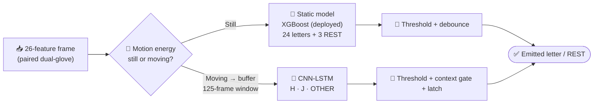
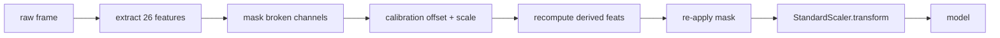
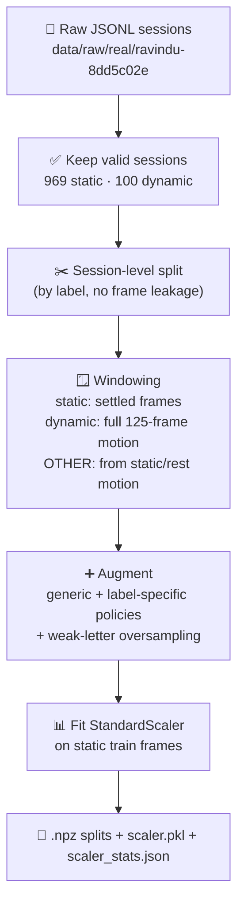
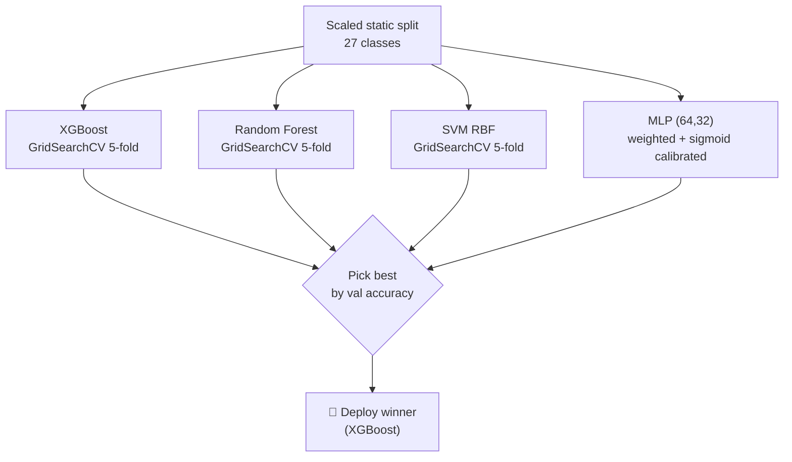
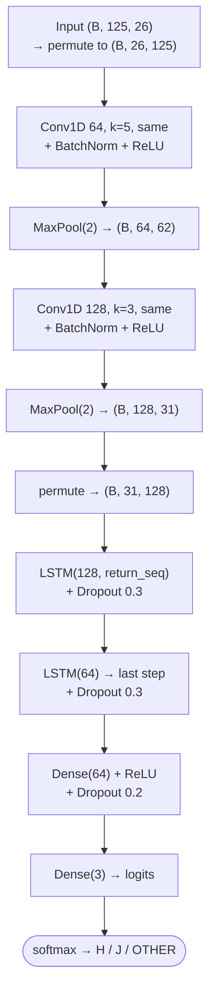
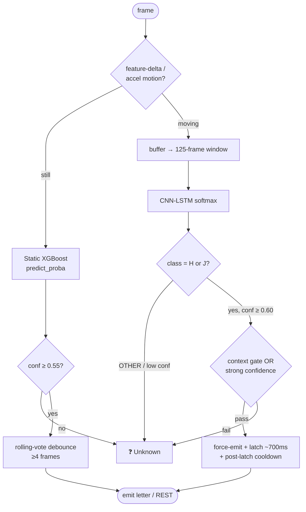

# 🧠 ML Models Guide — BSL Sign Gloves

> A complete, self-contained guide to the machine-learning models behind the BSL Sign Gloves system: **what** they are, **why** they were chosen, **how** they are trained (layer by layer), and the **actual measured results** from the latest full-user retrain run.
>
> Numbers in this guide come directly from the real training artifacts: `retrain_log.txt`, `retrain_stdout.txt`, `data/models/training_report_real.json`, and `data/models/dynamic_training_report_real.json`. Code of record: `ml/config.py`, `ml/train_static.py`, `ml/train_dynamic.py`, `ml/feature_engineering.py`, `ml/predict.py`.

---

## 📑 Table of Contents

1. [Big Picture — A Two-Stage Recognizer](#1-big-picture--a-two-stage-recognizer)
2. [The Input: 26-Feature Vector & Preprocessing](#2-the-input-26-feature-vector--preprocessing)
3. [How Training Data Is Built](#3-how-training-data-is-built)
4. [Static Models — XGBoost / RF / SVM / MLP](#4-static-models--xgboost--rf--svm--mlp)
5. [Dynamic Model — CNN-LSTM (Layer by Layer)](#5-dynamic-model--cnn-lstm-layer-by-layer)
6. [Why These Models Were Chosen](#6-why-these-models-were-chosen)
7. [Measured Training Results](#7-measured-training-results)
8. [How the Models Are Used at Inference](#8-how-the-models-are-used-at-inference)
9. [Reproducing the Training](#9-reproducing-the-training)
10. [Model Artifacts](#10-model-artifacts)

---

## 1. Big Picture — A Two-Stage Recognizer

BSL fingerspelling mixes **static hand poses** (most letters) with **motion gestures** (H and J). A single model class can't serve both well, so the system uses **two specialized models** behind a motion-aware router:



| Stage | Model | Handles | Output classes |
|-------|-------|---------|----------------|
| **Static** | XGBoost (best of 4 candidates) | Still poses | 24 letters (A–Z **except H, J**) + REST_1/2/3 = **27 classes** |
| **Dynamic** | CNN-LSTM (PyTorch) | Motion gestures | **H, J**, and **OTHER** (rejection class) = 3 classes |

- **H and J are dynamic** (they involve motion); every other letter is a static pose. **Z is static** in this dataset.
- **REST_1/2/3** are deliberate "no sign" poses so the system can stay silent between letters.
- **OTHER** is a dynamic *rejection* class trained from ordinary movement so a wave or fidget isn't forced into H/J. It never displays as a letter.

---

## 2. The Input: 26-Feature Vector & Preprocessing

Every prediction starts from one **paired dual-glove frame** turned into a fixed **26-dimensional vector** (`ml/feature_engineering.py`).

| Index | Feature group | Channels | Normalization |
|:---:|---|---|---|
| `0–9` | Flex (R + L) | thumb…pinky each hand | `(raw − 800) / 3000` → 0 (straight) … 1 (curled) |
| `10–15` | FSR (R + L) | thumb tip, index tip, pinky tip | `raw / 4095` → 0 … 1 |
| `16–21` | Euler (R + L) | roll, pitch, yaw | quaternion → degrees, pitch clamped ±85° |
| `22–23` | Hand openness (R + L) | derived | mean of that hand's working flex channels |
| `24–25` | Inter-hand deltas | derived | abs(roll Δ), abs(pitch Δ) |

Two pipeline-critical mechanisms sit on top of the raw features:

### 🚫 Broken-sensor masking (`MASKED_FEATURE_INDICES = (4, 5, 15)`)
The deployed glove has hardware damage, so three channels are **forced to zero in both training and inference** so the models never learn to depend on a dead sensor:

| Idx | Channel | Reason |
|:---:|---|---|
| 4 | `R_flex_pinky` | dead after the working sensor was rewired into the thumb position |
| 5 | `L_flex_thumb` | intermittent ADC dropouts |
| 15 | `L_fsr_pinky` | pad physically moved to the left index fingertip |

When a flex channel is masked, the dependent hand-openness feature is recomputed from the remaining working channels, so no constant bias is injected.

### ⚖️ Per-feature reliability weights (`FEATURE_WEIGHTS`, length 26)
Clean, discriminative channels are up-weighted; masked channels stay exactly `0.0`. Weights are **not** baked into the raw vector — each consumer applies them where appropriate:
- **XGBoost** receives them via its native `feature_weights` argument (biases column subsampling).
- The **MLP** pre-multiplies its inputs and stores `weighted=True` so inference repeats the same scaling.
- **Augmentation** suppresses noise on zero-weight channels.

### Order of operations at inference



> Calibration runs **before** the scaler because offsets/scales are defined in the unscaled feature domain. A single `StandardScaler` (fitted once on the real training data) is reused everywhere — no double scaling.

---

## 3. How Training Data Is Built

The training set is **not** a raw frame dump. `scripts/run_full_user_validation.py` builds it from captured JSONL sessions through a filter → window → augment → scale → split pipeline.



### Latest build (from `retrain_log.txt`)

| Split | Static frames | Dynamic windows | Shape |
|-------|:---:|:---:|---|
| Train | **103,086** | **2,332** | `(N, 26)` static · `(N, 125, 26)` dynamic |
| Val | 1,746 | 37 | — |
| Test | 1,746 | 37 | — |

- **Static sessions kept:** 969 (30–50 per label; weak letters I, L, N, O, T, V, REST_3 captured at 50).
- **Dynamic sessions kept:** 100 (H = 50, J = 50); `OTHER` windows are synthesized from static/rest motion (108 train / 27 val / 27 test).
- **Static classes:** 27 (24 letters + 3 REST). **Dynamic classes:** 3 (H, J, OTHER).
- Class imbalance is handled with **balanced sample weights** (range `[0.530, 1.473]` this run).

---

## 4. Static Models — XGBoost / RF / SVM / MLP

Four candidates are trained on the **same scaled split**; the best (by validation accuracy) is auto-deployed. The deployed predictor reads `training_report_real.json` at startup to know which artifact to load (fallback: Random Forest).



### Shared training recipe (`ml/train_static.py`)

- **Cross-validation:** 5-fold `StratifiedKFold`, scoring `f1_weighted`.
- **Class balancing:** XGBoost uses balanced `sample_weight`; RF and SVM use `class_weight='balanced'`.
- **Feature weighting:** XGBoost via `feature_weights`; MLP via input pre-multiplication.
- **Probability calibration:** MLP wrapped in `CalibratedClassifierCV` (sigmoid / Platt) so confidences are honest.
- **Label remapping:** training labels remapped to contiguous `0..N-1`; an `inv_label_map` + `label_names` are stored so the model can return global display labels (letters + REST).

### Hyperparameter search spaces (`ml/config.py`)

| Model | Grid |
|-------|------|
| **XGBoost** | `n_estimators` [200, 400] · `max_depth` [4, 6] · `learning_rate` [0.1] · `subsample` [0.7] · `colsample_bytree` [0.7] · `min_child_weight` [5] · `reg_alpha` [0.5] · `reg_lambda` [3.0] |
| **Random Forest** | `n_estimators` [300, 500] · `max_depth` [8, 12] · `min_samples_split` [5] · `min_samples_leaf` [3, 5] · `max_features` ['sqrt'] |
| **SVM** | `C` [0.1, 1.0, 10.0] · `gamma` ['scale', 'auto'] · `kernel` ['rbf'] |
| **MLP** | Fixed architecture `(64, 32)`, ReLU, Adam, `alpha=1e-3`, early stopping (no grid) |

> RF depth is intentionally capped and `min_samples_leaf` raised so a leaf represents several frames, not one — this prevents the forest from memorizing per-session sensor jitter.

---

## 5. Dynamic Model — CNN-LSTM (Layer by Layer)

H and J are *movements*, so the dynamic model consumes a **temporal window** of **125 frames × 26 features** (2.5 s at 50 Hz) and outputs H / J / OTHER. Conv1D layers extract local motion primitives; LSTM layers model the full-gesture sequence.



### Layer / shape table

| Stage | Layer | Output shape | Notes |
|-------|-------|--------------|-------|
| Input | — | `(B, 125, 26)` | permuted to `(B, 26, 125)` for Conv1D |
| Conv block 1 | Conv1D(64, k=5) → BN → ReLU → MaxPool(2) | `(B, 64, 62)` | local temporal features |
| Conv block 2 | Conv1D(128, k=3) → BN → ReLU → MaxPool(2) | `(B, 128, 31)` | higher-level features |
| Recurrent 1 | LSTM(128, return_seq) → Dropout(0.3) | `(B, 31, 128)` | full-sequence context |
| Recurrent 2 | LSTM(64) → Dropout(0.3) | `(B, 64)` | takes last time step |
| Head | Dense(64)+ReLU → Dropout(0.2) → Dense(3) | `(B, 3)` | raw logits (softmax in loss) |

**Total trainable parameters: 219,587.**

### Training configuration (`ml/train_dynamic.py`)

| Setting | Value |
|---------|-------|
| Framework / device | PyTorch (CPU; CUDA auto-used if available) |
| Optimizer | Adam, lr `0.001` |
| Loss | `CrossEntropyLoss` with **balanced class weights** (`[1.143, 1.143, 0.8]` this run) |
| Regularization | **mixup α=0.2** (batch-level), dropout 0.3 / 0.2 |
| Scheduler | `ReduceLROnPlateau` (factor 0.5, patience 5) |
| Early stopping | patience 10 on val loss |
| Batch size / max epochs | 32 / 100 |

> *Why PyTorch?* The original plan specified TensorFlow/Keras, but the deployment environment runs Python 3.14 where TensorFlow is unavailable, so the identical architecture is implemented in PyTorch.

---

## 6. Why These Models Were Chosen

| Model | Why it earns its place |
|-------|------------------------|
| **XGBoost** | Best accuracy/latency tradeoff on this 26-D tabular space; <1 ms inference; **native per-feature weighting** lets it lean on reliable channels; robust to the masked zeros. Current deployed static model. |
| **Random Forest** | Low-variance, dependable fallback; depth-capped to resist memorizing session jitter; matched XGBoost on this set. |
| **SVM (RBF)** | Strong decision margins on normalized features; a useful independent check that the feature space is cleanly separable. |
| **MLP (64,32)** | The only candidate that natively honors `FEATURE_WEIGHTS` through input scaling; **sigmoid-calibrated** for trustworthy confidences (important for the live confidence threshold). |
| **CNN-LSTM** | Static models can't see motion. Conv1D captures H's lateral two-finger motion and J's circular pinky trace locally; stacked LSTMs integrate the whole gesture; the OTHER class makes it a *rejector*, not just a classifier. |

**Why two stages instead of one end-to-end model?** Static poses must be recognized **instantly** (single frame, <1 ms) without waiting for a gesture to finish, while motion letters need **temporal context** (a 2.5 s window). Splitting the problem lets each model be optimal for its regime and keeps static latency tiny.

---

## 7. Measured Training Results

### 7.1 Static models — latest retrain (`retrain_log.txt`)

Training data: `(103086, 26)` train · `1746` val · `1746` test · 27 classes.

| Model | Best CV (f1) | Val acc | Test acc | Test F1 | Train time | Weighted |
|-------|:---:|:---:|:---:|:---:|:---:|:---:|
| **XGBoost** ⭐ | 0.9987 | **1.0000** | **1.0000** | 1.0000 | 312.4 s | no |
| Random Forest | 0.9948 | 1.0000 | 1.0000 | 1.0000 | 534.1 s | no |
| SVM (RBF) | 0.9975 | 0.9960 | 0.9977 | 0.9977 | 431.9 s | no |
| MLP (calibrated) | — | 0.9897 | 0.9983 | 0.9983 | 8.6 s | yes |

**Selected best model: XGBoost** (val acc 1.0000) with params:
`colsample_bytree=0.7, learning_rate=0.1, max_depth=6, min_child_weight=5, n_estimators=400, reg_alpha=0.5, reg_lambda=3.0, subsample=0.7`.

### 7.2 Dynamic model — CNN-LSTM

Training data: `(2332, 125, 26)` train · `37` val · `37` test · classes H / J / OTHER.

| Metric | Value |
|--------|:---:|
| Parameters | 219,587 |
| Class weights | `[1.143, 1.143, 0.8]` |
| Epochs trained | 17 (early-stopped; patience 10) |
| Training time | 22.3 s |
| Best val loss / acc | 0.0239 / 1.0000 |
| **Test accuracy** | **1.0000** |

Per-class test report (support in parentheses):

| Class | Precision | Recall | F1 | Support |
|-------|:---:|:---:|:---:|:---:|
| H | 1.00 | 1.00 | 1.00 | 5 |
| J | 1.00 | 1.00 | 1.00 | 5 |
| OTHER | 1.00 | 1.00 | 1.00 | 27 |

Training curve (abridged):

| Epoch | train_loss | train_acc | val_loss | val_acc | lr |
|:---:|:---:|:---:|:---:|:---:|:---:|
| 1 | 0.4684 | 0.6299 | 0.1193 | 0.9459 | 0.001 |
| 5 | 0.2810 | 0.6338 | 0.1048 | 0.9730 | 0.001 |
| 10 | 0.2423 | 0.7307 | 0.0399 | 1.0000 | 0.001 |
| 15 | 0.1914 | 0.7174 | 0.0327 | 1.0000 | 0.0005 |

### 7.3 Deployment gate

| Check | Result |
|-------|:---:|
| Best static model | XGBoost |
| Static test accuracy / macro F1 / min recall | 1.0000 / 1.0000 / 1.0000 |
| REST rejection accuracy | 1.0000 |
| Dynamic test accuracy | 1.0000 |
| **Decision** | ✅ **GO** → artifacts copied to canonical live paths |

> ⚠️ **Interpret with care.** These are **held-out *session* metrics for a single captured wearer**. Perfect scores reflect a clean, consistent capture — they are a strong deployment gate but **do not prove generalization to arbitrary new users**. Live distribution shift is handled by per-user calibration and the live-validation harness, not by these numbers alone.

---

## 8. How the Models Are Used at Inference

The live recognizer (`ml/predict.py`) is **stateful** — far more than a single-frame classifier.



Key runtime parameters (`ml/config.py`):

| Parameter | Value | Purpose |
|-----------|:---:|---------|
| `STATIC_CONFIDENCE_THRESHOLD` | 0.55 | min static confidence to emit |
| `DYNAMIC_CONFIDENCE_THRESHOLD` | 0.60 | min dynamic confidence to emit |
| `DEBOUNCE_FRAMES` | 4 | rolling votes before emit (~80 ms) |
| `DYNAMIC_WINDOW_FRAMES` | 125 | dynamic window (2.5 s @ 50 Hz) |
| Dynamic latch | ~700 ms | holds H/J so trailing static end-poses can't override it |

Safeguards that turn the offline model into a usable live stream: context gates for ambiguous H/J end-poses (bypassable by strong confidence), a K-shaped start probe so a possible **J can preempt static K**, and a rule that **OTHER / low-confidence segments never latch**.

### Per-user calibration

Before scaling, a neutral-pose capture (plus optional A/B/C reference letters) maps the current wearer's flex baseline and IMU mount angle into the training distribution. Offsets apply only to flex / Euler / openness channels — **never to FSRs** (zero pressure is real signal). This closes train/serve drift **without retraining**.

---

## 9. Reproducing the Training

```bash
# Full validated build → train static + dynamic → gate → deploy (recommended)
python -m scripts.run_full_user_validation

# Or train stages individually on real data
python -m ml.train_static  --real            # XGB + RF + SVM + MLP
python -m ml.train_static  --real --model xgb # one model
python -m ml.train_dynamic --real            # CNN-LSTM
python -m ml.train_dynamic --real --quick    # 10-epoch smoke test

# Cross-validation (leave-one-user-out)
python -m scripts.build_real_dataset --mode louo
python -m ml.train_static  --louo
python -m ml.train_dynamic --louo
```

All randomness is seeded (`SEED = 42`) for reproducibility.

---

## 10. Model Artifacts

| Artifact | Path | Contents |
|----------|------|----------|
| Deployed static model | `data/models/xgboost_static_v2.pkl` | XGBoost + `inv_label_map` + `weighted` flag + `label_names` |
| Static candidates | `data/models/{rf,svm,mlp}_static_v2.pkl` | RF / SVM / calibrated-MLP payloads |
| Deployed dynamic model | `data/models/cnn_lstm_dynamic_v2.pt` | state dict + `n_features`, `n_classes`, `class_names`, `cfg` |
| Scaler | `data/processed/real/scaler.pkl` | `StandardScaler` fitted on real static train frames |
| Scaler stats | `data/processed/real/scaler_stats.json` | mean/scale + neutral baseline for calibration |
| Static report | `data/models/training_report_real.json` | per-model CV / val / test metrics, best model |
| Dynamic report | `data/models/dynamic_training_report_real.json` | epochs, per-class metrics, confusion matrix |
| Validation report | `data/models/full_user_validation_report.json` | acceptance gates + GO/NO-GO decision |

---

<div align="center">

**Static = instant poses (XGBoost) · Dynamic = motion gestures (CNN-LSTM) · One motion-aware router ties them together.**

</div>
