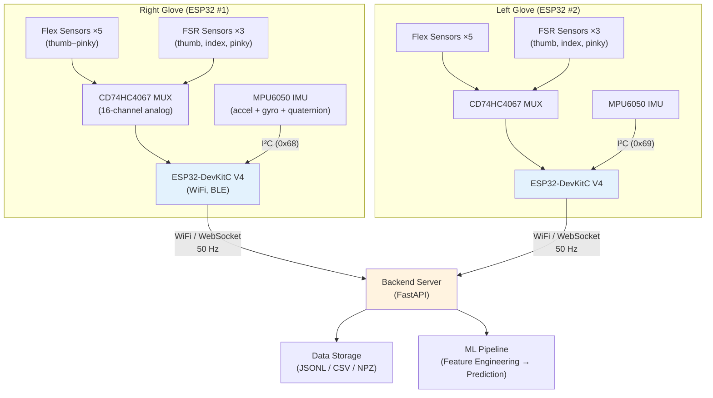
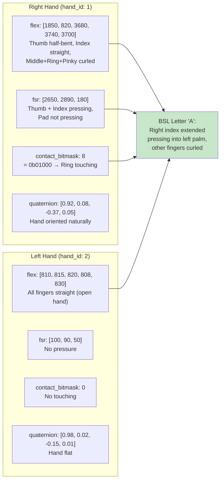
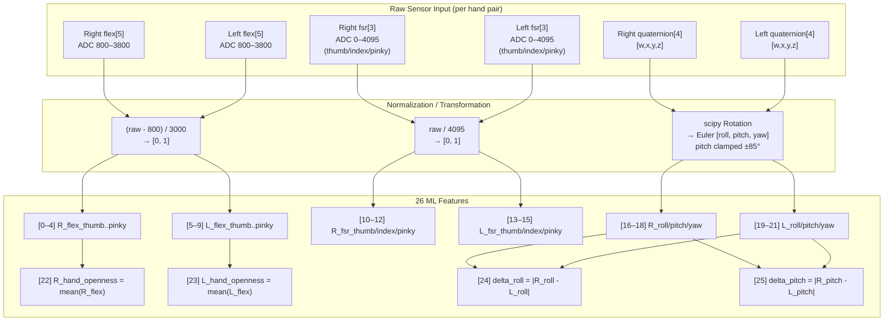
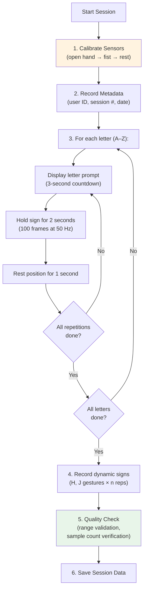
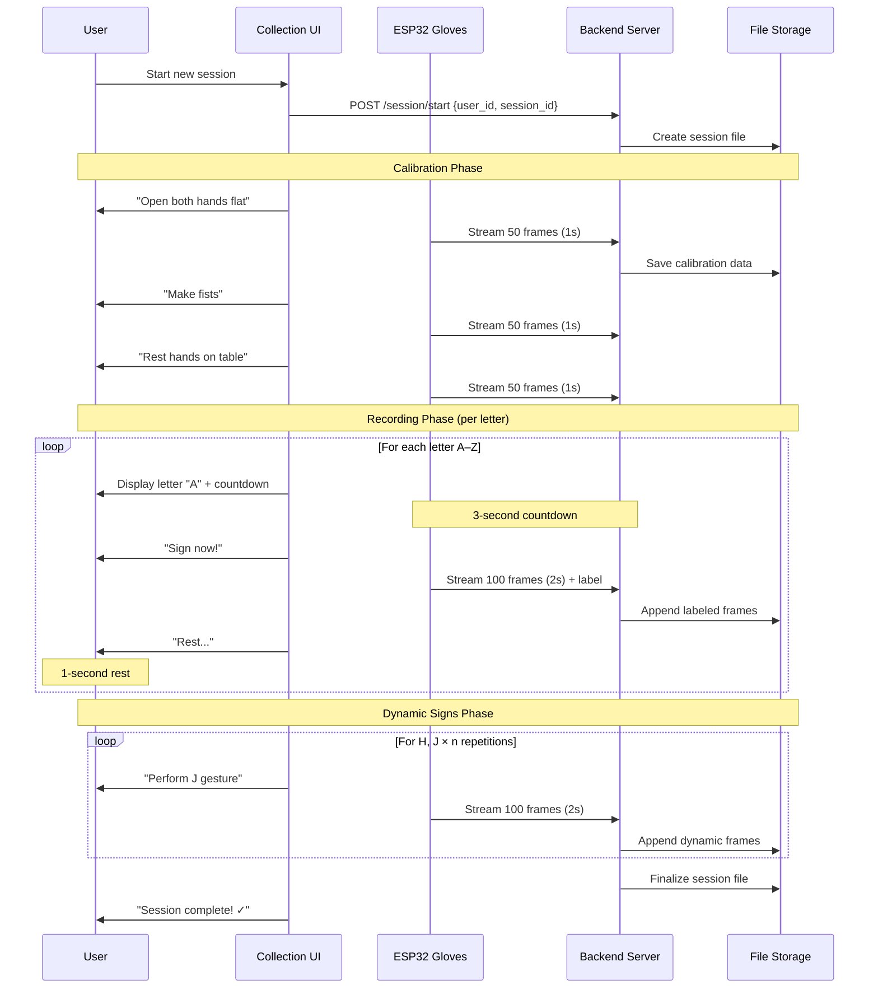

# Sensor Data Collection: Formats, Protocols & Requirements

> **BSL Sign Language Gloves — Sensor Data Collection Guide**
>
> This guide covers the hardware specifications, raw data formats, collection protocols, quality checks, and storage requirements for recording BSL fingerspelling data from physical sensor gloves.

---

## Table of Contents

- [Hardware Overview](#hardware-overview)
- [Sensor Specifications](#sensor-specifications)
- [JSON Packet Format](#json-packet-format)
- [Raw Sensor Ranges & Interpretation](#raw-sensor-ranges--interpretation)
- [26 ML Feature Mapping](#26-ml-feature-mapping)
- [File Format Options](#file-format-options)
- [Collection Protocol](#collection-protocol)
- [Quality Checks & Validation](#quality-checks--validation)
- [Storage Recommendations](#storage-recommendations)
- [Example Recording Session](#example-recording-session)

---

## Hardware Overview

The BSL Sign Language Gloves system uses a **dual-glove** configuration — one glove per hand, each with identical sensor arrays.



### Bill of Materials (~$96 per glove pair)

| Component            | Qty  | Cost   | Interface               | Purpose                |
|----------------------|------|--------|-------------------------|------------------------|
| ESP32-DevKitC V4     | 2    | ~$10   | WiFi / BLE              | Microcontroller        |
| Flex Sensors (2.2″)  | 10   | ~$20   | Analog → MUX → ADC      | Finger curl detection  |
| FSR 402              | 6    | ~$24   | Analog → MUX → ADC      | Pressure detection (thumb, index, pinky tips) |
| MPU6050 IMU          | 2    | ~$5    | I²C (0x68 / 0x69)      | Orientation + motion   |
| CD74HC4067 MUX       | 2    | ~$4    | 4 GPIO + 1 ADC          | Analog multiplexing    |
| Gloves               | 2    | ~$10   | —                       | Physical substrate     |
| LiPo Battery         | 2    | ~$12   | —                       | Wireless operation     |
| Misc (resistors, wire)| —   | ~$10   | —                       | Wiring                 |
| **Total**            | —    | **~$87** | —                     | —                      |

---

## Sensor Specifications

### 1. Flex Sensors (×5 per hand)

Flex sensors measure finger curl by detecting the bend angle of each finger.

| Property        | Value                          |
|-----------------|--------------------------------|
| **Quantity**    | 5 per hand (thumb → pinky)     |
| **Interface**   | Analog voltage via MUX → ADC   |
| **ADC Range**   | 12-bit (0–4095)                |
| **Straight**    | ~800 ADC                       |
| **Fully curled**| ~3800 ADC                      |
| **Useful range**| 800–3800 (3000 ADC span)       |

**Example readings:**
| Hand Position | Thumb | Index | Middle | Ring  | Pinky |
|---------------|-------|-------|--------|-------|-------|
| Flat open     | 810   | 830   | 825    | 815   | 840   |
| Fist          | 820   | 3650  | 3720   | 3690  | 3710  |
| Index pointing| 815   | 830   | 3700   | 3680  | 3720  |

### 2. MPU6050 IMU (×1 per hand)

Provides accelerometer, gyroscope, and quaternion data for hand orientation and motion detection.

| Property            | Value                             |
|---------------------|-----------------------------------|
| **Accelerometer**   | ±4g range (~±39 m/s²)            |
| **Gyroscope**       | ±500 °/s                          |
| **Quaternion**      | Computed from sensor fusion [w,x,y,z] |
| **At rest (accel)** | One axis reads ~9.8 m/s² (gravity)|
| **At rest (gyro)**  | Near zero on all axes             |
| **I²C Address**     | Right: 0x68, Left: 0x69          |

**Example readings:**
| State           | accel [x,y,z] m/s²    | gyro [x,y,z] °/s     |
|-----------------|------------------------|-----------------------|
| Hand at rest    | [-0.45, 3.21, 9.12]   | [0.3, -0.1, 0.2]     |
| Mid-wave motion | [2.30, -5.12, 8.45]   | [45.2, -12.8, 3.1]   |
| Sharp gesture   | [-5.1, 8.2, -3.4]     | [120.0, -85.0, 42.0] |

### 3. FSR 402 — Force Sensitive Resistors (×3 per hand)

Detect fingertip pressure. The third FSR is on the pinky fingertip (replacing the former palm pad).

| Property         | Value                                   |
|------------------|-----------------------------------------|
| **Positions**    | Thumb tip, index tip, **pinky tip**     |
| **No pressure**  | ~0–100 ADC                              |
| **Light press**  | ~800–1500 ADC                           |
| **Firm press**   | ~2500–4095 ADC                          |

> **Note:** The pinky FSR helps discriminate BSL letter "U" (right index presses on left pinky tip) from the similar-looking E/I/O group. Capacitive touch pins have been removed; FSR sensors are the sole contact-detection mechanism.

### 4. Capacitive Touch — Removed

> **⚠️ Hardware change:** Capacitive touch pins (T0–T4) are **not used** in this design. The `contact_bitmask` field is no longer present in the sensor JSON packet. Contact detection is handled entirely by the three FSR sensors on each hand.

### 5. CD74HC4067 Analog MUX (×1 per hand)

Routes 16 analog sensor inputs through a single ESP32 ADC pin. Transparent to data — it simply provides more analog channels.

---

## JSON Packet Format

Each ESP32 glove transmits a JSON packet at **50 Hz** (every 20 ms):

```json
{
  "timestamp_ms": 104523,
  "hand_id": 1,
  "flex": [1850, 820, 3680, 3740, 3700],
  "fsr": [2650, 2890, 20],
  "accel": [-0.45, 3.21, 9.12],
  "gyro": [2.1, -1.4, 0.6],
  "quaternion": [0.92, 0.08, -0.37, 0.05]
}
```

### Field Reference

| Field              | Type        | Length | Unit / Format                      | Description                           |
|--------------------|-------------|--------|------------------------------------|---------------------------------------|
| `timestamp_ms`     | integer     | 1      | Milliseconds since boot            | Synchronization timestamp             |
| `hand_id`          | integer     | 1      | 1 = right, 2 = left               | Glove identifier                      |
| `flex`             | int array   | 5      | Raw ADC (800–3800)                 | [thumb, index, middle, ring, pinky]   |
| `fsr`              | int array   | 3      | Raw ADC (0–4095)                   | [thumb_tip, index_tip, **pinky_tip**] |
| `accel`            | float array | 3      | m/s²                               | [x, y, z] accelerometer              |
| `gyro`             | float array | 3      | °/s                                | [x, y, z] gyroscope                  |
| `quaternion`       | float array | 4      | Unit quaternion                    | [w, x, y, z] orientation             |

> **Removed field:** `contact_bitmask` is no longer present. Capacitive touch pins have been removed from the hardware.

### Data Throughput

| Metric              | Value                           |
|---------------------|---------------------------------|
| Sample rate          | 50 Hz (20 ms interval)         |
| Bytes per packet     | ~120 bytes (JSON)              |
| Packets per second   | 100 (50 Hz × 2 hands)         |
| Data rate            | ~12 KB/s (both gloves)         |
| Per session (5 min)  | ~3.6 MB                        |
| Per session (frames) | 15,000 paired frames           |

---

## Raw Sensor Ranges & Interpretation

### Complete Sensor-to-BSL Interpretation Example

The following shows how to interpret raw sensor readings for a BSL letter "A":



---

## 26 ML Feature Mapping

How raw sensor fields are transformed into the 26-dimensional ML feature vector. Capacitive touch (10 features) has been removed; the palm pad FSR is replaced by the pinky tip FSR.



### Feature Index Quick Reference

| Index | Name                     | Source              | Normalization              | Range     |
|-------|--------------------------|---------------------|----------------------------|-----------|
| 0     | `R_flex_thumb`           | Right flex[0]       | (raw-800)/3000             | [0, 1]   |
| 1     | `R_flex_index`           | Right flex[1]       | (raw-800)/3000             | [0, 1]   |
| 2     | `R_flex_middle`          | Right flex[2]       | (raw-800)/3000             | [0, 1]   |
| 3     | `R_flex_ring`            | Right flex[3]       | (raw-800)/3000             | [0, 1]   |
| 4     | `R_flex_pinky`           | Right flex[4]       | (raw-800)/3000             | [0, 1]   |
| 5     | `L_flex_thumb`           | Left flex[0]        | (raw-800)/3000             | [0, 1]   |
| 6     | `L_flex_index`           | Left flex[1]        | (raw-800)/3000             | [0, 1]   |
| 7     | `L_flex_middle`          | Left flex[2]        | (raw-800)/3000             | [0, 1]   |
| 8     | `L_flex_ring`            | Left flex[3]        | (raw-800)/3000             | [0, 1]   |
| 9     | `L_flex_pinky`           | Left flex[4]        | (raw-800)/3000             | [0, 1]   |
| 10    | `R_fsr_thumb`            | Right fsr[0]        | raw/4095                   | [0, 1]   |
| 11    | `R_fsr_index`            | Right fsr[1]        | raw/4095                   | [0, 1]   |
| 12    | `R_fsr_pinky`            | Right fsr[2]        | raw/4095                   | [0, 1]   |
| 13    | `L_fsr_thumb`            | Left fsr[0]         | raw/4095                   | [0, 1]   |
| 14    | `L_fsr_index`            | Left fsr[1]         | raw/4095                   | [0, 1]   |
| 15    | `L_fsr_pinky`            | Left fsr[2]         | raw/4095                   | [0, 1]   |
| 16    | `R_roll`                 | Right quaternion    | Quat → Euler (degrees)     | [-180,180]|
| 17    | `R_pitch`                | Right quaternion    | Quat → Euler (clamped ±85°)| [-85, 85]|
| 18    | `R_yaw`                  | Right quaternion    | Quat → Euler (degrees)     | [-180,180]|
| 19    | `L_roll`                 | Left quaternion     | Quat → Euler (degrees)     | [-180,180]|
| 20    | `L_pitch`                | Left quaternion     | Quat → Euler (clamped ±85°)| [-85, 85]|
| 21    | `L_yaw`                  | Left quaternion     | Quat → Euler (degrees)     | [-180,180]|
| 22    | `R_hand_openness`        | mean(features[0:5]) | 0=open, 1=fist             | [0, 1]   |
| 23    | `L_hand_openness`        | mean(features[5:10])| 0=open, 1=fist             | [0, 1]   |
| 24    | `inter_hand_delta_roll`  | \|R_roll - L_roll\| | Absolute difference        | [0, 360] |
| 25    | `inter_hand_delta_pitch` | \|R_pitch - L_pitch\|| Absolute difference       | [0, 170] |

---

## File Format Options

### Option 1: JSON Lines (`.jsonl`) — Recommended for Collection

One JSON object per line. Each line is one sensor packet from one hand.

```jsonl
{"timestamp_ms":104500,"hand_id":1,"label":"A","flex":[1850,820,3680,3740,3700],"fsr":[2650,2890,20],"accel":[-0.45,3.21,9.12],"gyro":[2.1,-1.4,0.6],"quaternion":[0.92,0.08,-0.37,0.05]}
{"timestamp_ms":104500,"hand_id":2,"label":"A","flex":[810,815,820,808,830],"fsr":[100,90,50],"accel":[0.1,0.3,9.7],"gyro":[0.1,-0.2,0.1],"quaternion":[0.98,0.02,-0.15,0.01]}
{"timestamp_ms":104520,"hand_id":1,"label":"A","flex":[1855,825,3675,3735,3705],"fsr":[2640,2885,18],"accel":[-0.48,3.19,9.15],"gyro":[2.0,-1.3,0.5],"quaternion":[0.92,0.08,-0.37,0.05]}
```

> **`fsr` array:** `[thumb_tip, index_tip, pinky_tip]`. No `contact_bitmask` field.

**Advantages:** Append-friendly, human-readable, easy to stream from ESP32.

### Option 2: CSV — Good for Spreadsheet Analysis

```csv
timestamp_ms,hand_id,label,flex_0,flex_1,flex_2,flex_3,flex_4,fsr_0,fsr_1,fsr_2,accel_x,accel_y,accel_z,gyro_x,gyro_y,gyro_z,quat_w,quat_x,quat_y,quat_z
104500,1,A,1850,820,3680,3740,3700,2650,2890,20,-0.45,3.21,9.12,2.1,-1.4,0.6,0.92,0.08,-0.37,0.05
104500,2,A,810,815,820,808,830,100,90,50,0.1,0.3,9.7,0.1,-0.2,0.1,0.98,0.02,-0.15,0.01
```

> **`fsr_2`** = pinky tip (was palm pad in earlier revisions). No `contact_bitmask` column.

**Advantages:** Universal compatibility, importable in Excel/pandas/R.

### Option 3: NumPy `.npz` — Best for ML Training

Pre-processed feature arrays ready for training:

```python
# Structure:
# X: np.ndarray of shape (n_samples, 36) — feature vectors
# y: np.ndarray of shape (n_samples,)    — integer labels (0–25 for A–Z)
np.savez('session.npz', X=feature_array, y=label_array)
```

**Advantages:** Fastest loading for training, compact, preserves dtypes.

### Format Comparison

| Format   | Human Readable | Streaming | Size Efficiency | ML Ready  |
|----------|---------------|-----------|-----------------|-----------|
| `.jsonl` | ✅ Yes         | ✅ Yes    | ⚠️ Moderate     | ❌ Needs conversion |
| `.csv`   | ✅ Yes         | ✅ Yes    | ⚠️ Moderate     | ❌ Needs conversion |
| `.npz`   | ❌ No          | ❌ No     | ✅ Compact      | ✅ Direct load      |

**Recommended workflow:** Collect in `.jsonl` → Process with `feature_engineering.py` → Save as `.npz` for training.

---

## Collection Protocol

### Session Structure



### Recording Parameters

| Parameter              | Recommended Value     | Minimum               |
|------------------------|-----------------------|-----------------------|
| **Repetitions per sign** | 50                  | 30                    |
| **Hold duration**       | 2 seconds (100 frames)| 1 second (50 frames) |
| **Rest between signs**  | 1 second              | 0.5 seconds          |
| **Users**               | 5–10 different users  | 3 users              |
| **Sessions per user**   | 3 (different days)    | 1                     |
| **Sampling rate**       | 50 Hz                 | 50 Hz (fixed)        |

### Calibration Procedure (Per User, Per Session)

1. **Open hand** — Record 50 frames with all fingers fully extended
   - Captures `flex_min` per finger (expected ~800 ADC)
   - Captures `fsr_min` (expected ~0–100 ADC)
   
2. **Closed fist** — Record 50 frames with all fingers fully curled
   - Captures `flex_max` per finger (expected ~3800 ADC)
   - Captures `fsr_max` when pressing (expected ~3000+ ADC)
   
3. **Rest position** — Record 50 frames with hands relaxed on table
   - Captures IMU baseline quaternion
   - Captures baseline accelerometer (gravity vector)

### Labeling Strategy

| Approach            | Description                                         | Pros/Cons              |
|---------------------|-----------------------------------------------------|------------------------|
| **Prompted**        | UI displays letter, user signs on command            | Clean labels, tedious  |
| **Continuous + tag**| User signs freely, presses button to mark boundaries | Natural, needs trimming|
| **Video-synced**    | Record video alongside sensors, label post-hoc       | Most accurate, slow    |

**Recommended:** Prompted approach with a countdown timer. The backend sends a WebSocket message with the target letter, records for 2 seconds, then moves to the next.

### Dynamic Sign Recording (H, J)

For dynamic signs, the recording window is longer:

| Parameter            | Value                              |
|----------------------|------------------------------------|
| Window length        | 100 frames (2 seconds at 50 Hz)   |
| Motion pattern       | Full gesture trajectory            |
| Pre-gesture rest     | 0.5 seconds (25 frames of stillness) |
| Target gestures      | H and J motion patterns           |
| Distractors to record| Wave, scratch, adjust glove        |

---

## Quality Checks & Validation

### Automated Validation Script

```python
"""validate_recording.py — Validate raw sensor recording quality."""

import json
import numpy as np

def validate_jsonl(filepath):
    """Check a JSONL recording for common issues."""
    issues = []
    frames = []
    timestamps = []

    with open(filepath, 'r') as f:
        for line_num, line in enumerate(f, 1):
            try:
                packet = json.loads(line.strip())
                frames.append(packet)
                timestamps.append(packet['timestamp_ms'])
            except json.JSONDecodeError:
                issues.append(f"Line {line_num}: Invalid JSON")
                continue

            # Check flex sensor range
            for i, val in enumerate(packet.get('flex', [])):
                if val < 500 or val > 4200:
                    issues.append(f"Line {line_num}: flex[{i}]={val} out of expected range (500–4200)")

            # Check FSR range
            for i, val in enumerate(packet.get('fsr', [])):
                if val < 0 or val > 4095:
                    issues.append(f"Line {line_num}: fsr[{i}]={val} out of range (0–4095)")

            # Check quaternion unit length
            q = packet.get('quaternion', [0,0,0,0])
            q_norm = np.linalg.norm(q)
            if abs(q_norm - 1.0) > 0.1:
                issues.append(f"Line {line_num}: quaternion norm={q_norm:.3f} (expected ~1.0)")

            # Check required fields (contact_bitmask removed — capacitive touch not used)
            required = ['timestamp_ms', 'hand_id', 'flex', 'fsr', 'quaternion']
            for field in required:
                if field not in packet:
                    issues.append(f"Line {line_num}: missing field '{field}'")

    # Check sampling rate
    if len(timestamps) > 2:
        diffs = np.diff(sorted(set(timestamps)))
        avg_interval = np.mean(diffs)
        if avg_interval < 15 or avg_interval > 25:
            issues.append(f"Sampling interval avg={avg_interval:.1f}ms (expected ~20ms for 50Hz)")

    # Summary
    n_right = sum(1 for f in frames if f.get('hand_id') == 1)
    n_left = sum(1 for f in frames if f.get('hand_id') == 2)

    print(f"Total frames: {len(frames)} (right: {n_right}, left: {n_left})")
    print(f"Time span: {(timestamps[-1]-timestamps[0])/1000:.1f}s" if timestamps else "No data")
    print(f"Issues found: {len(issues)}")
    for issue in issues[:20]:  # Print first 20 issues
        print(f"  ⚠ {issue}")

    return len(issues) == 0

# Usage
validate_jsonl('data/raw/real/session_001.jsonl')
```

### Quality Checklist

- [ ] All 5 flex sensors per hand reporting values in 500–4200 range
- [ ] FSR sensors (thumb, index, pinky) responding to pressure (values change from ~0 to ~2500+)
- [ ] Pinky FSR spikes when right index presses on left pinky tip (BSL "U" detection)
- [ ] Quaternion norm is ~1.0 (±0.05)
- [ ] Accelerometer shows ~9.8 m/s² magnitude at rest
- [ ] Sampling rate is consistent at ~50 Hz (20ms intervals)
- [ ] Both hands (`hand_id` 1 and 2) present in each timestamp
- [ ] Labels are consistent and cover all 26 letters
- [ ] Each letter has ≥30 samples per user
- [ ] No extended periods of missing data (>100ms gap)

---

## Storage Recommendations

### Directory Structure

```
data/
├── raw/
│   ├── synthetic/              # Generated synthetic data
│   │   ├── static_dataset.npz
│   │   └── dynamic_dataset.npz
│   └── real/                   # Collected real data
│       ├── user_001/
│       │   ├── session_001.jsonl
│       │   ├── session_002.jsonl
│       │   ├── calibration_001.json
│       │   └── metadata.json
│       ├── user_002/
│       │   └── ...
│       └── collection_log.csv
├── processed/
│   ├── train.npz               # Synthetic training data
│   ├── val.npz
│   ├── test.npz
│   ├── scaler.pkl
│   └── real/                   # Processed real data
│       ├── train.npz
│       ├── val.npz
│       ├── test.npz
│       └── scaler.pkl
└── models/
```

### Metadata File (`metadata.json`)

```json
{
  "user_id": "user_001",
  "age_range": "20-30",
  "dominant_hand": "right",
  "bsl_experience": "beginner",
  "glove_size": "medium",
  "sessions": [
    {
      "session_id": "session_001",
      "date": "2026-03-15",
      "environment": "lab",
      "notes": "First session, some initial confusion with P/Q"
    }
  ]
}
```

### Storage Size Estimates

| Data Type                  | Per Session (5 min) | Per User (3 sessions) | Full Dataset (10 users) |
|----------------------------|--------------------|-----------------------|-------------------------|
| Raw JSONL                  | ~3.6 MB            | ~11 MB                | ~110 MB                 |
| Processed NPZ (features)  | ~1.2 MB            | ~3.6 MB               | ~36 MB                  |
| Calibration data           | ~10 KB             | ~30 KB                | ~300 KB                 |
| **Total per user**         | —                  | **~15 MB**            | **~150 MB**             |

---

## Example Recording Session

### Complete Session Flow



### Reading a BSL Letter from Sensor Data

Example interpretation of BSL letter "D" (right index pointing at left index):

| Sensor Group    | Right Hand Values              | Left Hand Values                | Interpretation              |
|-----------------|--------------------------------|---------------------------------|-----------------------------|
| Flex (raw)      | [830, 830, 3700, 3680, 3720]  | [820, 820, 840, 830, 835]      | R: index extended, rest curled; L: all open |
| Flex (norm)     | [0.01, 0.01, 0.97, 0.96, 0.97]| [0.007, 0.007, 0.013, 0.01, 0.012] | Normalized to [0,1]    |
| FSR (raw)       | [2800, 2900, 100]              | [100, 180, 50]                  | R: thumb+index pressing    |
| FSR (norm)      | [0.68, 0.71, 0.02]            | [0.02, 0.04, 0.01]             | Normalized to [0,1]        |
| Touch (bitmask) | 3 (= 0b00011)                 | 2 (= 0b00010)                  | R: thumb+index; L: index   |
| Touch (expanded)| [1, 1, 0, 0, 0]               | [0, 1, 0, 0, 0]                | Binary contact flags       |
| Euler (degrees) | [5.2, -12.3, 88.1]            | [2.1, -8.5, 92.0]              | Both hands forward-facing  |
| Hand openness   | 0.584                          | 0.010                           | R: partially closed; L: open |
| Delta roll      | 3.1°                           | —                               | Hands aligned              |
| Delta pitch     | 3.8°                           | —                               | Hands aligned              |

---

*Related documentation:*
- *[guide-train-with-real-data.md](guide-train-with-real-data.md) — How to train models with collected data*
- *[guide-synthetic-data-formats.md](guide-synthetic-data-formats.md) — Understanding synthetic data for comparison*
- *[guide-train-from-scratch.md](guide-train-from-scratch.md) — Full pipeline setup*
- *[guide-backend-integration.md](guide-backend-integration.md) — Backend for receiving sensor data*
