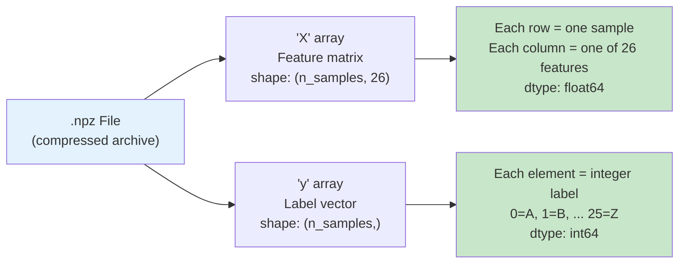
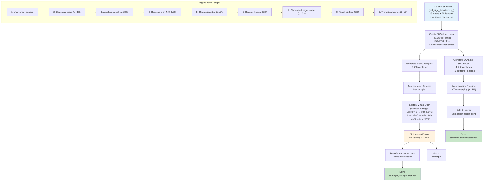
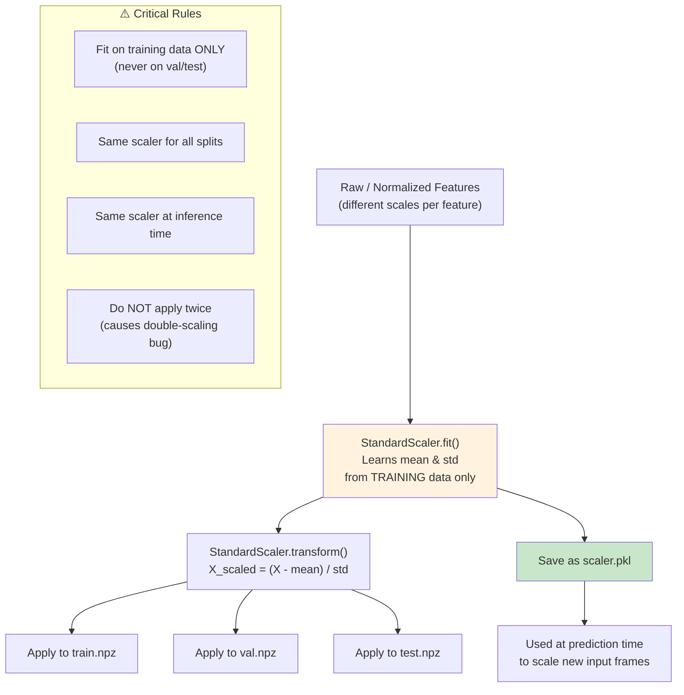
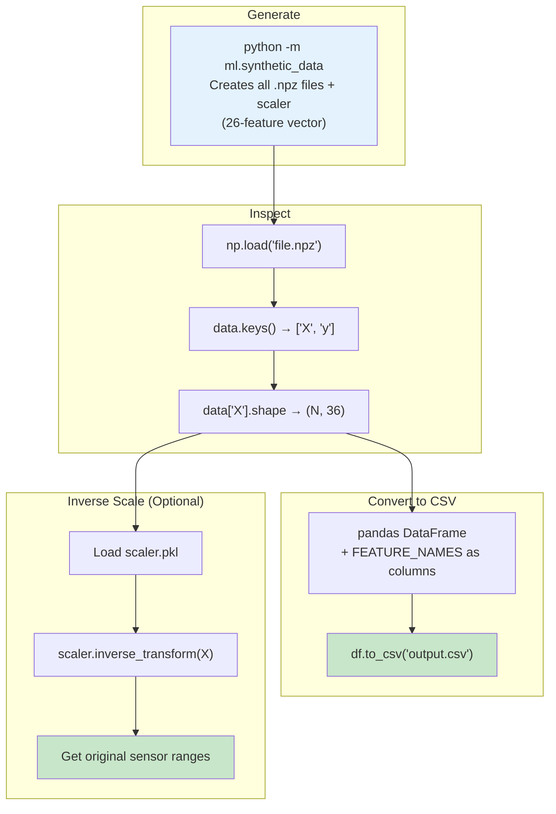

# Reading, Inspecting & Regenerating Synthetic Data

> **BSL Sign Language Gloves — Synthetic Data Formats Guide**
>
> This guide explains the `.npz` data format used throughout the project, how to load, inspect, and convert synthetic data to human-readable formats (CSV), and how to regenerate or customize synthetic datasets.

---

## Table of Contents

- [What Are .npz Files?](#what-are-npz-files)
- [Data Files in This Project](#data-files-in-this-project)
- [Loading and Inspecting .npz Files](#loading-and-inspecting-npz-files)
- [Understanding Feature Columns](#understanding-feature-columns)
- [Understanding Labels](#understanding-labels)
- [Converting .npz to CSV](#converting-npz-to-csv)
- [Visualizing Synthetic Data](#visualizing-synthetic-data)
- [Regenerating Synthetic Data](#regenerating-synthetic-data)
- [Customizing Data Generation](#customizing-data-generation)
- [Understanding the Generation Pipeline](#understanding-the-generation-pipeline)
- [Dynamic Data Format](#dynamic-data-format)
- [The Scaler File (scaler.pkl)](#the-scaler-file-scalerpkl)

---

## What Are .npz Files?

`.npz` is NumPy's compressed archive format for storing multiple arrays efficiently. It works like a ZIP file containing `.npy` arrays.



**Key advantages over CSV:**
- ~3–5× smaller file size (compressed)
- ~10× faster loading (binary, no parsing)
- Preserves exact data types (no float precision loss)
- Can store multiple named arrays in one file

---

## Data Files in This Project

### Static Data (Single-Frame Classification)

| File                              | Samples | Features | Purpose           | Scaled? |
|-----------------------------------|---------|----------|-------------------|---------|
| `data/raw/synthetic/static_dataset.npz` | 130,000 | **26**   | Raw generated data | No      |
| `data/processed/train.npz`        | 91,000  | **26**   | Training set (70%) | **Yes** |
| `data/processed/val.npz`          | 26,000  | **26**   | Validation set (15%)| **Yes** |
| `data/processed/test.npz`         | 13,000  | **26**   | Test set (15%)     | **Yes** |

### Dynamic Data (100-Frame Sequences)

| File                                   | Sequences | Shape per Seq | Classes | Purpose     |
|----------------------------------------|-----------|---------------|---------|-------------|
| `data/raw/synthetic/dynamic_dataset.npz`| Varies    | **(100, 26)** | 7       | Raw dynamic |
| `data/processed/dynamic_train.npz`      | ~70%      | **(100, 26)** | 7       | Training    |
| `data/processed/dynamic_val.npz`        | ~15%      | **(100, 26)** | 7       | Validation  |
| `data/processed/dynamic_test.npz`       | ~15%      | **(100, 26)** | 7       | Test        |

### Other Files

| File                         | Format  | Contents                                    |
|------------------------------|---------|---------------------------------------------|
| `data/processed/scaler.pkl`  | Pickle  | StandardScaler fitted on training data       |

---

## Loading and Inspecting .npz Files

### Basic Loading

```python
import numpy as np

# Load a .npz file
data = np.load('data/processed/train.npz')

# List all arrays in the file
print("Arrays:", list(data.keys()))
# Output: Arrays: ['X', 'y']

# Access arrays
X = data['X']  # Feature matrix
y = data['y']  # Labels

print(f"Features shape: {X.shape}")   # (91000, 26)
print(f"Labels shape:   {y.shape}")   # (91000,)
print(f"Feature dtype:  {X.dtype}")   # float64
print(f"Label dtype:    {y.dtype}")   # int64
```

### Detailed Inspection

```python
import numpy as np

def inspect_npz(filepath):
    """Print detailed information about an .npz file."""
    data = np.load(filepath)

    print(f"File: {filepath}")
    print(f"Arrays: {list(data.keys())}")
    print()

    for key in data.keys():
        arr = data[key]
        print(f"  [{key}]")
        print(f"    Shape: {arr.shape}")
        print(f"    Dtype: {arr.dtype}")
        print(f"    Min:   {arr.min():.6f}")
        print(f"    Max:   {arr.max():.6f}")
        print(f"    Mean:  {arr.mean():.6f}")
        print(f"    Std:   {arr.std():.6f}")
        if arr.ndim == 1:
            unique = np.unique(arr)
            print(f"    Unique values: {len(unique)} → {unique[:10]}{'...' if len(unique) > 10 else ''}")
        print()

# Inspect all data files
for path in [
    'data/processed/train.npz',
    'data/processed/val.npz',
    'data/processed/test.npz',
]:
    inspect_npz(path)
```

### View Specific Samples

```python
import numpy as np

data = np.load('data/processed/test.npz')
X, y = data['X'], data['y']

# View first 5 samples
print("First 5 samples:")
for i in range(5):
    label_letter = chr(ord('A') + y[i])
    print(f"  Sample {i}: label={label_letter} ({y[i]}), features={X[i][:5]}... (first 5 of 36)")

# View all samples for a specific letter
letter = 'A'
letter_idx = ord(letter) - ord('A')
mask = y == letter_idx
X_letter = X[mask]
print(f"\nLetter '{letter}': {X_letter.shape[0]} samples")
print(f"  Feature means: {X_letter.mean(axis=0)[:5]}...")
print(f"  Feature stds:  {X_letter.std(axis=0)[:5]}...")
```

---

## Understanding Feature Columns

Each of the 26 columns in the `X` array corresponds to a specific sensor feature. The complete mapping is defined in `ml/config.py`:

```python
from ml.config import FEATURE_NAMES

# Print all 36 feature names with their indices
for i, name in enumerate(FEATURE_NAMES):
    print(f"  Column {i:2d}: {name}")
```

**Output:**
```
  Column  0: R_flex_thumb
  Column  1: R_flex_index
  Column  2: R_flex_middle
  Column  3: R_flex_ring
  Column  4: R_flex_pinky
  Column  5: L_flex_thumb
  Column  6: L_flex_index
  Column  7: L_flex_middle
  Column  8: L_flex_ring
  Column  9: L_flex_pinky
  Column 10: R_fsr_thumb
  Column 11: R_fsr_index
  Column 12: R_fsr_pinky
  Column 13: L_fsr_thumb
  Column 14: L_fsr_index
  Column 15: L_fsr_pinky
  Column 16: R_roll
  Column 17: R_pitch
  Column 18: R_yaw
  Column 19: L_roll
  Column 20: L_pitch
  Column 21: L_yaw
  Column 22: R_hand_openness
  Column 23: L_hand_openness
  Column 24: inter_hand_delta_roll
  Column 25: inter_hand_delta_pitch
```

> **Change from v1.1:** Columns 12/15 renamed `fsr_pad` → `fsr_pinky` (FSR relocated to pinky fingertip). Columns 16–25 (touch features) removed entirely. Orientation/derived features renumbered 16–25 (were 26–35).

### Feature Groups

Features are organized into groups for ablation studies:

| Group         | Indices | Count | Description                    |
|---------------|---------|-------|--------------------------------|
| `flex`        | 0–9     | 10    | Finger curl (both hands)       |
| `fsr`         | 10–15   | 6     | Pressure sensors (thumb/index/pinky tips) |
| `orientation` | 16–21   | 6     | Euler angles (roll/pitch/yaw)  |
| `derived`     | 22–25   | 4     | Hand openness + inter-hand delta |

> **Removed group:** `touch` (was indices 16–25, 10 features) — capacitive touch pins removed from hardware.

---

## Understanding Labels

Labels are integer-encoded: `0` = A, `1` = B, ..., `25` = Z.

```python
import numpy as np
from ml.config import LETTERS, LETTER_TO_IDX, IDX_TO_LETTER

data = np.load('data/processed/test.npz')
y = data['y']

# Count samples per letter
unique, counts = np.unique(y, return_counts=True)
print("Label distribution:")
for idx, count in zip(unique, counts):
    print(f"  {IDX_TO_LETTER[idx]} (index {idx}): {count} samples")

# Convert numeric labels to letter strings
y_letters = [IDX_TO_LETTER[i] for i in y]
print(f"\nFirst 10 labels: {y_letters[:10]}")
```

### Label Mapping Reference

| Letter | Index | Type    | Letter | Index | Type    |
|--------|-------|---------|--------|-------|---------|
| A      | 0     | Static  | N      | 13    | Static  |
| B      | 1     | Static  | O      | 14    | Static  |
| C      | 2     | Static  | P      | 15    | Static  |
| D      | 3     | Static  | Q      | 16    | Static  |
| E      | 4     | Static  | R      | 17    | Static  |
| F      | 5     | Static  | S      | 18    | Static  |
| G      | 6     | Static  | T      | 19    | Static  |
| H      | 7     | Static  | U      | 20    | Static  |
| I      | 8     | Static  | V      | 21    | Static  |
| J      | 9     | **Dynamic** | W  | 22    | Static  |
| K      | 10    | Static  | X      | 23    | Static  |
| L      | 11    | Static  | Y      | 24    | Static  |
| M      | 12    | Static  | Z      | 25    | **Dynamic** |

---

## Converting .npz to CSV

### Convert Static Data to CSV with Headers

```python
"""npz_to_csv.py — Convert .npz files to human-readable CSV format."""

import numpy as np
import csv
from pathlib import Path

# Import feature names and label mapping
from ml.config import FEATURE_NAMES, IDX_TO_LETTER


def npz_to_csv(npz_path, csv_path):
    """Convert an .npz file to CSV with feature name headers.

    Args:
        npz_path: Path to input .npz file
        csv_path: Path to output .csv file
    """
    data = np.load(npz_path)
    X = data['X']
    y = data['y']

    # Create header: label + 36 feature names
    header = ['label', 'label_index'] + list(FEATURE_NAMES)

    with open(csv_path, 'w', newline='') as f:
        writer = csv.writer(f)
        writer.writerow(header)

        for i in range(len(X)):
            letter = IDX_TO_LETTER[int(y[i])]
            row = [letter, int(y[i])] + [f"{val:.6f}" for val in X[i]]
            writer.writerow(row)

    print(f"Converted {npz_path} → {csv_path}")
    print(f"  Rows: {len(X)}, Columns: {len(header)}")


# Convert all splits
if __name__ == '__main__':
    for split in ['train', 'val', 'test']:
        npz_to_csv(
            f'data/processed/{split}.npz',
            f'data/processed/{split}.csv',
        )
```

### Quick One-Liner Conversion

```python
import numpy as np
import pandas as pd
from ml.config import FEATURE_NAMES, IDX_TO_LETTER

data = np.load('data/processed/test.npz')
df = pd.DataFrame(data['X'], columns=FEATURE_NAMES)
df.insert(0, 'label', [IDX_TO_LETTER[i] for i in data['y']])
df.to_csv('data/processed/test.csv', index=False)
print(f"Saved {len(df)} rows to test.csv")
```

### CSV Output Example

```csv
label,label_index,R_flex_thumb,R_flex_index,R_flex_middle,...,inter_hand_delta_pitch
A,0,-0.423156,1.892341,-0.761245,...,0.045231
A,0,-0.398764,1.856723,-0.742156,...,0.052187
B,1,0.156789,0.143256,0.167890,...,-0.023456
...
```

> **Note:** The processed data is StandardScaler-transformed (zero mean, unit variance), so values will be in approximately [-3, +3] range, not the original sensor ranges.

### Convert to Unscaled Values

To get back the original (pre-scaled) feature values:

```python
import numpy as np
import pickle
import pandas as pd
from ml.config import FEATURE_NAMES, IDX_TO_LETTER

# Load scaler
with open('data/processed/scaler.pkl', 'rb') as f:
    scaler = pickle.load(f)

# Load and inverse-transform
data = np.load('data/processed/test.npz')
X_original = scaler.inverse_transform(data['X'])

# Save as CSV with original values
df = pd.DataFrame(X_original, columns=FEATURE_NAMES)
df.insert(0, 'label', [IDX_TO_LETTER[i] for i in data['y']])
df.to_csv('data/processed/test_unscaled.csv', index=False)
print("Saved unscaled CSV — values in original sensor ranges")
```

---

## Visualizing Synthetic Data

### Feature Distribution per Letter

```python
import numpy as np
import matplotlib.pyplot as plt
from ml.config import FEATURE_NAMES, IDX_TO_LETTER

data = np.load('data/processed/test.npz')
X, y = data['X'], data['y']

# Plot distribution of R_flex_index (column 1) per letter
feature_idx = 1
feature_name = FEATURE_NAMES[feature_idx]

fig, ax = plt.subplots(figsize=(14, 5))
for letter_idx in range(26):
    mask = y == letter_idx
    ax.violinplot(X[mask, feature_idx], positions=[letter_idx], showmeans=True, widths=0.8)

ax.set_xticks(range(26))
ax.set_xticklabels([IDX_TO_LETTER[i] for i in range(26)])
ax.set_xlabel('BSL Letter')
ax.set_ylabel(f'{feature_name} (scaled)')
ax.set_title(f'Distribution of {feature_name} across BSL Letters')
plt.tight_layout()
plt.savefig('data/figures/feature_distribution.png', dpi=150)
plt.show()
```

### Sample Count Verification

```python
import numpy as np

for split in ['train', 'val', 'test']:
    data = np.load(f'data/processed/{split}.npz')
    unique, counts = np.unique(data['y'], return_counts=True)
    print(f"{split}: {len(data['X'])} total, {len(unique)} classes, "
          f"min={counts.min()}, max={counts.max()}, balanced={'Yes' if counts.min() == counts.max() else 'No'}")
```

---

## Regenerating Synthetic Data

### Default Generation (Full Dataset)

```bash
python -m ml.synthetic_data
```

This generates:
- 130,000 static samples (5,000 per letter × 26 letters)
- Dynamic sequences for J, Z + 5 distractor classes
- 10 virtual user profiles
- Full augmentation pipeline
- Train/val/test splits with no user leakage
- StandardScaler fitted on training data

### Quick Generation (For Testing)

```bash
python -m ml.synthetic_data --quick
```

Generates 100 samples per sign instead of 5,000 — completes in seconds.

### Generation Pipeline



---

## Customizing Data Generation

All generation parameters are in `ml/config.py` under the `DATA_GEN` dictionary:

```python
# ml/config.py — DATA_GEN section
DATA_GEN = {
    'n_per_sign': 5000,                # Samples per letter → 130K total
    'n_virtual_users': 10,             # Virtual user profiles
    'virtual_user_offset': 0.10,       # ±10% baseline calibration offset

    # Augmentation
    'noise_sigma': 0.03,              # Gaussian noise σ = 3% of range
    'amplitude_scale': 0.08,          # ±8% amplitude scaling
    'baseline_shift_sigma': 0.03,     # N(0, 0.03) additive shift
    'orientation_jitter_deg': 15.0,   # ±15° orientation jitter
    'sensor_dropout_prob': 0.05,      # 5% per sensor per sample
    'time_warp_range': 0.15,          # ±15% time warping (dynamic)
    'correlated_finger_rho': 0.3,     # Adjacent finger noise correlation
    'transition_frames': (5, 10),     # Interpolated frames between poses

    # Distractor classes
    'n_distractor_classes': 5,        # Random gestures
    'n_distractor_samples': 500,      # Samples per distractor

    # Data split
    'train_ratio': 0.70,
    'val_ratio': 0.15,
    'test_ratio': 0.15,
}
```

### Common Customizations

| Goal                       | Parameter to Change          | Example                         |
|----------------------------|-----------------------------|---------------------------------|
| More samples per sign       | `n_per_sign`                | `10000` (→ 260K total)         |
| More noise                  | `noise_sigma`               | `0.06` (6% noise)             |
| Less augmentation           | Set all aug params to 0     | Minimal augmentation           |
| More virtual users          | `n_virtual_users`           | `20` users                     |
| More distractors            | `n_distractor_classes`      | `8` distractor types           |
| Different train/test split  | `train_ratio`, etc.         | `0.80 / 0.10 / 0.10`          |

### Example: Generate High-Noise Dataset

```python
# In ml/config.py, modify DATA_GEN:
DATA_GEN['noise_sigma'] = 0.06        # 2× noise
DATA_GEN['orientation_jitter_deg'] = 30.0  # 2× jitter
DATA_GEN['sensor_dropout_prob'] = 0.10     # 2× dropout
```

Then regenerate:
```bash
python -m ml.synthetic_data
```

---

## Dynamic Data Format

Dynamic data files store 3D arrays — each sample is a **sequence** of 100 frames:

```python
import numpy as np

data = np.load('data/processed/dynamic_test.npz')
X = data['X']  # Shape: (n_sequences, 100, 36)
y = data['y']  # Shape: (n_sequences,)

print(f"Sequences: {X.shape[0]}")
print(f"Frames per sequence: {X.shape[1]}")   # 100 (2 seconds at 50 Hz)
print(f"Features per frame: {X.shape[2]}")     # 26

# View one sequence
seq_idx = 0
print(f"\nSequence {seq_idx} (label={y[seq_idx]}):")
print(f"  First frame:  {X[seq_idx, 0, :5]}...")
print(f"  Middle frame: {X[seq_idx, 50, :5]}...")
print(f"  Last frame:   {X[seq_idx, 99, :5]}...")
```

### Dynamic Class Labels

| Index | Class Name        | Type       |
|-------|-------------------|------------|
| 0     | J                 | BSL letter |
| 1     | Z                 | BSL letter |
| 2     | wave_horizontal   | Distractor |
| 3     | wave_vertical     | Distractor |
| 4     | scratch           | Distractor |
| 5     | adjust_glove      | Distractor |
| 6     | random_gesture    | Distractor |

### Convert Dynamic Data to CSV

```python
"""dynamic_npz_to_csv.py — Convert dynamic .npz to CSV (one row per frame)."""

import numpy as np
import csv
from ml.config import FEATURE_NAMES

DYNAMIC_CLASSES = ['J', 'Z', 'wave_horizontal', 'wave_vertical',
                   'scratch', 'adjust_glove', 'random_gesture']

data = np.load('data/processed/dynamic_test.npz')
X, y = data['X'], data['y']

header = ['sequence_id', 'frame_idx', 'label'] + list(FEATURE_NAMES)

with open('data/processed/dynamic_test.csv', 'w', newline='') as f:
    writer = csv.writer(f)
    writer.writerow(header)

    for seq_idx in range(len(X)):
        label = DYNAMIC_CLASSES[y[seq_idx]]
        for frame_idx in range(X.shape[1]):
            row = [seq_idx, frame_idx, label] + [f"{v:.6f}" for v in X[seq_idx, frame_idx]]
            writer.writerow(row)

print(f"Saved {len(X)} sequences × {X.shape[1]} frames = {len(X) * X.shape[1]} rows")
```

---

## The Scaler File (scaler.pkl)

The `scaler.pkl` file contains a fitted `sklearn.preprocessing.StandardScaler` instance.

### What It Stores

```python
import pickle

with open('data/processed/scaler.pkl', 'rb') as f:
    scaler = pickle.load(f)

print(f"Type: {type(scaler)}")
print(f"Features seen: {scaler.n_features_in_}")
print(f"Samples seen: {scaler.n_samples_seen_}")
print()

from ml.config import FEATURE_NAMES
print("Per-feature statistics:")
print(f"{'Feature':<30} {'Mean':>10} {'Std':>10}")
print("-" * 52)
for i, name in enumerate(FEATURE_NAMES):
    print(f"{name:<30} {scaler.mean_[i]:>10.4f} {scaler.scale_[i]:>10.4f}")
```

### Why the Scaler Matters



### Using the Scaler for New Data

```python
import pickle
import numpy as np

# Load saved scaler
with open('data/processed/scaler.pkl', 'rb') as f:
    scaler = pickle.load(f)

# Scale a new feature vector (e.g., from real sensor)
new_features = np.array([0.35, 0.0, 0.97, ...])  # 36 features
new_features_scaled = scaler.transform(new_features.reshape(1, -1))

# Or inverse-transform to get original scale
original_features = scaler.inverse_transform(new_features_scaled)
```

---

## Full Workflow Summary



---

*Related documentation:*
- *[guide-train-from-scratch.md](guide-train-from-scratch.md) — Full training pipeline*
- *[guide-sensor-data-collection.md](guide-sensor-data-collection.md) — Sensor formats and collection*
- *[guide-train-with-real-data.md](guide-train-with-real-data.md) — Training with real data*
- *[guide-backend-integration.md](guide-backend-integration.md) — Backend for model inference*
