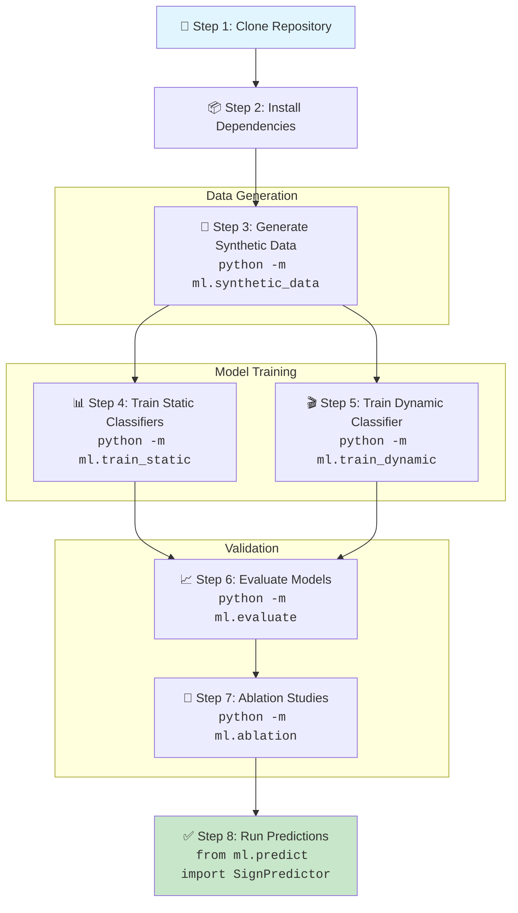
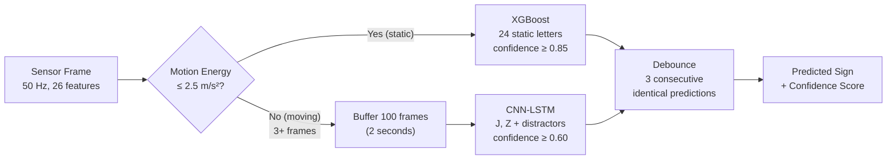
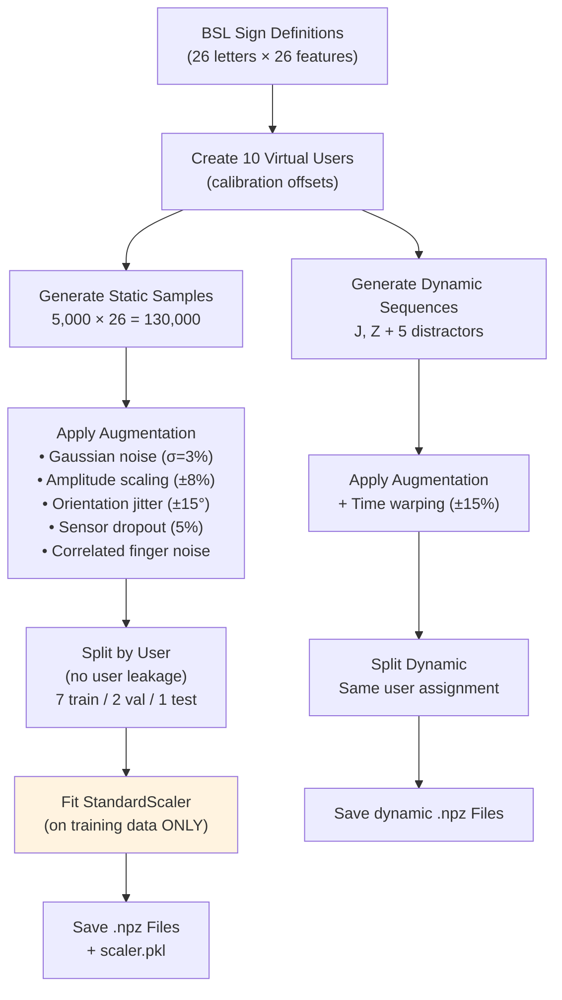
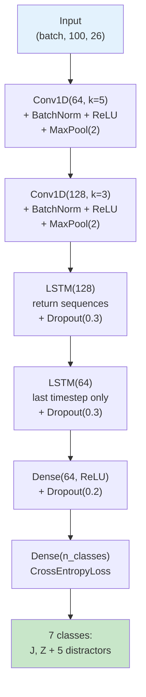
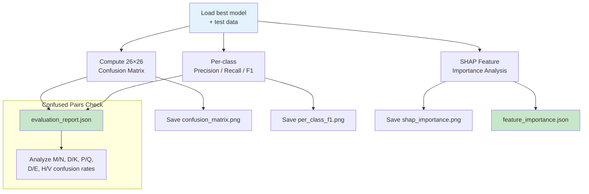

# How to Train & Run ML Models from Scratch on a New Machine

> **BSL Sign Language Gloves — ML Pipeline Setup & Training Guide**
>
> This guide walks you through setting up the complete ML pipeline on a fresh machine, generating synthetic data, training all models, and verifying results.

---

## Table of Contents

- [Prerequisites](#prerequisites)
- [Architecture Overview](#architecture-overview)
- [Step 1 — Clone the Repository](#step-1--clone-the-repository)
- [Step 2 — Set Up Python Environment](#step-2--set-up-python-environment)
- [Step 3 — Generate Synthetic Data](#step-3--generate-synthetic-data)
- [Step 4 — Train Static Classifiers](#step-4--train-static-classifiers)
- [Step 5 — Train Dynamic Classifier](#step-5--train-dynamic-classifier)
- [Step 6 — Evaluate Models](#step-6--evaluate-models)
- [Step 7 — Run Ablation Studies](#step-7--run-ablation-studies)
- [Step 8 — Run Predictions](#step-8--run-predictions)
- [Quick Test Mode](#quick-test-mode)
- [Expected Outputs Summary](#expected-outputs-summary)
- [Verification Checklist](#verification-checklist)
- [Troubleshooting](#troubleshooting)

---

## Prerequisites

| Requirement        | Details                                                       |
|--------------------|---------------------------------------------------------------|
| **Operating System** | Windows 10/11, macOS 12+, or Ubuntu 20.04+                  |
| **Python**          | 3.11 or higher (tested on 3.11–3.14)                        |
| **RAM**             | Minimum 8 GB (16 GB recommended for full grid search)        |
| **Disk Space**      | ~500 MB for data + models                                    |
| **GPU**             | Optional — PyTorch CPU training works fine for this dataset   |
| **Git**             | For cloning the repository                                   |

### Required Python Packages

| Package          | Purpose                                      | Minimum Version |
|------------------|----------------------------------------------|-----------------|
| `numpy`          | Numerical computation, data arrays           | 1.24+           |
| `scikit-learn`   | XGBoost/RF/SVM, GridSearchCV, metrics        | 1.3+            |
| `xgboost`        | XGBoost classifier                           | 2.0+            |
| `torch`          | CNN-LSTM model (PyTorch)                     | 2.0+            |
| `scipy`          | Quaternion → Euler conversion                | 1.11+           |
| `matplotlib`     | Visualization and plotting                   | 3.7+            |
| `seaborn`        | Enhanced confusion matrix heatmaps           | 0.12+           |
| `shap`           | Feature importance analysis                  | 0.42+           |
| `pandas`         | Data manipulation (optional, for CSV export) | 2.0+            |

---

## Architecture Overview

The ML pipeline uses a **two-stage classification** system: one for static signs (24 letters) and one for dynamic signs (J, Z + distractors).



### Two-Stage Pipeline Architecture



---

## Step 1 — Clone the Repository

```bash
git clone <repository-url> sign_gloves_ML_models
cd sign_gloves_ML_models
```

Verify the directory structure:

```
sign_gloves_ML_models/
├── ml/                          # Python ML package
│   ├── __init__.py
│   ├── config.py                # Central configuration (all constants)
│   ├── bsl_sign_definitions.py  # 26 BSL letter sensor signatures
│   ├── synthetic_data.py        # Synthetic data generation
│   ├── feature_engineering.py   # Raw sensor → 26-feature transform
│   ├── train_static.py          # XGBoost / RF / SVM training
│   ├── train_dynamic.py         # CNN-LSTM training (PyTorch)
│   ├── evaluate.py              # Evaluation & SHAP analysis
│   ├── predict.py               # Unified prediction service
│   ├── segmentation.py          # Motion detection & segmentation
│   └── ablation.py              # Feature ablation studies
├── data/
│   ├── raw/synthetic/           # Raw generated datasets
│   ├── processed/               # Scaled train/val/test splits
│   ├── models/                  # Trained models & reports
│   └── figures/                 # Generated charts & plots
└── docs/                        # Documentation
```

---

## Step 2 — Set Up Python Environment

### Option A: Using `venv` (Recommended)

```bash
# Create virtual environment
python -m venv venv

# Activate it
# Windows:
venv\Scripts\activate
# macOS / Linux:
source venv/bin/activate

# Install all dependencies
pip install numpy scipy scikit-learn xgboost torch matplotlib seaborn shap pandas
```

### Option B: Using Conda

```bash
conda create -n bsl_gloves python=3.11 -y
conda activate bsl_gloves

pip install numpy scipy scikit-learn xgboost torch matplotlib seaborn shap pandas
```

### Option C: Using a Requirements File

Create a `requirements.txt` in the project root:

```text
numpy>=1.24
scipy>=1.11
scikit-learn>=1.3
xgboost>=2.0
torch>=2.0
matplotlib>=3.7
seaborn>=0.12
shap>=0.42
pandas>=2.0
```

Then install:

```bash
pip install -r requirements.txt
```

### Verify Installation

```bash
python -c "import numpy, scipy, sklearn, xgboost, torch, matplotlib, seaborn, shap; print('All packages OK')"
```

> **Note on PyTorch:** If you have an NVIDIA GPU and want GPU-accelerated training, install the CUDA version of PyTorch from [pytorch.org](https://pytorch.org/get-started/locally/). For this dataset size (~130K static samples), CPU training completes in under 5 minutes.

---

## Step 3 — Generate Synthetic Data

This step creates 130,000 static samples (5,000 per letter × 26) and dynamic sequences for J, Z, plus 5 distractor gesture classes.

```bash
python -m ml.synthetic_data
```

### What Happens



### Generated Files

| File                                | Contents                                  | Approx Size |
|-------------------------------------|-------------------------------------------|-------------|
| `data/raw/synthetic/static_dataset.npz`  | Raw unscaled static samples          | ~38 MB      |
| `data/raw/synthetic/dynamic_dataset.npz` | Raw dynamic sequences                | ~15 MB      |
| `data/processed/train.npz`              | Scaled static training set (70%)      | ~25 MB      |
| `data/processed/val.npz`                | Scaled static validation set (15%)    | ~5 MB       |
| `data/processed/test.npz`               | Scaled static test set (15%)          | ~3 MB       |
| `data/processed/dynamic_train.npz`      | Dynamic training sequences            | ~10 MB      |
| `data/processed/dynamic_val.npz`        | Dynamic validation sequences          | ~2 MB       |
| `data/processed/dynamic_test.npz`       | Dynamic test sequences                | ~1 MB       |
| `data/processed/scaler.pkl`             | Fitted StandardScaler (reuse always!) | ~2 KB       |

### Verify

```bash
python -c "
import numpy as np
d = np.load('data/processed/train.npz')
print(f'Training: X={d[\"X\"].shape}, y={d[\"y\"].shape}')
d = np.load('data/processed/test.npz')
print(f'Test:     X={d[\"X\"].shape}, y={d[\"y\"].shape}')
"
```

Expected output:
```
Training: X=(91000, 26), y=(91000,)
Test:     X=(13000, 26), y=(13000,)
```

---

## Step 4 — Train Static Classifiers

Train three classifiers (XGBoost, Random Forest, SVM) with 5-fold stratified cross-validation and hyperparameter grid search.

```bash
python -m ml.train_static
```

### CLI Options

| Flag                | Description                                 |
|---------------------|---------------------------------------------|
| *(no flags)*        | Full grid search (all 3 models)            |
| `--quick`           | Reduced hyperparameter grids (fast test)   |
| `--model xgb`       | Train only XGBoost                         |
| `--model rf`         | Train only Random Forest                   |
| `--model svm`        | Train only SVM                             |

### Hyperparameter Search Spaces

**XGBoost** (default grid — 27 combinations):
- `n_estimators`: [200, 300, 500]
- `max_depth`: [4, 6, 8]
- `learning_rate`: [0.05, 0.1, 0.15]
- Fixed: `subsample=0.8`, `colsample_bytree=0.8`, `min_child_weight=3`

**Random Forest** (default grid — 48 combinations):
- `n_estimators`: [200, 300, 500]
- `max_depth`: [8, 12, 16, None]
- `min_samples_split`: [2, 5], `min_samples_leaf`: [1, 2]

**SVM** (default grid — 6 combinations):
- `C`: [0.1, 1.0, 10.0]
- `gamma`: ['scale', 'auto']
- `kernel`: ['rbf']

### Generated Files

| File                                    | Description                           |
|-----------------------------------------|---------------------------------------|
| `data/models/xgboost_static_v1.pkl`     | Best XGBoost model (pickle)          |
| `data/models/rf_static_v1.pkl`          | Best Random Forest model (pickle)    |
| `data/models/svm_static_v1.pkl`         | Best SVM model (pickle)             |
| `data/models/training_report.json`      | CV scores, test accuracy, best params|

### Expected Results (on Synthetic Data)

| Model        | Best CV F1   | Val Accuracy | Test Accuracy |
|--------------|-------------|--------------|---------------|
| **XGBoost**  | ~0.980      | ~97.8%       | **~97.4%**    |
| Random Forest| ~0.971      | ~96.9%       | ~96.5%        |
| SVM          | ~0.973      | ~97.2%       | ~96.7%        |

> **Note:** Full grid search may take 5–15 minutes depending on CPU. Use `--quick` for a fast sanity check (~1 minute).

---

## Step 5 — Train Dynamic Classifier

Train the CNN-LSTM model for dynamic gesture recognition (J, Z + 5 distractor gestures).

```bash
python -m ml.train_dynamic
```

### CLI Options

| Flag                | Description                          |
|---------------------|--------------------------------------|
| *(no flags)*        | Full training (100 max epochs)      |
| `--quick`           | Quick test (10 epochs)              |
| `--epochs 50`       | Custom epoch count                  |

### CNN-LSTM Architecture



### Training Configuration

| Parameter          | Value                                    |
|--------------------|------------------------------------------|
| Optimizer          | Adam (lr=0.001)                          |
| Loss Function      | CrossEntropyLoss                         |
| Batch Size         | 32                                       |
| Max Epochs         | 100                                      |
| Early Stopping     | Patience = 10 (on validation loss)       |
| LR Scheduler       | ReduceOnPlateau (factor=0.5, patience=5) |
| Model Parameters   | ~223,047                                 |

### Generated Files

| File                                         | Description                        |
|----------------------------------------------|------------------------------------|
| `data/models/cnn_lstm_dynamic_v1.pt`          | PyTorch model checkpoint          |
| `data/models/dynamic_training_report.json`    | Epochs, losses, accuracies         |

### Expected Results

| Metric          | Target  | Expected (Synthetic) |
|-----------------|---------|----------------------|
| Test Accuracy   | ≥ 88%   | ~100%                |
| Convergence     | —       | ~10–33 epochs         |

> **Note:** 100% accuracy on synthetic dynamic data is expected and normal — the J/Z motion trajectories are quite distinct. Real data will require retraining.

---

## Step 6 — Evaluate Models

Run the comprehensive evaluation suite on the best static model.

```bash
python -m ml.evaluate
```

### CLI Options

| Flag                | Description                            |
|---------------------|----------------------------------------|
| *(no flags)*        | Evaluate best model with SHAP          |
| `--model xgb`       | Evaluate specific model                |
| `--skip-shap`       | Skip SHAP analysis (much faster)       |

### Evaluation Pipeline



### Generated Files

| File                                      | Description                              |
|-------------------------------------------|------------------------------------------|
| `data/models/evaluation_report.json`       | Full metrics, per-class stats            |
| `data/models/feature_importance.json`      | SHAP importance per feature              |
| `data/figures/confusion_matrix_*.png`      | 26×26 heatmap                            |
| `data/figures/per_class_f1_*.png`          | Per-letter F1 bar chart                  |
| `data/figures/shap_importance_*.png`       | Top 20 feature importance chart          |

### Target Metrics

| Metric                              | Target        |
|--------------------------------------|---------------|
| Overall test accuracy                | ≥ 92%         |
| All letters precision                 | ≥ 80%         |
| Confused pairs with >10% confusion  | ≤ 5 pairs      |

---

## Step 7 — Run Ablation Studies

Test model resilience by removing feature groups and adding noise.

```bash
python -m ml.ablation
```

### CLI Options

| Flag         | Description                                |
|--------------|--------------------------------------------|
| *(no flags)* | Full ablation study                        |
| `--quick`    | Single reduced hyperparameter grid         |

### What Gets Tested

**Feature Group Ablation** — Remove each group independently and retrain:

| Group          | Feature Indices | What It Contains                        |
|----------------|-----------------|------------------------------------------|
| `flex`         | 0–9             | Finger curl (right + left)              |
| `fsr`          | 10–15           | Pressure sensors (thumb, index, pinky)  |
| `orientation`  | 16–21           | Euler angles (roll/pitch/yaw)           |
| `derived`      | 22–25           | Hand openness + inter-hand delta        |

**Noise Robustness** — Test at increasing noise levels: σ = [0.01, 0.03, 0.06, 0.09, 0.12, 0.15]

### Target Metrics

| Metric                       | Target  |
|-------------------------------|---------|
| Accuracy after any group removal | ≥ 70%  |
| Accuracy at 2× training noise    | ≥ 85%  |

### Generated Files

| File                                     | Description                       |
|------------------------------------------|-----------------------------------|
| `data/models/ablation_table.json`         | Accuracy per removed group        |
| `data/figures/ablation_accuracy.png`      | Bar chart of group removal impact |
| `data/figures/noise_robustness.png`       | Accuracy vs. noise level curve    |

---

## Step 8 — Run Predictions

Use the trained models for inference:

```python
from ml.predict import SignPredictor

# Initialize predictor (loads all models + scaler automatically)
predictor = SignPredictor()

# For each sensor frame:
import numpy as np

# Example: 26-feature vector (already normalized)
feature_vec = np.random.randn(26)  # Replace with real features
accel_xyz = np.array([0.1, -0.2, 9.8])  # Accelerometer reading

sign, confidence = predictor.predict(feature_vec, accel_xyz)
if sign is not None:
    print(f"Predicted: {sign} (confidence: {confidence:.2f})")
```

The predictor:
1. Computes motion energy from accelerometer data
2. Routes to **XGBoost** (ME ≤ 2.5 m/s²) or **CNN-LSTM** (ME > 2.5 for 3+ frames)
3. Applies confidence thresholds (static ≥ 0.85, dynamic ≥ 0.60)
4. Debounces output (3 consecutive identical predictions → emit)

---

## Quick Test Mode

To verify everything works without waiting for full training, use `--quick` flags throughout:

```bash
# Generate fewer samples (100/sign instead of 5,000)
python -m ml.synthetic_data --quick

# Reduced hyperparameter grids
python -m ml.train_static --quick

# Only 10 epochs
python -m ml.train_dynamic --quick

# Evaluate (skip SHAP for speed)
python -m ml.evaluate --skip-shap

# Quick ablation
python -m ml.ablation --quick
```

> **Quick mode completes the entire pipeline in ~2–5 minutes** vs. 15–30 minutes for full mode.

---

## Expected Outputs Summary

After running the full pipeline, your `data/` directory should contain:

```
data/
├── raw/synthetic/
│   ├── static_dataset.npz          ← Raw generated data
│   └── dynamic_dataset.npz
├── processed/
│   ├── train.npz                   ← 91,000 scaled training samples
│   ├── val.npz                     ← 26,000 scaled validation samples
│   ├── test.npz                    ← 13,000 scaled test samples
│   ├── dynamic_train.npz           ← Dynamic training sequences
│   ├── dynamic_val.npz             ← Dynamic validation sequences
│   ├── dynamic_test.npz            ← Dynamic test sequences
│   └── scaler.pkl                  ← StandardScaler (fitted on train)
├── models/
│   ├── xgboost_static_v1.pkl       ← Best static classifier
│   ├── rf_static_v1.pkl            ← Random Forest model
│   ├── svm_static_v1.pkl           ← SVM model
│   ├── cnn_lstm_dynamic_v1.pt      ← CNN-LSTM (PyTorch)
│   ├── training_report.json        ← Static training results
│   ├── dynamic_training_report.json ← Dynamic training results
│   ├── evaluation_report.json      ← Full evaluation metrics
│   ├── feature_importance.json     ← SHAP feature importances
│   └── ablation_table.json         ← Ablation study results
└── figures/
    ├── confusion_matrix_*.png      ← 26×26 heatmap
    ├── per_class_f1_*.png          ← Per-letter F1 chart
    ├── shap_importance_*.png       ← Feature importance chart
    ├── ablation_accuracy.png       ← Group removal bar chart
    └── noise_robustness.png        ← Noise degradation curve
```

---

## Verification Checklist

After completing all steps, verify:

- [ ] `data/processed/train.npz` has shape `(91000, 26)` for X
- [ ] `data/processed/scaler.pkl` exists (critical for prediction)
- [ ] `training_report.json` shows XGBoost test accuracy ≥ 92%
- [ ] `dynamic_training_report.json` shows test accuracy ≥ 88%
- [ ] `evaluation_report.json` shows all per-class precision ≥ 80%
- [ ] No confused pairs exceed 10% confusion rate
- [ ] `ablation_table.json` shows ≥ 70% accuracy for all group removals
- [ ] Noise robustness at 2× shows ≥ 85% accuracy
- [ ] `SignPredictor()` initializes without errors

---

## Troubleshooting

### `ModuleNotFoundError: No module named 'ml'`

Run commands from the **project root directory** (where the `ml/` folder is):

```bash
cd sign_gloves_ML_models
python -m ml.synthetic_data
```

### `FileNotFoundError: data/processed/train.npz`

You need to generate data first:

```bash
python -m ml.synthetic_data
```

### `ImportError: No module named 'xgboost'`

Install missing dependency:

```bash
pip install xgboost
```

### PyTorch CUDA issues

If PyTorch GPU fails, force CPU mode — the dynamic training module auto-detects device:

```bash
# The code already handles this — it uses CUDA if available, falls back to CPU
# No manual config needed
```

### Out of Memory during Grid Search

If full grid search exceeds RAM, use quick mode or train models individually:

```bash
python -m ml.train_static --quick
# or
python -m ml.train_static --model xgb
```

### SHAP analysis is slow

Skip SHAP for faster evaluation:

```bash
python -m ml.evaluate --skip-shap
```

SHAP uses `KernelExplainer` for SVM (slow) and `TreeExplainer` for XGBoost/RF (fast). If evaluating XGBoost, SHAP should complete in a few seconds.

---

## Complete One-Line Pipeline

For a quick full run after setup:

```bash
python -m ml.synthetic_data && python -m ml.train_static && python -m ml.train_dynamic && python -m ml.evaluate && python -m ml.ablation
```

Quick test version:

```bash
python -m ml.synthetic_data --quick && python -m ml.train_static --quick && python -m ml.train_dynamic --quick && python -m ml.evaluate --skip-shap && python -m ml.ablation --quick
```

---

*Related documentation:*
- *[guide-train-with-real-data.md](guide-train-with-real-data.md) — Training with real sensor data*
- *[guide-sensor-data-collection.md](guide-sensor-data-collection.md) — How to collect sensor data*
- *[guide-synthetic-data-formats.md](guide-synthetic-data-formats.md) — Reading & regenerating synthetic data*
- *[guide-backend-integration.md](guide-backend-integration.md) — Building a backend for model inference*
