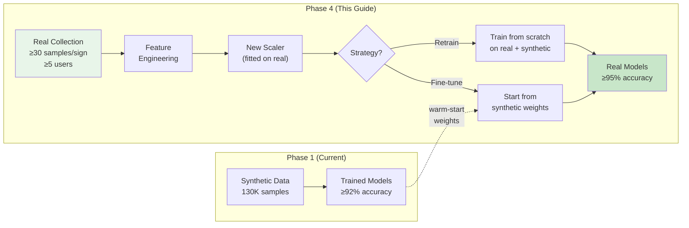
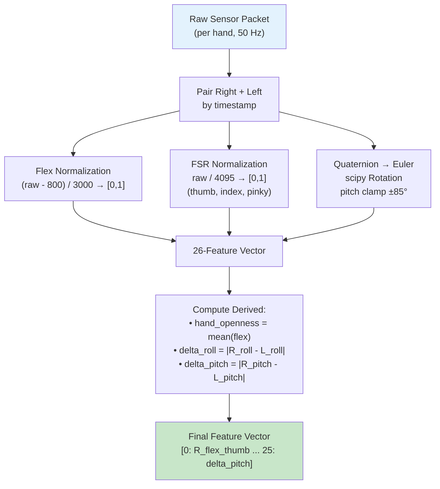
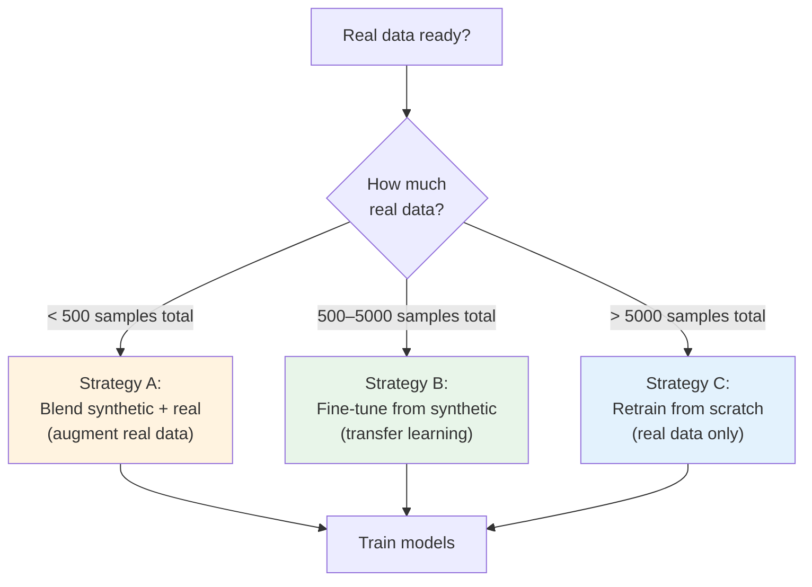
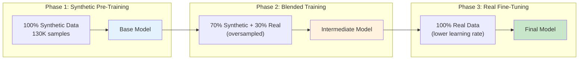

# How to Train Models with Real Sensor Data

> **BSL Sign Language Gloves — Real Data Training Guide**
>
> This guide explains how to transition from synthetic data to real sensor data collected from physical BSL fingerspelling gloves, covering data preparation, scaler fitting, fine-tuning strategies, and validation.

---

## Table of Contents

- [Overview: Synthetic → Real Data Transition](#overview-synthetic--real-data-transition)
- [Prerequisites](#prerequisites)
- [Real Data Format Requirements](#real-data-format-requirements)
- [Step 1 — Prepare Raw Sensor Recordings](#step-1--prepare-raw-sensor-recordings)
- [Step 2 — Convert Raw Data to 26 ML Features](#step-2--convert-raw-data-to-26-ml-features)
- [Step 3 — Create Train / Val / Test Splits](#step-3--create-train--val--test-splits)
- [Step 4 — Fit a New StandardScaler](#step-4--fit-a-new-standardscaler)
- [Step 5 — Choose a Training Strategy](#step-5--choose-a-training-strategy)
- [Step 6 — Train Static Classifier on Real Data](#step-6--train-static-classifier-on-real-data)
- [Step 7 — Fine-Tune Dynamic Classifier](#step-7--fine-tune-dynamic-classifier)
- [Step 8 — Evaluate on Real Test Set](#step-8--evaluate-on-real-test-set)
- [Blending Synthetic + Real Data](#blending-synthetic--real-data)
- [Target Metrics](#target-metrics)
- [Common Pitfalls](#common-pitfalls)

---

## Overview: Synthetic → Real Data Transition

The project follows a phased development approach. Phase 1 uses synthetic data; Phase 4 transitions to real sensor data:



### Key Differences: Synthetic vs. Real Data

| Aspect                  | Synthetic                                     | Real                                         |
|-------------------------|-----------------------------------------------|----------------------------------------------|
| Sensor noise            | Gaussian (σ=3%)                               | Non-Gaussian, sensor-specific                |
| Drift                   | None                                          | Thermal, mechanical drift over time          |
| Cross-talk              | None                                          | Adjacent sensor interference                 |
| Calibration             | 10 virtual user offsets                       | Per-user, per-session calibration            |
| Sign variability        | Definition ± augmentation                     | Personal signing style                       |
| Transitions             | Synthetic interpolation                       | Natural hand movement                        |
| Expected accuracy       | ≥92% static, ≥88% dynamic                    | **≥95% static, ≥90% dynamic** (with tuning) |

---

## Prerequisites

Before starting, ensure you have:

1. **A trained synthetic baseline** — Complete [guide-train-from-scratch.md](guide-train-from-scratch.md) first
2. **Real sensor data collected** — See [guide-sensor-data-collection.md](guide-sensor-data-collection.md)
3. **Python environment set up** with all dependencies installed

---

## Real Data Format Requirements

Each real data sample must produce a **26-dimensional feature vector** matching the specification in `ml/config.py`:

| Index | Feature Name                  | Source                              | Range      |
|-------|-------------------------------|-------------------------------------|------------|
| 0–4   | `R_flex_thumb..pinky`         | Right flex sensors (normalized)     | [0, 1]     |
| 5–9   | `L_flex_thumb..pinky`         | Left flex sensors (normalized)      | [0, 1]     |
| 10–12 | `R_fsr_thumb/index/pinky`     | Right FSR sensors (normalized)      | [0, 1]     |
| 13–15 | `L_fsr_thumb/index/pinky`     | Left FSR sensors (normalized)       | [0, 1]     |
| 16–18 | `R_roll/pitch/yaw`            | Right Euler angles (degrees)        | [-180,180] |
| 19–21 | `L_roll/pitch/yaw`            | Left Euler angles (degrees)         | [-180,180] |
| 22–23 | `R/L_hand_openness`           | Mean of flex sensors per hand       | [0, 1]     |
| 24–25 | `inter_hand_delta_roll/pitch` | Absolute angle differences          | [0, 360]   |

> **Note:** Capacitive touch features have been removed. The third FSR per hand is now the **pinky fingertip** (previously the palm pad).

> **Critical:** The feature order and normalization must match exactly. Use the functions in `ml/feature_engineering.py` to transform raw sensor packets.

---

## Step 1 — Prepare Raw Sensor Recordings

Your collected data should be in one of these formats (see [guide-sensor-data-collection.md](guide-sensor-data-collection.md) for details):

### JSON Lines Format (`.jsonl` — Recommended)

One JSON object per sensor frame, with a sign label:

```json
{"label": "A", "hand_id": 1, "flex": [820, 830, 825, 815, 840], "fsr": [2650, 2890, 180], "quaternion": [0.92, 0.08, -0.37, 0.05], "accel": [-0.45, 3.21, 9.12], "gyro": [2.1, -1.4, 0.6], "timestamp_ms": 104523}
{"label": "A", "hand_id": 2, "flex": [810, 815, 820, 808, 830], "fsr": [100, 90, 50], "quaternion": [0.98, 0.02, -0.15, 0.01], "accel": [0.1, 0.3, 9.7], "gyro": [0.1, -0.2, 0.1], "timestamp_ms": 104523}
```

> **Note:** The `fsr` array has 3 values per hand: [thumb, index, pinky]. There is no `contact_bitmask` field — capacitive touch has been removed.

> **Note:** Each timestep has TWO frames — one per hand (`hand_id: 1` = right, `hand_id: 2` = left). You must pair them by timestamp before feature engineering.

### CSV Format

```csv
label,R_flex_0,R_flex_1,...,L_quat_w,L_quat_x,L_quat_y,L_quat_z,L_accel_x,L_accel_y,L_accel_z
A,820,830,825,815,840,810,815,820,808,830,2650,2890,180,100,90,50,8,0,0.92,0.08,-0.37,0.05,0.98,0.02,-0.15,0.01,...
```

---

## Step 2 — Convert Raw Data to 26 ML Features

Use the feature engineering module to transform raw sensor readings:

```python
"""convert_real_data.py — Transform raw sensor recordings into ML features."""

import json
import numpy as np
from pathlib import Path
from ml.feature_engineering import (
    normalize_flex,
    normalize_fsr,
    quaternion_to_euler,
)
from ml.config import FEATURE_NAMES, LETTER_TO_IDX

def process_paired_frame(right_packet, left_packet):
    """Convert a paired sensor frame (both hands) into a 26-feature vector."""
    features = np.zeros(26, dtype=np.float64)

    # Flex sensors (indices 0–9)
    features[0:5] = normalize_flex(right_packet['flex'])
    features[5:10] = normalize_flex(left_packet['flex'])

    # FSR sensors: thumb, index, pinky (indices 10–15)
    features[10:13] = normalize_fsr(right_packet['fsr'])
    features[13:16] = normalize_fsr(left_packet['fsr'])

    # Euler angles from quaternion (indices 16–21)
    features[16:19] = quaternion_to_euler(right_packet['quaternion'])
    features[19:22] = quaternion_to_euler(left_packet['quaternion'])

    # Derived: hand openness (indices 22–23)
    features[22] = np.mean(features[0:5])    # Right hand openness
    features[23] = np.mean(features[5:10])   # Left hand openness

    # Derived: inter-hand deltas (indices 24–25)
    features[24] = abs(features[16] - features[19])  # Delta roll
    features[25] = abs(features[17] - features[20])  # Delta pitch

    return features


def load_jsonl_recordings(filepath):
    """Load paired JSONL recordings and convert to feature arrays."""
    frames_by_ts = {}

    with open(filepath, 'r') as f:
        for line in f:
            packet = json.loads(line.strip())
            ts = packet['timestamp_ms']
            hand = packet['hand_id']
            if ts not in frames_by_ts:
                frames_by_ts[ts] = {}
            frames_by_ts[ts][hand] = packet

    X_list, y_list = [], []
    for ts in sorted(frames_by_ts.keys()):
        frame = frames_by_ts[ts]
        if 1 in frame and 2 in frame:  # Both hands present
            features = process_paired_frame(frame[1], frame[2])
            label_str = frame[1].get('label', frame[2].get('label'))
            if label_str and label_str in LETTER_TO_IDX:
                X_list.append(features)
                y_list.append(LETTER_TO_IDX[label_str])

    return np.array(X_list), np.array(y_list)


# --- Usage ---
if __name__ == '__main__':
    X, y = load_jsonl_recordings('data/raw/real/session_001.jsonl')
    print(f"Loaded {X.shape[0]} samples with {X.shape[1]} features")
    print(f"Labels: {np.unique(y)}")
```

### Feature Pipeline Diagram



---

## Step 3 — Create Train / Val / Test Splits

Split data with **no user leakage** — all samples from one user go into the same split:

```python
"""split_real_data.py — Create stratified train/val/test splits."""

import numpy as np
from collections import defaultdict

def split_by_user(X_all, y_all, user_ids, train_ratio=0.70, val_ratio=0.15):
    """Split data by user to prevent data leakage.

    Args:
        X_all: Feature arrays dict {user_id: np.ndarray}
        y_all: Label arrays dict {user_id: np.ndarray}
        user_ids: List of all user IDs
        train_ratio: Fraction for training
        val_ratio: Fraction for validation

    Returns:
        (X_train, y_train), (X_val, y_val), (X_test, y_test)
    """
    rng = np.random.RandomState(42)
    shuffled_users = list(user_ids)
    rng.shuffle(shuffled_users)

    n_users = len(shuffled_users)
    n_train = int(n_users * train_ratio)
    n_val = int(n_users * val_ratio)

    train_users = shuffled_users[:n_train]
    val_users = shuffled_users[n_train:n_train + n_val]
    test_users = shuffled_users[n_train + n_val:]

    def gather(users):
        Xs, ys = [], []
        for u in users:
            Xs.append(X_all[u])
            ys.append(y_all[u])
        return np.concatenate(Xs), np.concatenate(ys)

    return gather(train_users), gather(val_users), gather(test_users)


# --- Create and save splits ---
# (X_train, y_train), (X_val, y_val), (X_test, y_test) = split_by_user(...)
```

### Save as `.npz` Files

```python
def save_splits(train, val, test, output_dir='data/processed/real'):
    """Save splits in the same .npz format used by the training scripts."""
    import os
    os.makedirs(output_dir, exist_ok=True)

    np.savez(f'{output_dir}/train.npz', X=train[0], y=train[1])
    np.savez(f'{output_dir}/val.npz',   X=val[0],   y=val[1])
    np.savez(f'{output_dir}/test.npz',  X=test[0],  y=test[1])

    print(f"Train: {train[0].shape}, Val: {val[0].shape}, Test: {test[0].shape}")
```

---

## Step 4 — Fit a New StandardScaler

> **⚠️ CRITICAL: You MUST fit a new StandardScaler on real training data.** The synthetic scaler was fitted on synthetic data distributions, which differ from real sensor statistics.

```python
"""fit_real_scaler.py — Fit and save a StandardScaler on real training data."""

import pickle
import numpy as np
from sklearn.preprocessing import StandardScaler

# Load the UNSCALED real training data
train = np.load('data/processed/real/train.npz')
X_train = train['X']

# Fit scaler on training data ONLY
scaler = StandardScaler()
scaler.fit(X_train)

# Transform all splits
for split_name in ['train', 'val', 'test']:
    d = np.load(f'data/processed/real/{split_name}.npz')
    X_scaled = scaler.transform(d['X'])
    np.savez(f'data/processed/real/{split_name}.npz', X=X_scaled, y=d['y'])

# Save the scaler
with open('data/processed/real/scaler.pkl', 'wb') as f:
    pickle.dump(scaler, f)

print(f"Scaler fitted on {X_train.shape[0]} real samples")
print(f"Feature means: {scaler.mean_[:5]}...")
print(f"Feature stds:  {scaler.scale_[:5]}...")
```

### Why a New Scaler Is Essential

```mermaid
flowchart TD
    subgraph "❌ WRONG: Reuse Synthetic Scaler"
        SynScale["Synthetic Scaler<br/>mean/std from synthetic data"] --> RealData["Real Data<br/>(different distributions)"]
        RealData --> BadNorm["Incorrectly normalized<br/>features shifted & scaled wrong"]
        BadNorm --> BadPred["Poor predictions<br/>accuracy drops significantly"]
    end

    subgraph "✅ CORRECT: Fit New Scaler"
        RealTrain["Real Training Data"] --> NewScale["New StandardScaler<br/>fitted on real distributions"]
        NewScale --> RealNorm["Correctly normalized<br/>zero mean, unit variance"]
        RealNorm --> GoodPred["Accurate predictions<br/>features properly scaled"]
    end

    style BadPred fill:#ffcdd2
    style GoodPred fill:#c8e6c9
```



---

## Step 5 — Choose a Training Strategy



### Strategy A: Blend Synthetic + Real (< 500 real samples)

Best when you have limited real data. Use synthetic data as the base and blend in real samples:

```python
"""blend_data.py — Combine synthetic and real data with oversampling."""

import numpy as np

# Load datasets
syn_train = np.load('data/processed/train.npz')
real_train = np.load('data/processed/real/train.npz')

# Oversample real data (e.g., 10x) to balance with synthetic
repeat_factor = max(1, len(syn_train['X']) // (10 * len(real_train['X'])))
X_real_up = np.repeat(real_train['X'], repeat_factor, axis=0)
y_real_up = np.repeat(real_train['y'], repeat_factor, axis=0)

# Blend
X_blended = np.concatenate([syn_train['X'], X_real_up])
y_blended = np.concatenate([syn_train['y'], y_real_up])

# Shuffle
rng = np.random.RandomState(42)
idx = rng.permutation(len(X_blended))
X_blended, y_blended = X_blended[idx], y_blended[idx]

np.savez('data/processed/blended_train.npz', X=X_blended, y=y_blended)
print(f"Blended: {X_blended.shape[0]} samples ({len(syn_train['X'])} synthetic + {len(X_real_up)} real upsampled)")
```

> **Important:** When blending, both datasets must be scaled with the SAME scaler. Fit the scaler on the blended training set's unscaled features.

### Strategy B: Fine-Tune from Synthetic (500–5000 real samples) — Recommended

Start from the synthetic-trained model and fine-tune on real data with a lower learning rate:

```python
"""fine_tune_static.py — Fine-tune XGBoost on real data."""

import pickle
import numpy as np
from xgboost import XGBClassifier

# Load existing synthetic-trained model
with open('data/models/xgboost_static_v1.pkl', 'rb') as f:
    model = pickle.load(f)

# Load real data
real_train = np.load('data/processed/real/train.npz')
X_train, y_train = real_train['X'], real_train['y']

# Fine-tune: continue training with lower learning rate
# XGBoost supports incremental training via xgb_model parameter
model.set_params(learning_rate=0.01, n_estimators=100)
model.fit(
    X_train, y_train,
    xgb_model=model.get_booster(),  # Warm-start from existing model
    verbose=True,
)

# Save fine-tuned model
with open('data/models/xgboost_real_v1.pkl', 'wb') as f:
    pickle.dump(model, f)

print("Fine-tuned XGBoost saved.")
```

### Strategy C: Retrain from Scratch (> 5000 real samples)

If you have enough real data, retrain the standard way:

```bash
# Modify ml/config.py PATHS to point to real data:
#   'train': 'data/processed/real/train.npz',
#   'val':   'data/processed/real/val.npz',
#   'test':  'data/processed/real/test.npz',
#   'scaler': 'data/processed/real/scaler.pkl',

python -m ml.train_static
python -m ml.train_dynamic
python -m ml.evaluate
```

---

## Step 6 — Train Static Classifier on Real Data

### Modify Config Paths

Update `ml/config.py` PATHS dictionary to point to real data:

```python
PATHS = {
    # ...existing paths...
    'train': 'data/processed/real/train.npz',    # Point to real data
    'val': 'data/processed/real/val.npz',
    'test': 'data/processed/real/test.npz',
    'scaler': 'data/processed/real/scaler.pkl',
    # Model output paths stay the same (or add _real suffix)
    'xgboost_model': 'data/models/xgboost_real_v1.pkl',
    'rf_model': 'data/models/rf_real_v1.pkl',
    'svm_model': 'data/models/svm_real_v1.pkl',
    # ...
}
```

### Train

```bash
python -m ml.train_static
```

The same CLI flags work:
- `--quick` for reduced grids
- `--model xgb` for XGBoost only

---

## Step 7 — Fine-Tune Dynamic Classifier

For the CNN-LSTM, fine-tuning from synthetic weights is especially effective:

```python
"""fine_tune_dynamic.py — Fine-tune CNN-LSTM on real dynamic sequences."""

import numpy as np
import torch
from ml.train_dynamic import CnnLstmClassifier, load_dynamic_data, train_epoch, val_epoch
from ml.config import CNN_LSTM, NUM_FEATURES, PATHS

# Load existing model
checkpoint = torch.load('data/models/cnn_lstm_dynamic_v1.pt', weights_only=False)
model = CnnLstmClassifier(
    n_features=NUM_FEATURES,
    n_classes=checkpoint['n_classes'],
    cfg=checkpoint.get('config', CNN_LSTM),
)
model.load_state_dict(checkpoint['model_state_dict'])

# Load real dynamic data
real_dyn = np.load('data/processed/real/dynamic_train.npz')
X_train = torch.FloatTensor(real_dyn['X'])  # Expected shape: (N, 100, 26)
y_train = torch.LongTensor(real_dyn['y'])

# Fine-tune with lower learning rate
optimizer = torch.optim.Adam(model.parameters(), lr=0.0001)  # 10x lower
criterion = torch.nn.CrossEntropyLoss()

model.train()
for epoch in range(20):
    # Training loop...
    total_loss = 0
    for i in range(0, len(X_train), 32):
        batch_X = X_train[i:i+32]
        batch_y = y_train[i:i+32]
        optimizer.zero_grad()
        outputs = model(batch_X)
        loss = criterion(outputs, batch_y)
        loss.backward()
        optimizer.step()
        total_loss += loss.item()
    print(f"Epoch {epoch+1}: loss={total_loss:.4f}")

# Save fine-tuned model
torch.save({
    'model_state_dict': model.state_dict(),
    'n_classes': checkpoint['n_classes'],
    'config': checkpoint.get('config', CNN_LSTM),
}, 'data/models/cnn_lstm_real_v1.pt')
```

---

## Step 8 — Evaluate on Real Test Set

```bash
# With config paths pointing to real data:
python -m ml.evaluate
```

Or evaluate programmatically:

```python
import pickle
import numpy as np
from sklearn.metrics import classification_report, accuracy_score
from ml.config import LETTERS

# Load model and real test data
with open('data/models/xgboost_real_v1.pkl', 'rb') as f:
    model = pickle.load(f)

test = np.load('data/processed/real/test.npz')
X_test, y_test = test['X'], test['y']

y_pred = model.predict(X_test)
print(f"Real-data test accuracy: {accuracy_score(y_test, y_pred):.4f}")
print(classification_report(y_test, y_pred, target_names=LETTERS))
```

---

## Blending Synthetic + Real Data

### Curriculum Learning Approach

A recommended strategy is to train in phases — start with synthetic, then progressively shift to real:



### Recommended Data Collection Targets

| Stage                      | Samples per Sign | Total Signs | Total Samples | Users |
|----------------------------|-----------------|-------------|---------------|-------|
| **Minimum viable** (Phase 4a) | 30              | 26          | 780           | 3     |
| **Recommended** (Phase 4b)    | 100             | 26          | 2,600         | 5     |
| **Production** (Phase 5)      | 500             | 26          | 13,000        | 10+   |

---

## Target Metrics

| Metric                                | Synthetic Baseline | Real Data Target |
|---------------------------------------|-------------------|-----------------|
| Static classifier accuracy (26 letters) | 97.4%             | **≥ 95%**       |
| Per-letter precision                   | ≥ 88.3%           | **≥ 85%**       |
| Confused pairs (>10% confusion)        | 0 pairs           | **≤ 3 pairs**   |
| Dynamic classifier accuracy (J, Z)     | 100%              | **≥ 90%**       |
| End-to-end latency per letter           | —                 | **< 200ms**     |
| Unknown rejection false positives       | —                 | **< 5%**        |

---

## Common Pitfalls

### ❌ Double-Scaling Bug

**Problem:** Applying StandardScaler twice (once in data prep, once in pipeline).

**Solution:** Scale data **once** during data preparation. The training scripts (`train_static.py`, `train_dynamic.py`) load pre-scaled data. Do NOT add a scaler in the model pipeline.

### ❌ User Leakage

**Problem:** Same user's samples appear in both training and test sets.

**Solution:** Always split by **user** first, not randomly. This ensures the model generalizes across different signers.

### ❌ Reusing Synthetic Scaler for Real Data

**Problem:** Real sensor distributions differ from synthetic. Using the synthetic scaler shifts real features incorrectly.

**Solution:** Always fit a **new** scaler on real training data.

### ❌ Forgetting to Update Predictor

**Problem:** `SignPredictor` in `ml/predict.py` still loads synthetic model paths.

**Solution:** After training real models, update `PATHS` in `ml/config.py` or pass explicit paths:

```python
from ml.predict import SignPredictor

predictor = SignPredictor(
    static_model_path='data/models/xgboost_real_v1.pkl',
    dynamic_model_path='data/models/cnn_lstm_real_v1.pt',
)
```

### ❌ Insufficient Real Data for Some Letters

**Problem:** Some letters may have very few real samples.

**Solution:** Use per-class augmentation — add more synthetic samples only for under-represented letters:

```python
# Check class balance
from collections import Counter
label_counts = Counter(y_train)
min_count = min(label_counts.values())
print(f"Most underrepresented: {min(label_counts, key=label_counts.get)} = {min_count} samples")
```

---

*Related documentation:*
- *[guide-train-from-scratch.md](guide-train-from-scratch.md) — Training pipeline setup*
- *[guide-sensor-data-collection.md](guide-sensor-data-collection.md) — How to collect & format sensor data*
- *[guide-synthetic-data-formats.md](guide-synthetic-data-formats.md) — Understanding synthetic data formats*
- *[guide-backend-integration.md](guide-backend-integration.md) — Backend for model inference*
