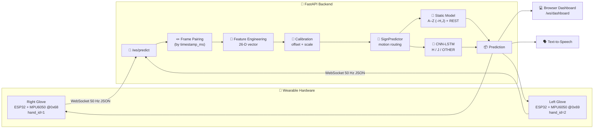
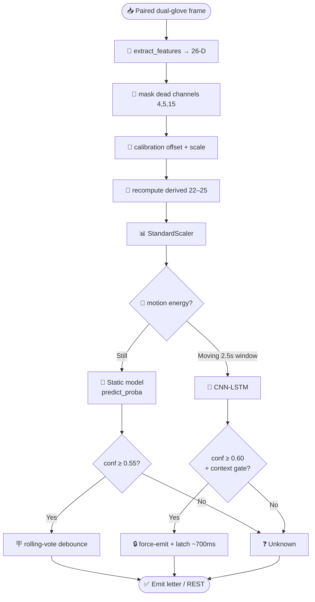
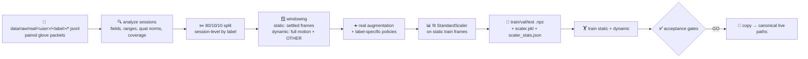
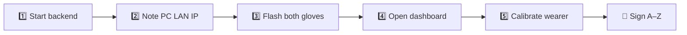

<div align="center">
  <h1>🧤 BSL Sign Gloves — Real-Time British Sign Language Fingerspelling</h1>

  ### 🤟 Dual-Glove Wearable + FastAPI ML Backend for Live A–Z Recognition

  **A pair of sensor gloves that read your hands and speak the letters you sign**
  *Two ESP32 Gloves • 26-Feature Pipeline • Static + Dynamic ML • Live Web Dashboard • Text-to-Speech*


</div>

---

## 📑 Table of Contents

1. [Project Overview](#-project-overview)
2. [Key Features](#-key-features)
3. [End-to-End System Architecture](#-end-to-end-system-architecture)
4. [Hardware Layer](#-hardware-layer)
5. [Firmware Layer (ESP32 / Arduino)](#-firmware-layer-esp32--arduino)
6. [Backend Layer (FastAPI)](#-backend-layer-fastapi)
7. [Frontend Layer (Dashboards)](#-frontend-layer-dashboards)
8. [The Machine Learning System](#-the-machine-learning-system)
9. [Feature Engineering (26-D Vector)](#-feature-engineering-the-26-dimensional-vector)
10. [The Models — What, Why, and How They Are Trained](#-the-models--what-why-and-how-they-are-trained)
11. [The Data Pipeline](#-the-data-pipeline)
12. [Calibration & Weak-Letter Recovery](#-calibration--weak-letter-recovery)
13. [Validation & Results](#-validation--results)
14. [Getting Started](#-getting-started)
15. [Running the System](#-running-the-full-system)
16. [Testing & Quality Gates](#-testing--quality-gates)
17. [Configuration Reference](#-configuration-reference)
18. [Project Structure](#-project-structure)
19. [Troubleshooting](#-troubleshooting)
20. [Known Limitations](#-known-limitations--risks)
21. [License](#-license)

---

## 🎯 Project Overview

**BSL Sign Gloves** is a wearable system that recognizes **British Sign Language (BSL) two-handed fingerspelling** (the letters **A–Z**) in real time and reads them out loud.

Two **ESP32-powered gloves** — one for each hand — stream synchronized sensor packets (finger bend, fingertip pressure, and hand orientation) over Wi-Fi at **50 Hz** to a **FastAPI backend**. The backend pairs the left and right hand frames by timestamp, engineers a **26-dimensional feature vector**, optionally applies **per-user calibration**, and routes the stream through a **two-stage machine-learning recognizer**:

- a **static classifier** (XGBoost / Random Forest / SVM / MLP) for the 24 still-pose letters plus three rest poses, and
- a **dynamic CNN-LSTM** for the two motion letters **H** and **J**.

Recognized letters are debounced, displayed on a **live browser dashboard**, spoken via **text-to-speech**, and echoed back to the gloves themselves.

> 💡 The system is **real-data driven** — models are trained on actual captured glove sessions, not synthetic stand-ins. The current deployed models are validated on a full **A–Z + REST** capture and gated with a `GO/NO-GO` deployment decision.

<div align="center">

| 🧤 Senses | 🔀 Routes | 🧠 Recognizes | 🗣️ Speaks | 🎯 Calibrates |
|:---:|:---:|:---:|:---:|:---:|
| Flex + FSR + IMU | Static vs Dynamic | A–Z fingerspelling | Text-to-Speech | Per-wearer offsets |

</div>

---

## ✨ Key Features

### 🧤 **Dual-Glove Synchronized Sensing**
Two ESP32 boards each read **5 flex sensors**, **3 force-sensitive resistors (FSRs)**, and a **6-axis IMU**, sampling at a clean 50 Hz and sharing an **NTP clock** so the backend can pair left/right frames precisely.

### 🔀 **Two-Stage Motion-Aware Routing**
A stateful predictor watches **frame-to-frame motion energy**. Still poses go to the fast static classifier; detected motion is buffered into a 2.5 s window and sent to the dynamic CNN-LSTM — so static letters and motion letters never fight each other.

### 🧠 **Four Static Models + One Dynamic Model**
XGBoost, Random Forest, SVM, and a calibrated MLP compete on real held-out data; the best is auto-deployed. A PyTorch CNN-LSTM handles the temporal **H/J** gestures with an `OTHER` rejection class.

### 🛡️ **Broken-Sensor Masking & Reliability Weighting**
Real hardware breaks. The pipeline **masks dead channels** (and rewired ones) consistently across training and inference, and applies **per-feature reliability weights** so the models lean on trustworthy sensors.

### 🎯 **Per-User Runtime Calibration**
A neutral-pose capture (plus optional A/B/C reference letters) maps a new wearer's baseline and IMU mount angle into the training distribution — **before** scaling — without retraining.

### 🩺 **Live Diagnostics & Recovery Tooling**
Built-in packet-rate/schema diagnostics, top-k prediction inspection, motion-routing debug, a **weak-letter recovery workflow**, and offline/live validation harnesses.

### 🗣️ **Speech Output**
Recognized letters are synthesized to audio using offline `pyttsx3` (falling back to `gTTS`) and streamed to the dashboard.

---

## 🏗️ End-to-End System Architecture



The recognizer is **stateful** — it maintains motion buffers, debounce history, a dynamic latch, post-latch cooldown, and context gates. Because of that, WebSocket inference is serialized with an `asyncio` lock while the model call runs on a worker thread, keeping the event loop responsive for heartbeats and the other glove's frames.

---

## 🔩 Hardware Layer

Each glove is an independent embedded unit. The two gloves are physically identical except for two firmware constants (hand id + IMU I²C address).

### Per-Glove Bill of Materials

<div align="center">

| Component | Qty / Hand | Role |
|-----------|:---:|------|
| **ESP32 dev board** | 1 | Wi-Fi MCU; reads sensors and streams JSON over WebSocket |
| **MPU6050 IMU** | 1 | 6-axis accelerometer + gyroscope → hand orientation (roll/pitch/yaw via quaternion) |
| **Flex sensors** | 5 | One per finger (thumb→pinky); measures finger bend/curl |
| **Force-Sensitive Resistors (FSR)** | 3 | Fingertip contact pressure — thumb tip, index tip, pinky tip |
| **16-channel analog MUX (CD74HC4067-class)** | 1 | Multiplexes 8 analog sensors into the one Wi-Fi-safe ADC pin |
| Resistors / wiring / glove substrate | — | Voltage dividers for flex/FSR, mounting |

</div>

### Pin Wiring (identical on both gloves)

```text
MUX SIG  → GPIO 36   (ADC1 — the only ADC usable while Wi-Fi is active)
MUX S0   → GPIO 16
MUX S1   → GPIO 17
MUX S2   → GPIO 18
MUX S3   → GPIO 19
MUX EN   → GPIO 5    (active LOW — pull to GND to enable)
IMU SDA  → GPIO 21   (I²C)
IMU SCL  → GPIO 22   (I²C, 400 kHz)
```

### MUX Channel Map

| MUX Channel | Sensor |
|:---:|---|
| `0–4` | Flex sensors — thumb, index, middle, ring, pinky |
| `5–7` | FSR sensors — thumb tip, index tip, pinky tip |

### Hand Identification

| Glove | `HAND_ID` | `MPU_ADDR` | AD0 pin |
|-------|:---:|:---:|---|
| Right | `1` | `0x68` | → GND |
| Left  | `2` | `0x69` | → 3.3 V |

> ⚠️ **ADC stability is engineered, not assumed.** ESP32 ADC channels retain charge after a MUX switch, so the firmware waits **300 µs** to settle, **discards 3** reads, then **averages 6** reads per channel. FSR channels are sampled in reverse order but stored in schema order to reduce stale-charge cross-talk. These constraints are enforced by `tests/test_arduino_firmware_mux.py`.

---

## 📟 Firmware Layer (ESP32 / Arduino)

Two Arduino sketches, both flashed to **both** ESP32 boards (only the two `#define`s change per hand):

| Sketch | Endpoint | Purpose |
|--------|----------|---------|
| `arduino/glove_wifi_collect/` | `/ws/collect` | Capture labeled training data |
| `arduino/glove_wifi_predict/` | `/ws/predict` | Live recognition |

### What the firmware does each cycle (every 20 ms = 50 Hz)

1. Reads all 5 flex + 3 FSR channels through the MUX (with settle/discard/average).
2. Reads the MPU6050 and fuses accel + gyro with a **complementary filter** (α = 0.98) into roll/pitch/yaw, then converts to a **unit quaternion** `[w, x, y, z]`.
3. Stamps the packet with an **NTP-synced timestamp** (so both gloves share a clock and the backend can pair frames).
4. Serializes and sends a compact JSON packet over the WebSocket.

### Packet format sent to the backend

```json
{
  "timestamp_ms": 123456789,
  "hand_id": 1,
  "flex": [0, 0, 0, 0, 0],
  "fsr":  [0, 0, 0],
  "accel": [0.0, 0.0, 9.81],
  "gyro":  [0.0, 0.0, 0.0],
  "quaternion": [1.0, 0.0, 0.0, 0.0],
  "contact_bitmask": 0
}
```

> Note: `contact_bitmask` is always `0` — capacitive touch was removed from the active ML feature space; the field remains only for schema compatibility.

### IMU configuration

- Accelerometer range: **±4 g** → `ACCEL_SCALE = 9.80665 / 8192`
- Gyroscope range: **±500 °/s** → `GYRO_SCALE = 1 / 65.5`
- Yaw is gyro-integrated (no magnetometer).

### Configuring before flashing

Edit the constants at the top of each `.ino`:

```cpp
#define HAND_ID    1            // 1 = right, 2 = left
#define MPU_ADDR   0x68         // 0x68 = right, 0x69 = left

const char* WIFI_SSID = "YourWiFi";
const char* WIFI_PASS = "YourPassword";
const char* WS_HOST   = "10.0.0.5";   // your PC's LAN IPv4 (run `ipconfig`)
```

A helper PowerShell flasher is provided: `arduino/flash_com11.ps1` (uses a bundled `arduino-cli`).

---

## 🖥️ Backend Layer (FastAPI)

The backend (`backend/`) is a FastAPI app that loads the ML models once at startup and exposes prediction, collection, calibration, settings, and diagnostics surfaces.

### Service singletons (started in `backend/main.py` lifespan)

| Service | Responsibility |
|---------|----------------|
| `PredictionService` | Wraps `ml.predict.SignPredictor`; adds feature engineering, calibration, metrics, top-k output, REST/dict formatting |
| `ConnectionManager` | Tracks connected ESP32 gloves + browser dashboard subscribers |
| `CollectionService` | Manages users, recording sessions, frame pairing, JSONL writes, manifests, previews, trimming |
| `PredictionDiagnostics` | Live packet rate, schema health, latest/recent packets |
| `TTSService` | Speech synthesis (`pyttsx3` → `gTTS` fallback) |
| `SettingsStore` | Persists thresholds + TTS settings across restarts |

### API surface

| Type | Endpoint | Purpose |
|------|----------|---------|
| Page | `GET /` | Prediction dashboard SPA |
| Page | `GET /collection` | Data-collection SPA |
| WS | `/ws/predict` | ESP32 live prediction stream (dual-glove) |
| WS | `/ws/collect` | ESP32 data-collection stream |
| WS | `/ws/dashboard` | Browser stream of predictions / settings / connection events |
| WS | `/ws/diagnostics` | Browser live packet diagnostics |
| REST | `POST /api/predict/raw` | One-shot raw dual-glove prediction |
| REST | `POST /api/predict/features` | One-shot prediction from a precomputed 26-D vector |
| REST | `GET /api/metrics` | Runtime prediction counters + latency |
| REST | `GET /api/predict/diagnostics` | Packet-rate / schema / latest packets |
| REST | `/api/collection/*` | Users, sessions, progress, previews, trim, delete, glove status |
| REST | `/api/calibrate/*` | Neutral capture, reference capture, profile save/load/clear/reset |
| REST | `GET/PUT /api/settings` | Runtime thresholds + TTS controls |
| REST | `POST /api/predict/batch` | Legacy batch path (⚠️ still validates 36 columns — see limitations) |

### Frame pairing (the heart of the live path)

Because the two ESP32s don't arrive in the same event-loop tick, the backend buffers single-hand packets and pairs them by `timestamp_ms` within a **300 ms tolerance** (discarding unpaired frames older than 500 ms). **Both hands are required** — the deployed models are dual-glove models, so a fabricated neutral hand would hurt more than silence.

---

## 🎨 Frontend Layer (Dashboards)

The UI is shipped as static single-page apps served directly by FastAPI from `backend/static/`:

| File | Served at | Purpose |
|------|-----------|---------|
| `index.html` | `/` | **Prediction dashboard** — live letter, confidence, route (static/dynamic), motion energy, glove connection status, threshold sliders, TTS controls, calibration wizard |
| `collection.html` | `/collection` | **Data-collection studio** — pick a user + label, record sessions, preview/trim, track per-letter progress |
| `js/diagnostics.js` | — | Live packet diagnostics (rate, schema health) |
| `audio/latest.mp3` | `/static/audio/latest.mp3` | Latest TTS output |

The dashboard connects to `/ws/dashboard` and receives every prediction frame plus connection and settings events in real time.

---

## 🧠 The Machine Learning System

The ML core lives in `ml/`. It is intentionally separated from the backend so it can be trained, evaluated, and validated independently.



### Label topology

| Route | Labels |
|-------|--------|
| **Static** | A, B, C, D, E, F, G, **I**, K, L, M, N, O, P, Q, R, S, T, U, V, W, X, Y, **Z** + REST_1, REST_2, REST_3 (**27 classes**) |
| **Dynamic** | **H**, **J**, OTHER (3 classes) |

- **H and J are motion gestures** → handled by the CNN-LSTM.
- **Z is static** in this dataset.
- **OTHER** is a dynamic *rejection* class trained from normal/rest movement so everyday motion isn't forced into H or J. It never emits as a displayed sign.
- **REST_1/2/3** are deliberate "no sign" poses so the system can stay quiet between letters.

---

## 📐 Feature Engineering: the 26-Dimensional Vector

`ml/feature_engineering.py` turns one paired raw frame into 26 deterministic, normalized features (`ml/config.py` is the source of truth).

| Index | Feature | Normalization |
|:---:|---|---|
| `0–4` | Right flex: thumb, index, middle, ring, pinky | flex ADC 800–3800 → 0 (straight) … 1 (curled) |
| `5–9` | Left flex: thumb, index, middle, ring, pinky | same |
| `10–12` | Right FSR: thumb tip, index tip, pinky tip | FSR ADC 0–4095 → 0 (no press) … 1 (max) |
| `13–15` | Left FSR: thumb tip, index tip, pinky tip | same |
| `16–18` | Right Euler: roll, pitch, yaw | quaternion → degrees, pitch clamped ±85° |
| `19–21` | Left Euler: roll, pitch, yaw | same |
| `22–23` | Right / Left hand openness (derived) | mean of working flex channels |
| `24–25` | Inter-hand roll Δ, pitch Δ (derived) | absolute right−left difference |

### Broken-sensor masking

Real gloves degrade. The pipeline zeroes specific channels **identically in training and inference** so the models never learn to depend on a dead sensor:

| Masked index | Channel | Reason |
|:---:|---|---|
| `4` | `R_flex_pinky` | Right pinky flex became the dead channel after the working sensor was rewired into the right-thumb position |
| `5` | `L_flex_thumb` | Left thumb flex has intermittent ADC dropouts |
| `15` | `L_fsr_pinky` | Left pinky FSR pad was physically moved to the left index fingertip |

When a flex channel is masked, the dependent **hand-openness** feature is recomputed from the remaining working channels so no constant bias is injected.

### Reliability weights

`FEATURE_WEIGHTS` (length 26) tells models how much to trust each channel. They are **not** baked into the raw vector by default — instead:
- **XGBoost** receives them via its native `feature_weights` argument (biases column subsampling).
- The **MLP** pre-multiplies inputs (and marks its payload `weighted=True` so inference repeats it).
- **Augmentation** suppresses noise on zero-weight channels so masked channels stay exactly 0.

Discriminative channels (e.g. right index FSR, left index FSR, right middle/ring flex, orientation) are up-weighted for the historically weak letters.

---

## 🤖 The Models — What, Why, and How They Are Trained

### 🌲 Static models (4 candidates, best auto-deployed)

All four are trained on the **scaled real-data static split** and compared on a held-out validation set. The winner is recorded in `data/models/training_report_real.json`; the live predictor reads that report at startup and loads the matching artifact (falling back to Random Forest).

| Model | Why it's used | How it's trained |
|-------|---------------|------------------|
| **XGBoost** | Strong tabular performer; native per-feature weighting; handles class imbalance well | `GridSearchCV` (5-fold stratified, `f1_weighted`); `multi:softprob`; balanced sample weights; reliability `feature_weights` |
| **Random Forest** | Robust, low-variance fallback; depth-capped to avoid memorizing per-session jitter | `GridSearchCV`; `class_weight='balanced'` |
| **SVM (RBF)** | Strong margins on normalized features | `GridSearchCV`; `class_weight='balanced'`; probability calibration |
| **MLP (64,32)** | Only candidate that natively honors feature weights through input scaling; **Platt/sigmoid-calibrated** probabilities | Fit on weighted inputs, then `CalibratedClassifierCV` (sigmoid) for honest confidences |

**Why four?** Different model families fail differently on real hardware drift. Training all four and auto-selecting the best on held-out data makes the deployment robust to which family generalizes best after each retrain.

Static hyperparameter search spaces, CV folds (`5`), and scoring (`f1_weighted`) are all defined in `ml/config.py`.

### 🔂 Dynamic model — CNN-LSTM (PyTorch)

H and J are *movements*, not poses, so a single frame can't classify them. A **CNN-LSTM** consumes a **125-frame × 26-feature** window (2.5 s at 50 Hz):

```text
Input (125, 26)
  → Conv1D(64, k=5) → BatchNorm → ReLU → MaxPool(2)
  → Conv1D(128, k=3) → BatchNorm → ReLU → MaxPool(2)
  → LSTM(128, return_seq) → Dropout(0.3)
  → LSTM(64)             → Dropout(0.3)
  → Dense(64, ReLU)      → Dropout(0.2)
  → Dense(n_classes)  [logits]
```

- **Why CNN-LSTM?** Conv1D layers extract local temporal motion primitives; LSTM layers model the full-gesture sequence. The combination captures H's lateral two-finger motion and J's circular pinky trace.
- **Training:** Adam (lr 0.001), `CrossEntropyLoss` with balanced class weights, early stopping (patience 10), `ReduceLROnPlateau`, and gentle **mixup (α=0.2)** regularization. Implemented in PyTorch because TensorFlow is unavailable on Python 3.14.
- **`OTHER` class:** built from static/rest distractor sequences so ordinary movement is rejected rather than misread as H/J.

### 🛡️ Live H/J safeguards (in `ml/predict.py`)

Going from an offline model to a usable live stream required routing guardrails (all regression-tested):
- Motion is detected by **feature-delta** energy (primary), accel-delta, or a K-shaped dynamic-start probe.
- Accepted H/J are **force-emitted and latched ~700 ms**, then a cooldown suppresses trailing static end-poses so they can't out-vote the dynamic result.
- A **context gate** checks the static end-pose label, but strong dynamic confidence can bypass a mismatch.
- A K-shaped start is briefly held so a possible **J can preempt static K**; if the probe says OTHER, static K recovers.
- `OTHER` and low-confidence dynamic segments stay Unknown and never latch.

---

## 🗄️ The Data Pipeline



### Raw capture format

- `data/raw/real/users.json` — user records (slugged folder names)
- `data/raw/real/manifest.json` — per-user, per-label session counts
- `data/raw/real/<user>/<label>/<session>.jsonl` — raw paired packets (two lines per paired frame)

### Key scripts

| Script | Role |
|--------|------|
| `scripts/build_real_dataset.py` | General real-data materialization (incl. LOUO mode) |
| `scripts/run_full_user_validation.py` | Full A–Z + REST build → train → gate → deploy |
| `scripts/live_accuracy_recovery.py` | Guardrailed weak-letter recovery workflow |
| `scripts/validate_live_recognition.py` | Offline replay + interactive live validation |
| `scripts/run_louo.py` | Leave-One-User-Out cross-validation |
| `scripts/run_ag_validation.py` | A–G subset validation probe |

> The training data is **not** a raw frame dump — it is filtered, windowed, augmented, scaled, labeled, and split **by session** (so frames from one recording never leak across train/test). Augmentation uses **label-specific policies** (e.g. low FSR dropout for pressure-sensitive E/I/O/U; extra orientation jitter for G/W/Z/J).

---

## 🎯 Calibration & Weak-Letter Recovery

### Per-user calibration (no retraining required)

Calibration runs **before** the scaler, in the unscaled feature domain:

```text
raw frame → extract 26 features → apply calibration offset/scale
          → recompute derived features → reapply broken-sensor mask
          → StandardScaler → model
```

1. **Neutral capture** (~150 frames, both hands flat) → compares to `train_neutral_baseline` in `scaler_stats.json` → produces a masked additive offset.
2. **Optional A/B/C reference captures** → refine per-flex amplitude scale.
3. Offsets apply only to **flex, Euler, and openness** channels — **never to FSRs** (zero pressure is real signal) or inter-hand deltas (recomputed anyway).

Profiles persist under `data/calibrations/<label>.json`. `POST /api/calibrate/reset` clears debounce/motion/latch state between live trials without wiping calibration.

### Weak-letter recovery

`scripts/live_accuracy_recovery.py` targets the historically weak live letters **E, G, I, J, M, N, O, U, W, Z**. It enforces per-letter correction-session targets before allowing a normal retrain (bypassable with `train --existing-data`), and runs interactive live validation profiles (`validate weak`, `validate all`) with top-1 / top-3 acceptance thresholds.

---

## 📊 Validation & Results

Latest **full-user validation** (`data/models/full_user_validation_report.json`, `data/models/training_report_real.json`, `dynamic_training_report_real.json`):

<div align="center">

| Metric | Value |
|--------|:---:|
| Raw sessions | **1,069** |
| Raw paired frames | **207,669** |
| Split policy | 80/10/10 session-level, stratified by user & label |
| Static train / val / test samples | 107,676 / 1,746 / 1,746 |
| Static classes | 27 (24 letters + 3 REST) |
| **Best static model** | **XGBoost** |
| Static test accuracy / macro-F1 | **1.00 / 1.00** |
| Static min class recall | 1.00 |
| REST rejection accuracy | 1.00 |
| Dynamic train / val / test samples | 2,492 / 37 / 37 |
| Dynamic classes | H, J, OTHER |
| Dynamic test accuracy | **1.00** |
| Dynamic H/J min recall | 1.00 |
| CNN-LSTM parameters | 219,587 |
| **Deployment recommendation** | ✅ **GO** |

</div>

Per-static-model comparison on the real held-out set:

| Model | Val acc | Test acc | Notes |
|-------|:---:|:---:|---|
| **XGBoost** | 1.000 | 1.000 | Deployed best |
| Random Forest | 1.000 | 1.000 | Fallback |
| SVM (RBF) | 0.9937 | 0.9977 | |
| MLP (calibrated) | 0.9897 | 0.9994 | weighted inputs |

> ⚠️ **Read these numbers honestly.** They are **held-out *session* metrics for a single captured user (Ravindu)**. They are strong deployment gates but do **not** prove generalization to arbitrary new wearers — which is exactly why the calibration wizard and live-validation harness exist. Live distribution shift remains the main operational risk.

---

## 🚀 Getting Started

### Prerequisites

- **Python 3.14** (the repo's models were built under CPython 3.14; PyTorch is used since TensorFlow isn't available there)
- A Wi-Fi network reachable by both the PC and the ESP32 gloves
- Arduino IDE / `arduino-cli` with the **ESP32 board package**, plus libraries **arduinoWebSockets** (Markus Sattler) and **ArduinoJson v6**
- The assembled dual-glove hardware (or recorded `.jsonl` sessions for offline work)

### 1. Clone & enter

```bash
git clone <your-repo-url> sign_gloves_ML_models
cd sign_gloves_ML_models
```

### 2. Create a virtual environment

```bash
python -m venv .venv
# Windows (PowerShell)
.\.venv\Scripts\Activate.ps1
# macOS / Linux
source .venv/bin/activate
```

### 3. Install dependencies

```bash
pip install -r backend/requirements.txt
```

This installs FastAPI, Uvicorn, NumPy, PyTorch, XGBoost, scikit-learn, SciPy, and the TTS engines. For training plots you may also want `matplotlib` and `seaborn` (optional).

---

## ▶️ Running the Full System



### Step 1 — Start the backend (bind to all interfaces so gloves can reach it)

```bash
python -m uvicorn backend.main:app --host 0.0.0.0 --port 8000
```

> Use `--host 0.0.0.0`, **not** `127.0.0.1` — otherwise the ESP32s on Wi-Fi cannot connect. On startup the server prints its LAN IPs.

### Step 2 — Find your PC's LAN IP

```bash
ipconfig      # Windows  → IPv4 Address
ifconfig      # macOS / Linux
```

### Step 3 — Flash both gloves

In each `.ino`, set `HAND_ID` / `MPU_ADDR` (right vs left), your Wi-Fi SSID/password, and `WS_HOST` = your PC's LAN IP. Then flash:

- For **live recognition** → flash `arduino/glove_wifi_predict/` (connects to `/ws/predict`).
- For **data collection** → flash `arduino/glove_wifi_collect/` (connects to `/ws/collect`).

(Windows helper: `arduino/flash_com11.ps1`.)

### Step 4 — Open the dashboards

- Prediction: **http://localhost:8000/**
- Collection: **http://localhost:8000/collection**

Both gloves should appear as connected. Predicted letters stream live with confidence, route, and motion energy.

### Step 5 — Calibrate the wearer

Use the dashboard calibration wizard (neutral pose, optional A/B/C references) before signing — this aligns the wearer to the training distribution.

### One-shot prediction without hardware (REST)

```bash
curl -X POST http://localhost:8000/api/predict/raw \
  -H "Content-Type: application/json" \
  -d '{
        "right_flex":[2000,1500,1500,1500,1500], "right_fsr":[0,0,0],
        "right_quaternion":[1,0,0,0], "right_accel":[0,0,9.81], "right_bitmask":0,
        "left_flex":[2000,1500,1500,1500,1500],  "left_fsr":[0,0,0],
        "left_quaternion":[1,0,0,0],  "left_accel":[0,0,9.81],  "left_bitmask":0
      }'
```

> The `RawSensorInput` schema uses flat per-hand fields (`right_flex`, `right_fsr`, `right_quaternion`, `right_accel`, `left_flex`, …). The `*_bitmask` fields are accepted for compatibility but ignored (touch is not in the active feature space).

---

## 🏋️ Training & Retraining

### Full validated build + deploy (recommended path)

```bash
python -m scripts.run_full_user_validation
```

Builds a fresh dataset from the captured user, trains static + dynamic models from scratch into isolated folders, runs acceptance gates, and **only deploys** to the canonical live paths if the decision is `GO`.

### Train individual stages on real data

```bash
python -m ml.train_static  --real            # all 4 static candidates
python -m ml.train_static  --real --model xgb # one model
python -m ml.train_static  --real --quick     # reduced grids (fast)
python -m ml.train_dynamic --real            # CNN-LSTM
python -m ml.train_dynamic --real --quick    # 10-epoch smoke test
```

### Cross-validation

```bash
python -m scripts.build_real_dataset --mode louo   # build LOUO splits
python -m ml.train_static  --louo                  # per-held-out-user static
python -m ml.train_dynamic --louo                  # per-held-out-user dynamic
```

### Weak-letter recovery

```bash
python -m scripts.live_accuracy_recovery validate weak   # interactive live check
python -m scripts.live_accuracy_recovery train --existing-data
```

---

## 🧪 Testing & Quality Gates

The `tests/` suite encodes the operational constraints that are easy to regress.

```bash
# Run everything
python -m pytest

# Focused runs
python -m pytest tests/test_dynamic_routing.py            # H/J routing + safeguards
python -m pytest tests/test_weak_letter_recovery_config.py # masks/weights/aug/oversampling
python -m pytest tests/test_live_accuracy_recovery.py      # recovery CLI wrappers
python -m pytest tests/test_arduino_firmware_mux.py        # ESP32 ADC sampling safety
python -m pytest tests/test_diagnostics_services.py        # prediction/collection diagnostics
python -m pytest tests/test_collection_live.py             # collection smoke
python -m pytest tests/test_phase2.py ... tests/test_phase6.py  # phase smoke checks
```

These tests deliberately assert things like: *don't clamp the dynamic threshold back to 0.90, don't latch `OTHER`, don't let a failed dynamic probe permanently suppress static K, keep masked sensors zero & unweighted, and keep MUX sampling robust.*

---

## ⚙️ Configuration Reference

All ML constants live in `ml/config.py`. Most-tuned values:

<div align="center">

| Constant | Value | Meaning |
|----------|:---:|---------|
| `SAMPLE_RATE_HZ` | 50 | Sensor sampling frequency |
| `DYNAMIC_WINDOW_FRAMES` | 125 | Dynamic window length (2.5 s @ 50 Hz) |
| `NUM_FEATURES` | 26 | ML feature vector length |
| `MASKED_FEATURE_INDICES` | (4, 5, 15) | Dead/rewired channels zeroed everywhere |
| `STATIC_CONFIDENCE_THRESHOLD` | 0.55 | Min static confidence to emit |
| `DYNAMIC_CONFIDENCE_THRESHOLD` | 0.60 | Min dynamic confidence to emit |
| `DEBOUNCE_FRAMES` | 4 | Consecutive votes before emit (~80 ms) |
| `MOTION_ENERGY_THRESHOLD` | 2.5 | Static↔dynamic routing threshold |
| `DYNAMIC_LETTERS` | {H, J} | Motion letters routed to CNN-LSTM |
| `CV_FOLDS` / `CV_SCORING` | 5 / f1_weighted | Static GridSearch settings |

</div>

Runtime thresholds (static/dynamic confidence, motion energy) and TTS settings are also adjustable live from the dashboard and persisted by `SettingsStore`.

---

## 📁 Project Structure

```text
sign_gloves_ML_models/
├── 📄 README.md                       # This file
├── 📄 LICENSE                         # Apache 2.0
│
├── 📂 arduino/                        # ESP32 firmware
│   ├── glove_wifi_collect/           # Data-collection sketch (/ws/collect)
│   ├── glove_wifi_predict/           # Live-recognition sketch (/ws/predict)
│   ├── test_no_mux/                  # Bring-up sketches (single sensor / no MUX)
│   └── flash_com11.ps1               # Windows arduino-cli flasher
│
├── 📂 backend/                        # FastAPI application
│   ├── main.py                       # App factory, lifespan, router wiring
│   ├── requirements.txt              # Python dependencies
│   ├── routers/                      # predict, batch, websocket, audio,
│   │                                 #   settings, collection, calibration
│   ├── services/                     # predictor, collection, connection_manager,
│   │                                 #   prediction_diagnostics, settings_store, tts
│   ├── models/                       # Pydantic schemas
│   └── static/                       # index.html, collection.html, js/, audio/
│
├── 📂 ml/                             # Machine-learning core
│   ├── config.py                     # ⭐ Authoritative constants (features, labels,
│   │                                 #    masks, weights, thresholds, paths, aug)
│   ├── feature_engineering.py        # raw frame → 26-D vector
│   ├── predict.py                    # ⭐ Stateful SignPredictor (routing/debounce/latch)
│   ├── train_static.py               # XGB / RF / SVM / MLP training + loading
│   ├── train_dynamic.py              # CNN-LSTM training + loading
│   ├── real_data.py                  # JSONL loading, pairing, settled windows
│   ├── real_augmentation.py          # real-data + label-specific augmentation
│   ├── segmentation.py               # motion segmenter / segment extraction
│   ├── synthetic_data.py             # legacy synthetic generator (baseline only)
│   ├── bsl_sign_definitions.py       # BSL letter pose definitions
│   ├── evaluate.py / ablation.py     # evaluation + feature-group ablation
│
├── 📂 scripts/                        # Pipelines & validation
│   ├── build_real_dataset.py         # general real-data materialization (+ LOUO)
│   ├── run_full_user_validation.py   # full A–Z + REST build → train → gate → deploy
│   ├── live_accuracy_recovery.py     # weak-letter recovery guardrails
│   ├── validate_live_recognition.py  # offline replay + live validation harness
│   ├── run_louo.py / run_ag_validation.py
│
├── 📂 tests/                          # Regression suite (routing, firmware, diag, recovery)
│
├── 📂 data/
│   ├── raw/real/                     # captured JSONL sessions + users/manifest
│   ├── processed/real/               # train/val/test .npz, scaler.pkl, scaler_stats.json
│   ├── models/                       # deployed artifacts + training reports
│   ├── calibrations/                 # per-user calibration profiles
│   └── figures/                      # confusion matrices, live validation outputs
│
└── 📂 docs/
    ├── system-deep-analysis.md       # Current full-system analysis (source of truth)
    └── ml-recognition-deep-analysis.md  # ML subsystem deep dive
```

---

## 🐛 Troubleshooting

<div align="center">

| Problem | Likely cause | Fix |
|---------|--------------|-----|
| Gloves never connect | Backend bound to `127.0.0.1` | Start uvicorn with `--host 0.0.0.0`; set `WS_HOST` to the PC's LAN IP |
| Only one glove shows | Frame pairing failing | Both gloves need NTP sync; check clocks and `timestamp_ms` |
| Predictions all `Unknown` | Below confidence, or no calibration | Run the calibration wizard; lower thresholds via dashboard |
| Noisy / flickering flex values | MUX stale charge | Firmware already settles/discards/averages — verify wiring & `MUX_EN` LOW |
| H/J never recognized | Motion not triggering or context-gated | Check motion-routing debug; ensure full 2.5 s gesture; review dynamic gate |
| Wrong letter for M/N/L/W | Finger-count letters depend on masked flex channels | Recalibrate; confirm working flex channels |
| `/api/predict/batch` rejects input | Legacy endpoint validates 36 columns | Use `/api/predict/raw` or `/api/predict/features` (26-D) |
| Model won't load at startup | Missing artifacts | Run `python -m scripts.run_full_user_validation` to (re)build & deploy |

</div>

---

## ⚠️ Known Limitations & Risks

- 🧍 **Single-user validation.** Current reports are held-out *session* metrics for one captured wearer. New wearers still need calibration + live validation.
- 🧮 **Legacy batch endpoint.** `backend/routers/batch.py` still validates **36** features; the active pipeline is **26**. Use the raw/features endpoints.
- 📝 **Stale comments.** Some docstrings mention older 36-feature / 0.90-threshold behavior — `ml/config.py` and `ml/predict.py` are the live source of truth.
- 🔑 **Firmware secrets.** Wi-Fi SSID/password and host IP are hard-coded in the `.ino` files — sanitize before sharing.
- 🧤 **Both gloves required.** The deployed models are dual-glove; a missing hand yields silence by design (no fabricated neutral hand).
- 🔒 **Stateful predictor.** Any new concurrent inference path must respect the `/ws/predict` serialization (asyncio lock + worker thread).
- 🚫 **Touch is gone.** Bitmask fields exist only for schema compatibility; don't reintroduce touch features without retraining the whole pipeline.

---

## 📄 License

Licensed under the **Apache License 2.0** — see [`LICENSE`](LICENSE).

---

<div align="center">

  ### 🧤 **From Fingertips to Letters** 🧤
  ### 🌟 **Wearable Sensing Meets Real-Data Machine Learning** 🌟

  ⭐ **Star this repository if it helped you!** ⭐

</div>