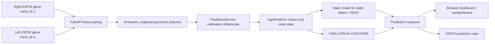

# BSL Sign Glove System Deep Analysis

Last updated: 2026-06-09

This document describes the current codebase as it exists now, not the older
planning state. It intentionally replaces the previous draft plans, setup
guides, and historical notes with one full-system analysis that can be used to
understand the deployed architecture.

## Executive Summary

The project is a dual-glove BSL fingerspelling recognition system. Two ESP32
gloves stream synchronized sensor packets to a FastAPI backend. The backend
pairs right-hand and left-hand frames, engineers a 26-dimensional feature
vector, applies optional per-user calibration, routes the frame stream through
a static or dynamic ML recognizer, and broadcasts predictions plus diagnostics
to browser dashboards and the ESP32 clients.

The system has moved beyond the original synthetic-data plan. The active
pipeline is now real-data driven:

- Touch sensors have been removed from the ML feature space.
- The third FSR channel is treated as a pinky-tip FSR, not a palm-pad FSR.
- The live feature vector has 26 features.
- Broken channels are explicitly masked in both training and inference:
  feature indices `4`, `5`, and `15`.
- Static recognition covers A-Z except dynamic letters H and J, plus REST_1,
  REST_2, and REST_3.
- Dynamic recognition covers H and J plus an OTHER class used to reject normal
  non-H/J movement.
- The current deployed static model is chosen from
  `data/models/training_report_real.json`; as of the latest report it is
  XGBoost.
- The latest full-user validation report marks the deployment decision as
  `GO`.

## Repository Map

| Path | Current role |
| --- | --- |
| `arduino/glove_wifi_collect/` | ESP32 firmware for real-data collection via `/ws/collect`. |
| `arduino/glove_wifi_predict/` | ESP32 firmware for live recognition via `/ws/predict`. |
| `backend/main.py` | FastAPI application factory, service startup, router registration, static dashboards. |
| `backend/routers/` | REST and WebSocket API surfaces for prediction, collection, calibration, settings, batch, audio, and diagnostics. |
| `backend/services/` | Long-lived runtime services: prediction, collection, connection tracking, diagnostics, settings, and TTS. |
| `backend/static/` | Browser dashboard and collection UI served directly by FastAPI. |
| `ml/config.py` | Authoritative ML constants: feature names, labels, masks, weights, thresholds, paths, augmentation, calibration. |
| `ml/feature_engineering.py` | Raw dual-glove packets to 26 normalized features. |
| `ml/predict.py` | Stateful static/dynamic recognizer, motion routing, debounce, latch, dynamic gates. |
| `ml/train_static.py` | Static model training and model payload loading. |
| `ml/train_dynamic.py` | CNN-LSTM dynamic model training and loading. |
| `ml/real_data.py` | Raw JSONL session loading, pairing, settled-window extraction. |
| `ml/real_augmentation.py` | Real-data frame and sequence augmentation, including label-specific policies. |
| `scripts/build_real_dataset.py` | General real-data materialization pipeline. |
| `scripts/run_full_user_validation.py` | Current full Ravindu A-Z plus REST validation and deployment run. |
| `scripts/live_accuracy_recovery.py` | Guardrailed recovery workflow for weak live letters. |
| `scripts/validate_live_recognition.py` | Offline replay and interactive live validation harness. |
| `tests/` | Regression coverage for routing, firmware sampling, diagnostics, collection, and recovery config. |
| `data/raw/real/` | Captured JSONL sessions and user metadata. |
| `data/processed/real/` | Current real-data training splits, scaler, coverage report, and scaler stats. |
| `data/models/` | Deployed static and dynamic model artifacts plus reports. |

## System Data Flow



The deployed recognizer is stateful. It is not a pure single-frame classifier:
it maintains feature-delta motion buffers, debounce history, dynamic latch
state, post-latch cooldown, top-k diagnostics, and dynamic context gates.
Because of that state, WebSocket inference is serialized with an asyncio lock
while the actual model call runs on a worker thread. This keeps heartbeats and
incoming glove frames responsive without allowing concurrent mutation of the
same `SignPredictor` instance.

## Hardware and Firmware Layer

The live hardware model is two ESP32 boards, one per glove:

- Right glove: `HAND_ID = 1`, MPU6050 address `0x68`.
- Left glove: `HAND_ID = 2`, MPU6050 address `0x69`.
- Both sketches use WebSockets and ArduinoJson.
- Both sketches sample at 50 Hz (`SAMPLE_MS = 20`).
- Both sketches use the same MUX pinout:
  - MUX SIG: GPIO36, ADC1, WiFi-safe.
  - MUX S0-S3: GPIO16, GPIO17, GPIO18, GPIO19.
  - MUX EN: GPIO5, active low.
  - IMU SDA/SCL: GPIO21/GPIO22.
- MUX channels:
  - `0-4`: flex sensors, thumb to pinky.
  - `5-7`: FSR sensors, thumb tip, index tip, pinky tip.

The firmware deliberately discards multiple ADC reads after each MUX channel
switch and averages stable reads. Tests require at least 250 us of settle time,
at least 3 discarded reads, and at least 4 averaged reads. FSR channels are
sampled in reverse order but stored in schema order to reduce stale-charge
cross-talk while keeping `fsr = [thumb, index, pinky]`.

The ESP32 payload shape is:

```json
{
  "timestamp_ms": 123456789,
  "hand_id": 1,
  "flex": [0, 0, 0, 0, 0],
  "fsr": [0, 0, 0],
  "accel": [0.0, 0.0, 9.81],
  "gyro": [0.0, 0.0, 0.0],
  "quaternion": [1.0, 0.0, 0.0, 0.0],
  "battery_pct": 87.5
}
```

Prediction mode connects to `/ws/predict`; collection mode connects to
`/ws/collect`. Both modes require both gloves. The backend no longer fabricates
a neutral missing hand for prediction because the deployed models are
dual-glove models and a fake hand is more harmful than silence.

## Backend Runtime Architecture

`backend/main.py` starts these service singletons during the FastAPI lifespan:

- `PredictionService`: wraps `ml.predict.SignPredictor`, calibration, metrics,
  top-k output, feature distribution diagnostics, and response formatting.
- `ConnectionManager`: tracks ESP32 clients and browser dashboard WebSocket
  subscribers.
- `TTSService`: generates latest audio when REST/manual prediction emits a
  sign, using offline `pyttsx3` if present, otherwise `gTTS` when available.
- `CollectionService`: manages users, recording sessions, frame pairing,
  JSONL writes, manifest counts, session previews, trimming, and diagnostics.
- `PredictionDiagnostics`: tracks prediction-mode packet rate, schema health,
  latest packets, recent packets, and diagnostic subscribers.
- `SettingsStore`: persists dashboard thresholds and TTS settings.

The main routes are:

| Surface | Endpoint | Purpose |
| --- | --- | --- |
| Browser dashboard | `/` | Prediction dashboard SPA. |
| Browser collection UI | `/collection` | Data collection SPA. |
| Prediction REST | `POST /api/predict/raw` | One-shot raw dual-glove prediction. |
| Prediction REST | `POST /api/predict/features` | One-shot precomputed-feature prediction. |
| Prediction metrics | `GET /api/metrics` | Runtime prediction counters and latency. |
| Prediction diagnostics | `GET /api/predict/diagnostics` | Prediction packet rate, schema, latest packets. |
| Live prediction WS | `/ws/predict` | ESP32 live prediction stream. |
| Dashboard WS | `/ws/dashboard` | Browser stream of predictions, settings, connection events. |
| Collection WS | `/ws/collect` | ESP32 data collection stream. |
| Diagnostics WS | `/ws/diagnostics` | Browser live packet diagnostics for collect or predict. |
| Collection REST | `/api/collection/*` | Users, sessions, progress, previews, trim, delete, glove status. |
| Calibration REST | `/api/calibrate/*` | Neutral capture, reference capture, profile save/load/clear/reset. |
| Settings REST | `GET/PUT /api/settings` | Runtime thresholds and TTS controls. |
| Batch REST | `POST /api/predict/batch` | Legacy batch upload path. See known mismatches below. |

## Feature Space

The current ML feature vector has 26 dimensions. It is defined in
`ml/config.py` and produced by `ml/feature_engineering.py`.

| Index range | Features |
| --- | --- |
| `0-4` | Right flex: thumb, index, middle, ring, pinky. |
| `5-9` | Left flex: thumb, index, middle, ring, pinky. |
| `10-12` | Right FSR: thumb tip, index tip, pinky tip. |
| `13-15` | Left FSR: thumb tip, index tip, pinky tip. |
| `16-18` | Right Euler roll, pitch, yaw. |
| `19-21` | Left Euler roll, pitch, yaw. |
| `22-23` | Derived right and left hand openness. |
| `24-25` | Inter-hand roll and pitch deltas. |

Touch has been removed from the feature vector. `RawSensorInput` still accepts
bitmask fields for compatibility, but feature extraction ignores touch. The
older 36-feature docs and assumptions are obsolete for the active recognition
path.

Current hardware masks:

| Index | Feature | Reason |
| --- | --- | --- |
| `4` | `R_flex_pinky` | Right pinky flex channel is now the dead channel after the working sensor was rewired into the right-thumb position. |
| `5` | `L_flex_thumb` | Left thumb flex is unreliable due to intermittent ADC dropouts. |
| `15` | `L_fsr_pinky` | Left pinky FSR channel is unavailable after the working pad moved to left index. |

`apply_sensor_mask()` zeros these channels in both training materialization and
live inference. Derived hand openness is recomputed from the remaining working
flex channels, so the mask does not inject a constant bias.

## Prediction Behavior

The live predictor has two routes:

- Static route: deployed static model for A-Z except H and J, plus REST_1,
  REST_2, and REST_3.
- Dynamic route: CNN-LSTM for H, J, and OTHER.

Important current routing behavior:

- Feature-delta motion is the primary live trigger; gravity-energy routing is
  kept warm but disabled for live route decisions to avoid drift in tilted
  static poses.
- Dynamic windows are 125 frames, or 2.5 seconds at 50 Hz.
- The dynamic threshold is `0.60`; the static threshold is `0.55`.
- Dynamic output is forced through a latch for about 700 ms after accepted
  H/J, followed by a cooldown to prevent trailing static end poses from
  replacing the dynamic letter.
- Dynamic context gates use static end-pose labels only for ambiguous dynamic
  segments. Strong dynamic confidence can bypass a context mismatch.
- K-shaped starts can be held briefly so a possible J can preempt static K.
- OTHER dynamic predictions remain Unknown and are not latched.

## Collection and Data Storage

`CollectionService` is the authority for captured real data. It persists:

- `data/raw/real/users.json`: user records with slugged folder names.
- `data/raw/real/manifest.json`: per-user, per-label session counts.
- `data/raw/real/<user-folder>/<label>/<session>.jsonl`: raw paired glove
  packet lines, two lines per paired frame.

Collection labels include:

- BSL letters A-Z.
- REST_1, REST_2, REST_3.

Session recording writes only when both hand packets can be paired within the
timestamp tolerance. The service also provides session preview, trimming,
delete operations, progress reports, glove liveness, recent packet inspection,
and live diagnostics.

## Training, Deployment, and Validation State

The current canonical artifacts are:

- `data/processed/real/train.npz`, `val.npz`, `test.npz`
- `data/processed/real/dynamic_train.npz`, `dynamic_val.npz`, `dynamic_test.npz`
- `data/processed/real/scaler.pkl`
- `data/processed/real/scaler_stats.json`
- `data/models/xgboost_static_v2.pkl`
- `data/models/rf_static_v2.pkl`
- `data/models/svm_static_v2.pkl`
- `data/models/mlp_static_v2.pkl`
- `data/models/cnn_lstm_dynamic_v2.pt`
- `data/models/training_report_real.json`
- `data/models/dynamic_training_report_real.json`
- `data/models/full_user_validation_report.json`

Latest report summary from the current workspace:

| Metric | Value |
| --- | --- |
| Raw sessions | 1069 |
| Raw paired frames | 207669 |
| Split policy | 80/10/10 session-level stratified by user and label |
| Static train/val/test samples | 107676 / 1746 / 1746 |
| Static classes | 27: 24 static letters plus 3 REST labels |
| Best static model | XGBoost |
| Static test accuracy | 1.0 |
| Static macro F1 | 1.0 |
| Static min class recall | 1.0 |
| REST rejection accuracy | 1.0 |
| Dynamic train/val/test samples | 2492 / 37 / 37 |
| Dynamic classes | H, J, OTHER |
| Dynamic test accuracy | 1.0 |
| Dynamic H/J min recall | 1.0 |
| Deployment recommendation | GO |

These metrics are held-out session metrics for the current Ravindu-only
full-user validation workflow. They are valuable deployment gates, but they do
not prove broad generalization to many unseen users. The calibration and
live-validation workflow exist because live user distribution shift remains
the main operational risk.

## Calibration and Settings

Runtime calibration is applied before the StandardScaler:

1. Neutral capture averages incoming frames while both hands are held in a
   neutral pose. The service compares the average to `train_neutral_baseline`
   in `scaler_stats.json` and produces a masked offset.
2. Optional reference captures for A, B, and C refine flex amplitude scales by
   comparing user amplitudes to training amplitudes.
3. The service applies offset and scale, recomputes derived features, reapplies
   the sensor mask, and then calls the predictor.

Calibration profiles persist under `data/calibrations/<label>.json`.
`POST /api/calibrate/reset` clears debounce, motion, and latch state without
clearing calibration, which is useful between live trials.

Runtime settings can adjust:

- Static confidence threshold.
- Dynamic confidence threshold.
- Motion energy threshold.
- TTS enabled/rate/volume.

Settings are saved and broadcast to dashboards.

## Testing and Guardrails

Current tests cover the most fragile runtime behavior:

- Dynamic routing and H/J safeguards in `tests/test_dynamic_routing.py`.
- Live accuracy recovery commands and wrappers in
  `tests/test_live_accuracy_recovery.py`.
- Weak-letter masks, weights, augmentation policies, and oversampling in
  `tests/test_weak_letter_recovery_config.py`.
- ESP32 MUX ADC sampling safety in `tests/test_arduino_firmware_mux.py`.
- Prediction and collection diagnostics in `tests/test_diagnostics_services.py`.
- Collection and phase smoke checks in `tests/test_collection_live.py` and
  `tests/test_phase*.py`.

The tests intentionally encode operational constraints that are easy to regress:
do not clamp the dynamic threshold back to 0.90, do not latch OTHER, do not let
dynamic failure permanently suppress static K, keep broken sensors masked and
unweighted, and keep MUX sampling robust.

## Known Current Mismatches and Risks

The following are part of the current codebase state and should not be hidden:

- `backend/routers/batch.py` still checks uploaded arrays for 36 features even
  though the active ML feature vector is 26. One-shot REST and WebSocket
  prediction use 26 features correctly.
- Some docstrings and comments still mention older 36-feature behavior or older
  threshold values. The code constants in `ml/config.py` and runtime behavior
  in `ml/predict.py` are the active source of truth.
- The firmware has WiFi SSID/password and host IP constants in source files.
  This is convenient for local flashing but should be treated carefully if the
  repository is shared.
- Full validation is currently centered on one user folder:
  `data/raw/real/ravindu-8dd5c02e`. The system includes calibration and live
  new-user validation because broader wearer generalization is not guaranteed
  by the current reports.
- The live predictor is intentionally stateful. Any new concurrent inference
  path must respect the serialization pattern used by `/ws/predict`.
- Touch-related schema fields exist only for compatibility; new logic should
  not reintroduce touch features unless the hardware and training pipeline are
  intentionally changed together.

## Current Mental Model

The system is best understood as a paired-stream recognition pipeline rather
than a model-only project:

1. Firmware stabilizes sensor sampling and sends one packet per hand at 50 Hz.
2. Backend pairing converts two asynchronous streams into dual-hand frames.
3. Feature engineering normalizes raw values, removes dead channels, and
   derives hand and inter-hand features.
4. Calibration maps the current wearer toward the training distribution.
5. Stateful inference decides whether the stream is static or dynamic.
6. Static and dynamic model outputs are thresholded, gated, debounced, latched,
   and diagnosed.
7. The dashboard, ESP32 client, TTS path, collection UI, and validation scripts
   observe or reuse the same central prediction service.

Keeping those boundaries intact is more important than any single model score.
Most historical accuracy failures came from train/serve drift, stale routing,
missing dual-hand pairing, weak-letter undercoverage, or calibration mismatch,
not from the model class alone.
